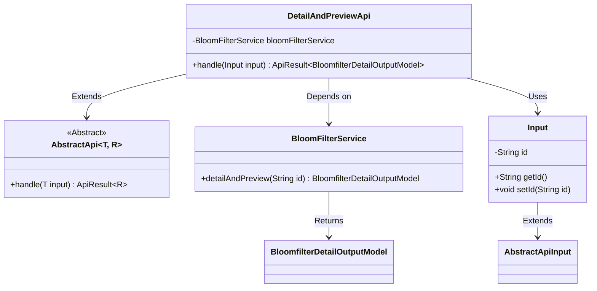

# Basic Information

|      |      |
|------|------|
| Name | DetailAndPreviewApi |
| Language | .java |
| Code Path | WeFe/fusion/fusion-service/src/main/java/com/welab/wefe/data/fusion/service/api/bloomfilter/DetailAndPreviewApi.java |
| Package Name | com.welab.wefe.data.fusion.service.api.bloomfilter |
| Dependencies | ['com.welab.wefe.common.fieldvalidate.annotation.Check', 'com.welab.wefe.common.web.api.base.AbstractApi', 'com.welab.wefe.common.web.api.base.Api', 'com.welab.wefe.common.web.dto.AbstractApiInput', 'com.welab.wefe.common.web.dto.ApiResult', 'com.welab.wefe.data.fusion.service.dto.entity.bloomfilter.BloomfilterDetailOutputModel', 'com.welab.wefe.data.fusion.service.dto.entity.dataset.DataSetDetailOutputModel', 'com.welab.wefe.data.fusion.service.service.bloomfilter.BloomFilterService', 'com.welab.wefe.data.fusion.service.service.dataset.DataSetService', 'org.springframework.beans.factory.annotation.Autowired'] |
| Brief Description | This is a filter details preview API class that retrieves Bloom filter details by ID, returning both the details and preview data. The input parameter is the data ID, and it invokes BloomFilterService to process the request. |

# Description

This is an API class named "Filter Detail Preview" with the path "filter/detail_and_preview". It inherits from the AbstractApi base class, using generics to specify the input type as the internal class Input and the output type as BloomfilterDetailOutputModel. The class injects the BloomFilterService, with its core processing logic being to retrieve detail data through the detailAndPreview method of bloomFilterService. The input parameter Input inherits from AbstractApiInput and contains a mandatory string-type id field to identify the data to be queried. The primary function of this API is to return the corresponding filter details and preview information based on the provided id.

# Class Summary

| Name   | Type  | Description |
|-------|------|-------------|
| DetailAndPreviewApi | class | This is an API class named "Filter Details Preview" that retrieves Bloom filter details and preview data by ID. The input parameter is the data ID, and the output is the Bloom filter details model. |

## Class DetailAndPreviewApi

|      |      |
|------|------|
| Access Modifier | @Api(path = "filter/detail_and_preview", name = "过滤器详情预览", desc = "过滤器详情预览");public |
| Type | class |
| Name | DetailAndPreviewApi |
| Description | This is an API class named "Filter Details Preview" that retrieves Bloom filter details and preview data by ID. The input parameter is the data ID, and the output is the Bloom filter details model. |

### UML Class Diagram

This code illustrates the implementation structure of a filter detail preview API. The DetailAndPreviewApi inherits from the generic abstract class AbstractApi, processes Input parameters, and returns BloomfilterDetailOutputModel results. It retrieves data via the dependency-injected BloomFilterService. The Input class extends AbstractApiInput and contains an id field with accessor methods. The overall design adheres to dependency injection and layered architecture principles, encapsulating the API request handling logic.

### Internal Method Call Graph

```mermaid
graph TD
    A["Class DetailAndPreviewApi"]
    B["Annotation: @Api"]
    C["Inheritance: AbstractApi<Input, BloomfilterDetailOutputModel>"]
    D["Dependency Injection: @Autowired BloomFilterService"]
    E["Overridden Method: handle(Input input)"]
    F["Inner Class: Input"]
    G["Field: @Check String id"]
    H["Method: getId()"]
    I["Method: setId(String id)"]
    J["Invocation: bloomFilterService.detailAndPreview(input.getId())"]
    K["Return: ApiResult.success()"]

    A --> B
    A --> C
    A --> D
    A --> E
    E --> J
    J --> K
    A --> F
    F --> G
    F --> H
    F --> I
```

This code illustrates an API class named DetailAndPreviewApi, which inherits from AbstractApi and handles filter detail preview functionality. The class structure includes the @Api annotation for defining interface metadata, injects BloomFilterService via @Autowired, and overrides the handle method to invoke the service layer for data retrieval. The inner class Input extends AbstractApiInput, containing an id field annotated with @Check along with getter/setter methods. The flowchart clearly presents the class inheritance relationship, dependency injection, method call chain, and inner class structure, demonstrating the core workflow of API request processing.

### Field List

| Name  | Type  | Description |
|-------|-------|------|
| bloomFilterService | BloomFilterService | Using @Autowired to automatically inject an instance of BloomFilterService. |

### Method List

| Name  | Type  | Description |
|-------|-------|------|
| handle | ApiResult<BloomfilterDetailOutputModel> | The code rewrites the handle method, calling the detailAndPreview method of bloomFilterService, passing the ID of the input, and returning an ApiResult object containing the result. |

