# Basic Information

|      |      |
|------|------|
| Name | DetailApi |
| Language | .java |
| Code Path | WeFe/fusion/fusion-service/src/main/java/com/welab/wefe/data/fusion/service/api/bloomfilter/DetailApi.java |
| Package Name | com.welab.wefe.data.fusion.service.api.bloomfilter |
| Dependencies | ['com.welab.wefe.common.fieldvalidate.annotation.Check', 'com.welab.wefe.common.web.api.base.AbstractApi', 'com.welab.wefe.common.web.api.base.Api', 'com.welab.wefe.common.web.dto.AbstractApiInput', 'com.welab.wefe.common.web.dto.ApiResult', 'com.welab.wefe.data.fusion.service.dto.entity.bloomfilter.BloomfilterOutputModel', 'com.welab.wefe.data.fusion.service.service.bloomfilter.BloomFilterService', 'org.springframework.beans.factory.annotation.Autowired'] |
| Brief Description | This is a filter detail API class with the path "filter/detail", requiring login. It inherits from AbstractApi, processes the input ID, and returns a BloomfilterOutputModel result. It uses BloomFilterService to retrieve details. The input class Input includes a mandatory field id. |

# Description

The code defines an API class named `DetailApi`, designed to retrieve filter details. The API path is `filter/detail` and requires login access. The class inherits from `AbstractApi`, with generic parameters specifying the input type as the inner class `Input` and the output type as `BloomfilterOutputModel`. The inner class `Input` extends `AbstractApiInput`, containing a mandatory `id` field accessed via getter and setter methods. The API processing logic invokes the `detail` method of the injected `BloomFilterService`, passing the `id` parameter and returning the result. The entire API encapsulates the functionality for retrieving Bloom filter details.

# Class Summary

| Name   | Type  | Description |
|-------|------|-------------|
| DetailApi | class | This is an API class named "Filter Details" with the path "filter/detail", requiring login. It inherits from AbstractApi, processes the input parameter id, and returns a BloomfilterOutputModel result, fetching details via BloomFilterService. |


## Class DetailApi

|      |      |
|------|------|
| Access Modifier | @Api(path = "filter/detail", name = "过滤器详情", desc = "过滤器详情", login = true);public |
| Type | class |
| Name | DetailApi |
| Description | This is an API class named "Filter Details" with the path "filter/detail", requiring login. It inherits from AbstractApi, processes the input parameter id, and returns a BloomfilterOutputModel result, fetching details via BloomFilterService. |


### UML Class Diagram

```mermaid
classDiagram
    class DetailApi {
        -BloomFilterService bloomFilterService
        +handle(Input input) ApiResult~BloomfilterOutputModel~
    }
    <<Interface>> DetailApi {
        <<AbstractApi>>
    }
    class AbstractApi~Input, BloomfilterOutputModel~ {
        <<abstract>>
    }
    class Input {
        -String id
        +String getId()
        +void setId(String id)
    }
    class AbstractApiInput {
        <<abstract>>
    }
    class BloomfilterOutputModel
    class BloomFilterService {
        +detail(String id) BloomfilterOutputModel
    }
    class ApiResult~T~ {
        <<generic>>
    }

    DetailApi --> AbstractApi : Extends
    DetailApi --> BloomFilterService : Depends on
    Input --> AbstractApiInput : Extends
    AbstractApi --> ApiResult : Uses generic
    AbstractApi --> Input : Generic parameter
    AbstractApi --> BloomfilterOutputModel : Generic parameter
    BloomFilterService --> BloomfilterOutputModel : Returns
```

Class Diagram Description: The diagram illustrates that the DetailApi class inherits from the generic class AbstractApi<Input, BloomfilterOutputModel> and depends on the BloomFilterService. The Input class, as an inner class, extends AbstractApiInput and contains an id field with its accessor methods. BloomFilterService provides a detail method that returns BloomfilterOutputModel. AbstractApi utilizes the generic ApiResult class to handle results, demonstrating a typical API controller structure.


### Internal Method Call Graph

```mermaid
graph TD
    A["Class DetailApi"]
    B["Annotation: @Api"]
    C["Inheritance: AbstractApi<Input, BloomfilterOutputModel>"]
    D["Dependency Injection: @Autowired BloomFilterService"]
    E["Overridden Method: handle(Input input)"]
    F["Inner Class: Input"]
    G["Field: @Check String id"]
    H["Method: String getId()"]
    I["Method: void setId(String id)"]
    J["Invocation: bloomFilterService.detail(input.getId())"]
    K["Return: ApiResult<BloomfilterOutputModel>"]

    A --> B
    A --> C
    A --> D
    A --> E
    E --> J
    J --> K
    A --> F
    F --> G
    F --> H
    F --> I
```



This flowchart illustrates the structure and key components of the DetailApi class. DetailApi is a class annotated with @Api, inheriting from AbstractApi with generic types Input and BloomfilterOutputModel. It injects BloomFilterService via @Autowired and overrides the handle method to process input parameters. The inner class Input contains an id field annotated with @Check along with its getter/setter methods. The handle method invokes bloomFilterService.detail() and returns an encapsulated ApiResult. The entire flow clearly demonstrates the data processing path from request handling to result return.

### Field List

| Name  | Type  | Description |
|-------|-------|------|
| bloomFilterService | BloomFilterService | Using @Autowired to automatically inject an instance of BloomFilterService. |

### Method List

| Name  | Type  | Description |
|-------|-------|------|
| handle | ApiResult<BloomfilterOutputModel> | Java method override, calling bloomFilterService.detail to process the input ID and return the result. |


