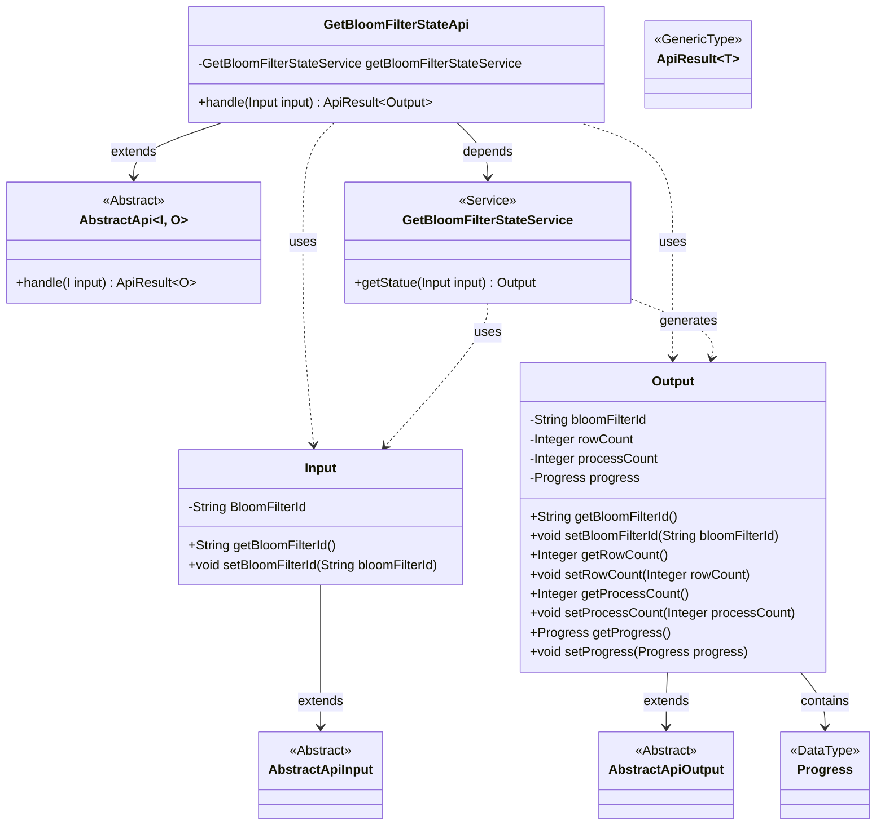
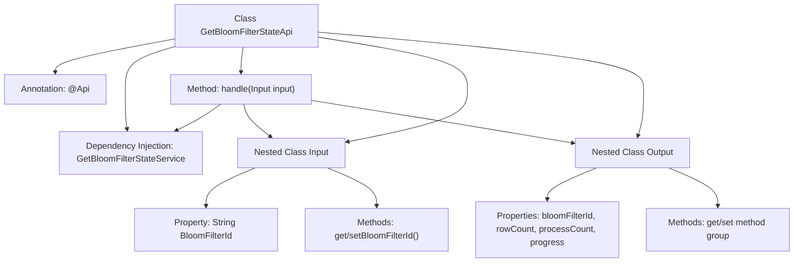

# Basic Information

|      |      |
|------|------|
| Name | GetBloomFilterStateApi |
| Language | .java |
| Code Path | WeFe/fusion/fusion-service/src/main/java/com/welab/wefe/data/fusion/service/api/bloomfilter/GetBloomFilterStateApi.java |
| Package Name | com.welab.wefe.data.fusion.service.api.bloomfilter |
| Dependencies | ['com.welab.wefe.common.exception.StatusCodeWithException', 'com.welab.wefe.common.fieldvalidate.annotation.Check', 'com.welab.wefe.common.web.api.base.AbstractApi', 'com.welab.wefe.common.web.api.base.Api', 'com.welab.wefe.common.web.dto.AbstractApiInput', 'com.welab.wefe.common.web.dto.AbstractApiOutput', 'com.welab.wefe.common.web.dto.ApiResult', 'com.welab.wefe.data.fusion.service.enums.Progress', 'com.welab.wefe.data.fusion.service.service.bloomfilter.GetBloomFilterStateService', 'org.springframework.beans.factory.annotation.Autowired', 'java.io.IOException'] |
| Brief Description | API for retrieving Bloom filter status. Login required. Input is the filter ID, output includes ID, number of rows, processed count, and progress. |

# Description

The code defines an API class named GetBloomFilterStateApi, which is used to retrieve the current state of a Bloom filter. The API path is `filter/get_state` and requires login access. Input parameters include the Bloom filter ID, and the output contains the filter ID, number of rows, processed count, and progress information. The request is handled by GetBloomFilterStateService, which returns the result.

# Class Summary

| Name   | Type  | Description |
|-------|------|-------------|
| GetBloomFilterStateApi | class | API for retrieving Bloom filter status. Requires login. Input the filter ID, returns ID, number of rows, processed count, and progress. |

## Class GetBloomFilterStateApi

|      |      |
|------|------|
| Access Modifier | @Api(path = "filter/get_state", name = "获取过滤器当前状态", desc = "获取过滤器当前状态", login = true);public |
| Type | class |
| Name | GetBloomFilterStateApi |
| Description | API for retrieving Bloom filter status. Requires login. Input the filter ID, returns ID, number of rows, processed count, and progress. |

### UML Class Diagram

This code describes a Bloom Filter status retrieval API implementation, encompassing input parameter processing, business logic invocation, and result encapsulation. The GetBloomFilterStateApi inherits from the generic abstract class AbstractApi and obtains status data through the GetBloomFilterStateService. The Input class extends AbstractApiInput and contains the Bloom Filter ID, while the Output class extends AbstractApiOutput and includes status information and a progress object. The overall structure demonstrates a typical API layered design pattern, comprising controller, service layer, and data transfer objects.

### Internal Method Call Graph

This flowchart illustrates the complete structure of the GetBloomFilterStateApi class, including API annotation markers, core service dependencies, and input/output data structures. The main class coordinates the processing flow through the handle method, invoking GetBloomFilterStateService to retrieve status. The Input class handles parameter validation, while the Output class encapsulates the returned Bloom filter state information (including ID, row count, processed count, and progress), forming a complete API request-response chain.

### Field List

| Name  | Type  | Description |
|-------|-------|------|
| getBloomFilterStateService | GetBloomFilterStateService | Automatically inject Bloom filter state service instances. |

### Method List

| Name  | Type  | Description |
|-------|-------|------|
| handle | ApiResult<Output> | Java method override, calling the service to retrieve the Bloom filter status and return a successful result. |

