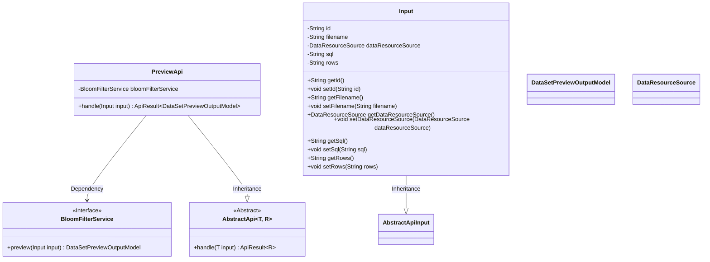

# Basic Information

|      |      |
|------|------|
| Name | PreviewApi |
| Language | .java |
| Code Path | WeFe/fusion/fusion-service/src/main/java/com/welab/wefe/data/fusion/service/api/bloomfilter/PreviewApi.java |
| Package Name | com.welab.wefe.data.fusion.service.api.bloomfilter |
| Dependencies | ['com.welab.wefe.common.fieldvalidate.annotation.Check', 'com.welab.wefe.common.web.api.base.AbstractApi', 'com.welab.wefe.common.web.api.base.Api', 'com.welab.wefe.common.web.dto.AbstractApiInput', 'com.welab.wefe.common.web.dto.ApiResult', 'com.welab.wefe.data.fusion.service.dto.entity.dataset.DataSetPreviewOutputModel', 'com.welab.wefe.data.fusion.service.enums.DataResourceSource', 'com.welab.wefe.data.fusion.service.service.bloomfilter.BloomFilterService', 'org.springframework.beans.factory.annotation.Autowired'] |
| Brief Description | Preview the uploaded filter source file API, which accepts data ID, file name, data source, SQL, and row count as input, processes them through BloomFilterService, and returns the preview results. |

# Description

The code defines an API class named PreviewApi, which is used to preview uploaded filter source files. It inherits from AbstractApi, accepts an Input class as the input parameter, and returns a result of type DataSetPreviewOutputModel. The Input class includes fields such as data ID, file name, data resource source, SQL statement, and row count, along with corresponding getter and setter methods. The API processes the input data through the preview method of BloomFilterService and returns a successful result.

# Class Summary

| Name   | Type  | Description |
|-------|------|-------------|
| PreviewApi | class | Preview the uploaded filter source file API, which takes inputs such as data ID, file name, and data source, and invokes the BloomFilterService to return the preview result. |

## Class PreviewApi

|      |      |
|------|------|
| Access Modifier | @Api(path = "filter/preview", name = "Preview the uploaded filter source file");public |
| Type | class |
| Name | PreviewApi |
| Description | Preview the uploaded filter source file API, which takes inputs such as data ID, file name, and data source, and invokes the BloomFilterService to return the preview result. |

### UML Class Diagram

This code illustrates the implementation structure of a preview API, where PreviewApi inherits from the generic abstract class AbstractApi, processes Input-type parameters, and returns DataSetPreviewOutputModel results. It relies on the BloomFilterService interface to perform data preview functionality, with Input as a nested class encapsulating parameters such as data ID, filename, and resource source. The class diagram clearly presents inheritance relationships and cross-class dependencies, demonstrating a design pattern that achieves unified API processing through abstract base classes.

### Internal Method Call Graph

```mermaid
graph TD
    A["Class PreviewApi"]
    B["Inheritance: AbstractApi<Input, DataSetPreviewOutputModel>"]
    C["Annotation: @Api(path='filter/preview', name='Preview the uploaded filter source file')"]
    D["Dependency Injection: @Autowired BloomFilterService"]
    E["Overridden Method: handle(Input input)"]
    F["Inner Class: Input"]
    G["Property: String id"]
    H["Property: String filename"]
    I["Property: DataResourceSource dataResourceSource"]
    J["Property: String sql"]
    K["Property: String rows"]
    L["getter/setter Method Group"]
    M["Invocation: bloomFilterService.preview(input)"]
    N["Return: ApiResult<DataSetPreviewOutputModel>"]

    A --> B
    A --> C
    A --> D
    A --> E
    E --> M --> N
    A --> F
    F --> G
    F --> H
    F --> I
    F --> J
    F --> K
    F --> L
```

This code flowchart illustrates the complete structure of the PreviewApi class, which is a REST API endpoint class inheriting from AbstractApi with a path-specific API annotation. The core functionality involves processing input parameters via bloomFilterService.preview(input) and returning preview results, where Input is an inner class containing multiple data fields and corresponding access methods. The flowchart clearly presents class inheritance, dependency injection, method overriding, and inner class structure, particularly highlighting the data flow path from request handling to service invocation.

### Field List

| Name  | Type  | Description |
|-------|-------|------|
| bloomFilterService | BloomFilterService | Using @Autowired to automatically inject an instance of BloomFilterService. |

### Method List

| Name  | Type  | Description |
|-------|-------|------|
| handle | ApiResult<DataSetPreviewOutputModel> | Process the input and return the preview result of the Bloom filter service. |

