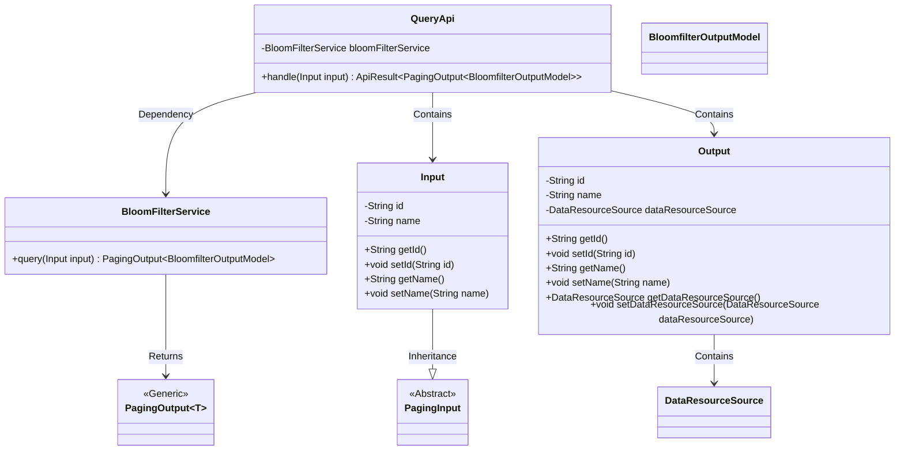

# Basic Information

|      |      |
|------|------|
| Name | QueryApi |
| Language | .java |
| Code Path | WeFe/fusion/fusion-service/src/main/java/com/welab/wefe/data/fusion/service/api/bloomfilter/QueryApi.java |
| Package Name | com.welab.wefe.data.fusion.service.api.bloomfilter |
| Dependencies | ['com.welab.wefe.common.fieldvalidate.annotation.Check', 'com.welab.wefe.common.web.api.base.AbstractApi', 'com.welab.wefe.common.web.api.base.Api', 'com.welab.wefe.common.web.dto.ApiResult', 'com.welab.wefe.data.fusion.service.dto.base.PagingInput', 'com.welab.wefe.data.fusion.service.dto.base.PagingOutput', 'com.welab.wefe.data.fusion.service.dto.entity.bloomfilter.BloomfilterOutputModel', 'com.welab.wefe.data.fusion.service.enums.DataResourceSource', 'com.welab.wefe.data.fusion.service.service.bloomfilter.BloomFilterService', 'org.springframework.beans.factory.annotation.Autowired'] |
| Brief Description | The QueryApi class is used to query the filter list, accepting pagination parameters and filter names, and returning pagination results along with filter information. |

# Description

This is a Java class named QueryApi, designed for querying filter lists. It extends AbstractApi, takes Input parameters, and returns paginated BloomfilterOutputModel results. The Input class includes id and name fields, with validation annotations on the name field. The Output class contains id, name, and dataResourceSource fields. This class processes query requests through BloomFilterService and returns successful results.

# Class Summary

| Name   | Type  | Description |
|-------|------|-------------|
| QueryApi | class | Query the filter list API, with input containing ID and name, output paginated results, and call BloomFilterService to handle the query. |

## Class QueryApi

|      |      |
|------|------|
| Access Modifier | @Api(path = "filter/query", name = "查询过滤器列表");public |
| Type | class |
| Name | QueryApi |
| Description | Query the filter list API, with input containing ID and name, output paginated results, and call BloomFilterService to handle the query. |

### UML Class Diagram

This code illustrates the class structure of a query filter list API. QueryApi inherits from AbstractApi to handle paginated query requests, relying on BloomFilterService for actual query operations. It includes two inner classes: Input (inheriting PagingInput for receiving query parameters) and Output (for encapsulating response data). The query method of BloomFilterService returns paginated results involving the generic class PagingOutput and model class BloomfilterOutputModel. The overall design reflects a layered architecture with clear responsibility separation.

### Internal Method Call Graph

```mermaid
graph TD
    A["Class QueryApi"]
    B["Annotation: @Api(path='filter/query', name='Query Filter List')"]
    C["Inheritance: AbstractApi<Input, PagingOutput<BloomfilterOutputModel>>"]
    D["Dependency Injection: @Autowired BloomFilterService"]
    E["Overridden Method: handle(Input input)"]
    F["Inner Class: Input"]
    G["Inner Class: Output"]
    H["Input Property: String id"]
    I["Input Property: @Check String name"]
    J["Input Method: getter/setter"]
    K["Output Property: String id"]
    L["Output Property: @Check String name"]
    M["Output Property: DataResourceSource"]
    N["Output Method: getter/setter"]

    A --> B
    A --> C
    A --> D
    A --> E
    A --> F
    A --> G
    F --> H
    F --> I
    F --> J
    G --> K
    G --> L
    G --> M
    G --> N
    E --> D
    E --> F
```

This code describes a Spring framework-based query API class QueryApi, which inherits from AbstractApi and handles paginated query requests. The flowchart illustrates the class structure relationships, including: 1) API annotation configuration at the class level; 2) Dependency injection of BloomFilterService; 3) Implementation logic of the core handler method handle(); 4) Definitions of two nested input and output classes Input and Output, where Input contains pagination parameters and filter conditions, and Output includes return data structures and resource source identifiers. The entire design follows a layered architecture pattern, with generic types specifying input and output type constraints.

### Field List

| Name  | Type  | Description |
|-------|-------|------|
| bloomFilterService | BloomFilterService | Using @Autowired to automatically inject an instance of BloomFilterService. |

### Method List

| Name  | Type  | Description |
|-------|-------|------|
| handle | ApiResult<PagingOutput<BloomfilterOutputModel>> | Java method override, calls bloomFilterService to query input and returns paginated results. |

