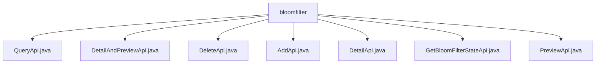

# Basic Information

|      |      |
|------|------|
| Name | bloomfilter |
| Language | .java |
| Code Path | WeFe/fusion/fusion-service/src/main/java/com/welab/wefe/data/fusion/service/api/bloomfilter |
| Package Name | docs.fusion.fusion-service.src.main.java.com.welab.wefe.data.fusion.service.api.bloomfilter |
| Brief Description | QueryApi query filter list, inherits AbstractApi, input includes id and name, outputs paginated results. DetailAndPreviewApi retrieves filter details and preview, requires id as input. DeleteApi deletes a filter, requires id and login. AddApi adds a filter, includes multi-field validation. DetailApi retrieves details, requires id and login. GetBloomFilterStateApi retrieves status, includes progress information. PreviewApi previews files, input includes data ID, etc. |

# Description

## Overview  
This module serves as the Bloom filter management API group, with its core responsibility being to provide CRUD operations and status query functionalities for filters, following a resource manager pattern. The interface specifications uniformly inherit from the AbstractApi base class, with input parameters often including mandatory ID fields, and outputs primarily being BloomfilterOutputModel or its variants. Key data structures include BloomfilterDetailOutputModel (containing details and preview data) and BloomfilterAddOutput (including data source ID), among others. External dependencies consist of the BloomFilterService series, such as DeleteApi relying on its deletion functionality. Implementation examples are abundant, such as AddApi involving complex field validations like file names and SQL scripts.  

## Primary Business Scenarios  
The module supports full lifecycle management: AddApi for creating filters (e.g., requiring dataset names and deduplication flags), QueryApi for paginated list queries, DetailApi for retrieving details, and DeleteApi for resource removal. Special scenarios include PreviewApi for previewing file content (requiring data IDs and SQL statements) and GetBloomFilterStateApi for monitoring processing progress. The interaction mode is consistently RESTful, such as DetailAndPreviewApi combining detail and preview functionalities. Typical applications involve filter configuration before data cleaning, enabling workflows through combined calls, such as Add followed by Query for validation.

### Package Internal Structure View

This flowchart illustrates the structure of 7 API files under the bloomfilter directory, where all Java files are directly subordinate to the bloomfilter node. It presents a peer-level relationship among Bloom Filter-related interfaces, including core functional interfaces such as query, detail preview, deletion, addition, detail retrieval, state retrieval, and preview.

# File List

| Name   | Type  | Description |
|-------|------|-------------|
| [QueryApi.java](QueryApi.md) | file | The QueryApi class is used to query the filter list, accepting pagination parameters and filter names, and returning pagination results along with filter information. |
| [DetailAndPreviewApi.java](DetailAndPreviewApi.md) | file | This is a filter details preview API class that retrieves Bloom filter details by ID, returning both the details and preview data. The input parameter is the data ID, and it uses BloomFilterService to process the request. |
| [DeleteApi.java](DeleteApi.md) | file | API class for deleting filters, requires login, calls BloomFilterService to delete the filter with the specified ID. The input parameter is a mandatory ID field. |
| [AddApi.java](AddApi.md) | file | API endpoint for adding a filter requires login. Input includes dataset name, description, file, etc., and outputs a data source ID. Name length must be 4-30 characters, description cannot exceed 3072 characters, and primary key is mandatory. |
| [DetailApi.java](DetailApi.md) | file | This is a filter detail API class with the path "filter/detail", requiring login. It inherits from AbstractApi, processes the input ID, and returns a BloomfilterOutputModel result. It uses BloomFilterService to retrieve details. The input class Input includes a mandatory field id. |
| [GetBloomFilterStateApi.java](GetBloomFilterStateApi.md) | file | API for retrieving Bloom filter status. Requires login. Input is the filter ID, and output includes ID, number of rows, processed count, and progress. |
| [PreviewApi.java](PreviewApi.md) | file | Preview the uploaded filter source file API, which receives data ID, file name, data source, SQL, and row count inputs, processes them through BloomFilterService, and returns the preview results. |

