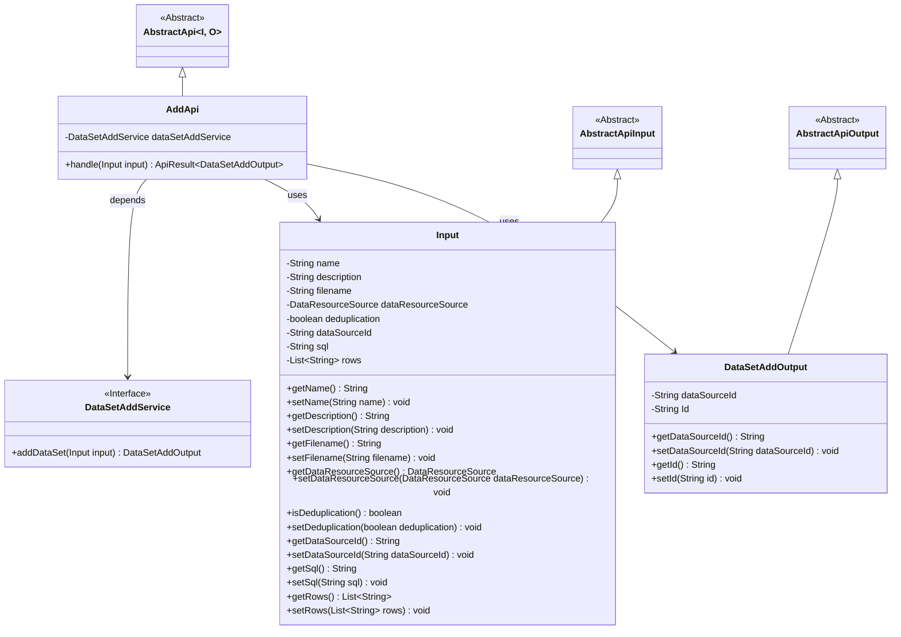

# Basic Information

|      |      |
|------|------|
| Name | AddApi |
| Language | .java |
| Code Path | WeFe/fusion/fusion-service/src/main/java/com/welab/wefe/data/fusion/service/api/dataset/AddApi.java |
| Package Name | com.welab.wefe.data.fusion.service.api.dataset |
| Dependencies | ['com.welab.wefe.common.fieldvalidate.annotation.Check', 'com.welab.wefe.common.web.api.base.AbstractApi', 'com.welab.wefe.common.web.api.base.Api', 'com.welab.wefe.common.web.dto.AbstractApiInput', 'com.welab.wefe.common.web.dto.AbstractApiOutput', 'com.welab.wefe.common.web.dto.ApiResult', 'com.welab.wefe.data.fusion.service.enums.DataResourceSource', 'com.welab.wefe.data.fusion.service.service.dataset.DataSetAddService', 'org.springframework.beans.factory.annotation.Autowired', 'java.util.List'] |
| Brief Description | API interface for adding datasets, including input parameters such as name, description, and files, returning the data source ID and dataset ID. Login is required. |

# Description

The code defines an API class named `AddApi` for adding datasets. The API path is `"data_set/add"` and requires login access. The input parameter `Input` includes the dataset name, description, filename, data source type, deduplication flag, data source ID, SQL script, and feature column list. The name is mandatory and must be 4-30 characters long, while the description has a maximum length of 3072 characters. The output parameter `DataSetAddOutput` contains the data source ID and the generated ID. The processing logic is implemented through the `dataSetAddService.addDataSet` method, which returns a success result.

# Class Summary

| Name   | Type  | Description |
|-------|------|-------------|
| AddApi | class | Add dataset API, requires login. Input includes name, description, file, data source, etc. Output contains data source ID and ID. Name must be 4-30 characters, description limited to 3072 characters. |

## Class AddApi

|      |      |
|------|------|
| Access Modifier | @Api(path = "data_set/add", name = "添加数据集", desc = "添加数据集", login = true);public |
| Type | class |
| Name | AddApi |
| Description | Add dataset API, requires login. Input includes name, description, file, data source, etc. Output contains data source ID and ID. Name must be 4-30 characters, description limited to 3072 characters. |

### UML Class Diagram

This code describes a dataset addition API class `AddApi`, which inherits from the generic abstract class `AbstractApi`, uses the `Input` class as input parameters, and `DataSetAddOutput` as output results. The `Input` class contains multiple validated fields such as dataset name, description, filename, etc.; `DataSetAddOutput` includes the data source ID and generated ID. `AddApi` implements core business logic through the dependency-injected `DataSetAddService` interface. The entire design adopts a layered structure and strict input validation mechanism.

### Internal Method Call Graph

```mermaid
graph TD
    A["Class AddApi"]
    B["Annotation: @Api"]
    C["Dependency Injection: DataSetAddService"]
    D["Method: handle(Input input)"]
    E["Inner Class: Input"]
    F["Inner Class: DataSetAddOutput"]
    G["Input Property: String name"]
    H["Input Property: String description"]
    I["Input Property: String filename"]
    J["Input Property: DataResourceSource dataResourceSource"]
    K["Input Property: boolean deduplication"]
    L["Input Property: String dataSourceId"]
    M["Input Property: String sql"]
    N["Input Property: List<String> rows"]
    O["Input Method: getter/setter"]
    P["DataSetAddOutput Property: String dataSourceId"]
    Q["DataSetAddOutput Property: String Id"]
    R["DataSetAddOutput Method: getter/setter"]

    A --> B
    A --> C
    A --> D
    A --> E
    A --> F
    E --> G
    E --> H
    E --> I
    E --> J
    E --> K
    E --> L
    E --> M
    E --> N
    E --> O
    F --> P
    F --> Q
    F --> R
    D --> C
```

This code represents an API class for adding datasets, containing input parameter validation and output result processing functionalities. The flowchart illustrates the overall structure of the AddApi class, including class annotations, service dependencies, core processing methods, and two inner classes Input and DataSetAddOutput. The Input class contains multiple properties with validation annotations and corresponding getter/setter methods for receiving parameters passed from the frontend. The DataSetAddOutput class defines the data structure returned by the API. The core handle method executes business logic processing by calling dataSetAddService.

### Field List

| Name  | Type  | Description |
|-------|-------|------|
| dataSetAddService | DataSetAddService | The code snippet uses the @Autowired annotation to automatically inject an instance of DataSetAddService. |

### Method List

| Name  | Type  | Description |
|-------|-------|------|
| handle | ApiResult<DataSetAddOutput> | The override method processes the input and returns the result of the dataset addition service. |

