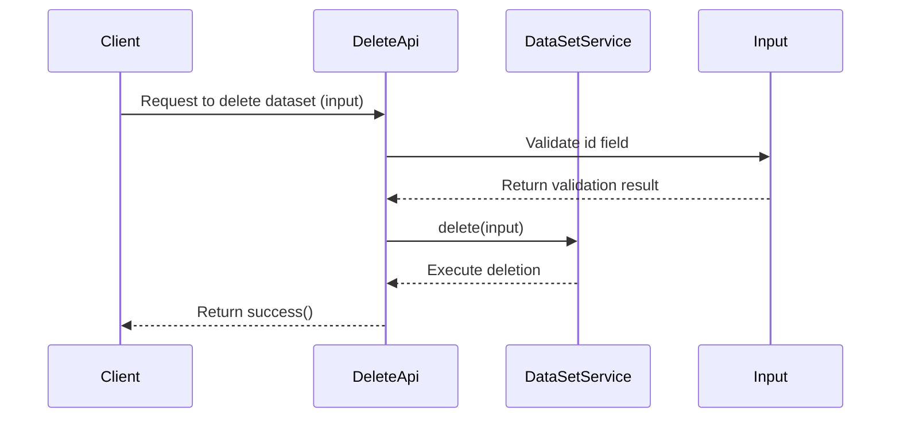

# Basic Information

|      |      |
|------|------|
| Name | DeleteApi |
| Language | .java |
| Code Path | WeFe/fusion/fusion-service/src/main/java/com/welab/wefe/data/fusion/service/api/dataset/DeleteApi.java |
| Package Name | com.welab.wefe.data.fusion.service.api.dataset |
| Dependencies | ['com.welab.wefe.common.fieldvalidate.annotation.Check', 'com.welab.wefe.common.web.api.base.AbstractNoneOutputApi', 'com.welab.wefe.common.web.api.base.Api', 'com.welab.wefe.common.web.dto.AbstractApiInput', 'com.welab.wefe.common.web.dto.ApiResult', 'com.welab.wefe.data.fusion.service.service.dataset.DataSetService', 'org.springframework.beans.factory.annotation.Autowired'] |
| Brief Description | Delete Dataset API, requires login, accepts the id parameter, and calls dataSetService to delete the data. |

# Description

This is a Java class named DeleteApi, designed to implement the functionality of deleting a dataset. The class extends AbstractNoneOutputApi with a generic parameter of the inner class Input. The @Api annotation defines the API path as "data_set/delete", the name as "Delete Dataset", and requires login authentication. The class injects the DataSetService and overrides the handler method to invoke the delete operation and return a success result. The inner class Input extends AbstractApiInput, containing a mandatory String-type id field along with its getter/setter methods, marked as a required field using the @Check annotation.

# Class Summary

| Name   | Type  | Description |
|-------|------|-------------|
| DeleteApi | class | API interface for deleting a dataset, requires login, accepts an id parameter, calls dataSetService to delete the data and returns a success result. |


## Class DeleteApi

|      |      |
|------|------|
| Access Modifier | @Api(path = "data_set/delete", name = "删除数据集", desc = "删除数据集", login = true);public |
| Type | class |
| Name | DeleteApi |
| Description | API interface for deleting a dataset, requires login, accepts an id parameter, calls dataSetService to delete the data and returns a success result. |


### UML Class Diagram

```mermaid
classDiagram
    class DeleteApi {
        -DataSetService dataSetService
        +handler(Input input) ApiResult
    }
    class AbstractNoneOutputApi~T~ {
        <<Abstract>>
        +handler(T input) ApiResult
    }
    class DataSetService {
        +delete(DeleteApi$Input input)
    }
    class DeleteApi$Input {
        -String id
        +String getId()
        +void setId(String id)
    }
    class AbstractApiInput {
        <<Abstract>>
    }
    class ApiResult {
    }

    DeleteApi --> AbstractNoneOutputApi~DeleteApi$Input~ : Inheritance
    DeleteApi --> DataSetService : Dependency
    DeleteApi$Input --> AbstractApiInput : Inheritance
    DeleteApi ..> DeleteApi$Input : Nested Class
    AbstractNoneOutputApi ..> ApiResult : Return Type
```

This code demonstrates a dataset deletion API implementation using a layered architecture design. The DeleteApi inherits from the generic abstract class AbstractNoneOutputApi, processes input objects containing ID parameters, and executes deletion operations via DataSetService. The Input class extends AbstractApiInput and includes data validation annotations, reflecting clear separation of responsibilities and type-safe design. The inter-class relationships encompass inheritance, dependency, and composition, forming a standard API processing workflow structure.


### Internal Method Call Graph

```mermaid
graph TD
    A["Class DeleteApi"]
    B["Annotation: @Api"]
    C["Inheritance: AbstractNoneOutputApi<Input>"]
    D["Dependency Injection: @Autowired DataSetService"]
    E["Overridden Method: handler(Input input)"]
    F["Inner Class: Input"]
    G["Field: String id"]
    H["Method: String getId()"]
    I["Method: void setId(String id)"]
    J["Invocation: dataSetService.delete(input)"]
    K["Return: success()"]

    A --> B
    A --> C
    A --> D
    A --> E
    E --> J
    E --> K
    A --> F
    F --> G
    F --> H
    F --> I
```





This code defines a dataset deletion API interface by extending an abstract class to implement a no-output-type API. The main workflow includes: after receiving a client request, validating the id field in input parameters, invoking the service layer to perform deletion, and finally returning a success result. The inner class Input encapsulates request parameters and implements field validation, reflecting layered design and parameter validation mechanisms.

### Field List

| Name  | Type  | Description |
|-------|-------|------|
| dataSetService | DataSetService | Using @Autowired to automatically inject an instance of DataSetService. |

### Method List

| Name  | Type  | Description |
|-------|-------|------|
| handler | ApiResult | This method overrides the parent class handler, invokes the dataSetService to delete the input data, and returns a successful result. |


