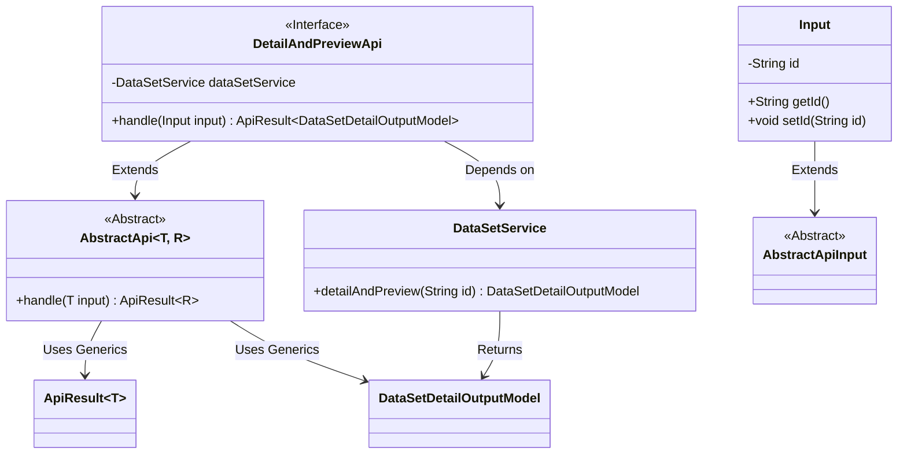

# Basic Information

|      |      |
|------|------|
| Name | DetailAndPreviewApi |
| Language | .java |
| Code Path | WeFe/fusion/fusion-service/src/main/java/com/welab/wefe/data/fusion/service/api/dataset/DetailAndPreviewApi.java |
| Package Name | com.welab.wefe.data.fusion.service.api.dataset |
| Dependencies | ['com.welab.wefe.common.fieldvalidate.annotation.Check', 'com.welab.wefe.common.web.api.base.AbstractApi', 'com.welab.wefe.common.web.api.base.Api', 'com.welab.wefe.common.web.dto.AbstractApiInput', 'com.welab.wefe.common.web.dto.ApiResult', 'com.welab.wefe.data.fusion.service.dto.entity.dataset.DataSetDetailOutputModel', 'com.welab.wefe.data.fusion.service.service.dataset.DataSetService', 'org.springframework.beans.factory.annotation.Autowired'] |
| Brief Description | This is an API class named "Filter Details Preview" with the path "data_set/detail_and_preview". It takes a data ID as input and returns the dataset details preview result. |

# Description

The code defines an API class named `DetailAndPreviewApi`, designed to handle dataset detail and preview requests. The class inherits from `AbstractApi`, specifying the input type as the inner class `Input` and the output type as `DataSetDetailOutputModel`. The `DataSetService` is injected via `Autowired`, and the `handle` method invokes the `detailAndPreview` method of `dataSetService` to process the request. The inner class `Input` contains a validated string-type `id` field, along with getter and setter methods. The API path is `"data_set/detail_and_preview"`, and its name is `"Filter Detail Preview"`.

# Class Summary

| Name   | Type  | Description |
|-------|------|-------------|
| DetailAndPreviewApi | class | This is an API class named "Filter Details Preview" that retrieves details and preview data by calling the dataset service with an input data ID, returning the dataset details output model. |

## Class DetailAndPreviewApi

|      |      |
|------|------|
| Access Modifier | @Api(path = "data_set/detail_and_preview", name = "过滤器详情预览", desc = "过滤器详情预览");public |
| Type | class |
| Name | DetailAndPreviewApi |
| Description | This is an API class named "Filter Details Preview" that retrieves details and preview data by calling the dataset service with an input data ID, returning the dataset details output model. |

### UML Class Diagram

This code illustrates a class structure for an API handling dataset detail previews. The DetailAndPreviewApi extends the generic abstract class AbstractApi and retrieves data details via DataSetService. The Input class, as an inner class, inherits from AbstractApiInput and contains a data ID field with accessor methods. The class diagram clearly depicts inheritance relationships, dependencies, and the use of generic parameters, reflecting a typical API service-layer design pattern in the Spring framework.

### Internal Method Call Graph

```mermaid
graph TD
    A["Class DetailAndPreviewApi"]
    B["Annotation: @Api"]
    C["Inheritance: AbstractApi<Input, DataSetDetailOutputModel>"]
    D["Dependency Injection: @Autowired DataSetService"]
    E["Overridden Method: handle(Input input)"]
    F["Inner Class: Input"]
    G["Field: String id"]
    H["Method: getId()"]
    I["Method: setId(String id)"]
    J["Invocation: dataSetService.detailAndPreview(input.getId())"]
    K["Return: success(result)"]

    A --> B
    A --> C
    A --> D
    A --> E
    E --> J
    J --> K
    A --> F
    F --> G
    F --> H
    F --> I
```

This flowchart illustrates the structure and workflow of the DetailAndPreviewApi class. The class defines an API path through the @Api annotation, inherits from AbstractApi, and injects the DataSetService. The core handle method calls dataSetService.detailAndPreview to retrieve data details and returns encapsulated results. The inner Input class contains an id field with getter/setter methods for parameter validation. The entire process clearly demonstrates the call chain from request handling to data response, reflecting the typical layered design pattern of Spring Boot APIs.

### Field List

| Name  | Type  | Description |
|-------|-------|------|
| dataSetService | DataSetService | Automatically inject the DataSetService instance. |

### Method List

| Name  | Type  | Description |
|-------|-------|------|
| handle | ApiResult<DataSetDetailOutputModel> | This method overrides the parent class logic, invokes the service to retrieve dataset details and preview, and returns a successful result. The input is an ID, and the output is a dataset detail model. |

