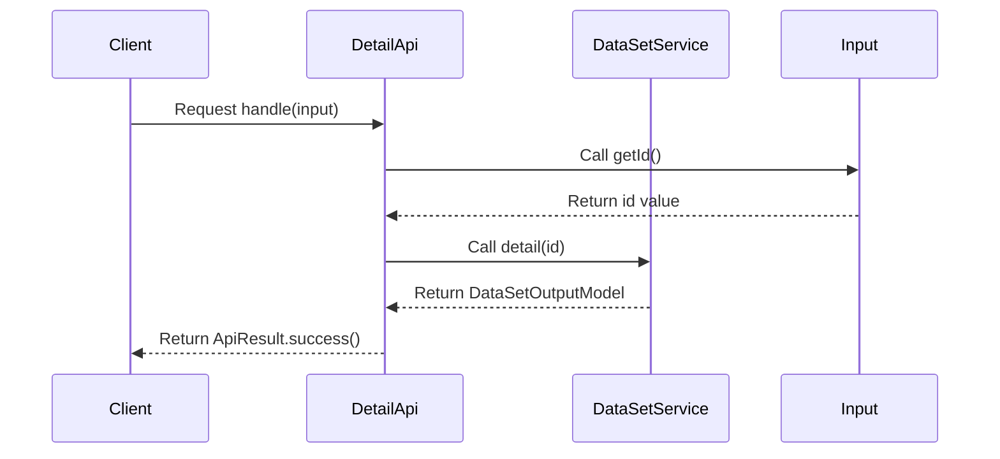

# Basic Information

|      |      |
|------|------|
| Name | DetailApi |
| Language | .java |
| Code Path | WeFe/fusion/fusion-service/src/main/java/com/welab/wefe/data/fusion/service/api/dataset/DetailApi.java |
| Package Name | com.welab.wefe.data.fusion.service.api.dataset |
| Dependencies | ['com.welab.wefe.common.fieldvalidate.annotation.Check', 'com.welab.wefe.common.web.api.base.AbstractApi', 'com.welab.wefe.common.web.api.base.Api', 'com.welab.wefe.common.web.dto.AbstractApiInput', 'com.welab.wefe.common.web.dto.ApiResult', 'com.welab.wefe.data.fusion.service.dto.entity.dataset.DataSetOutputModel', 'com.welab.wefe.data.fusion.service.service.dataset.DataSetService', 'org.springframework.beans.factory.annotation.Autowired'] |
| Brief Description | This is an API class named "Filter Details" with the path "data_set/detail", requiring login. It inherits from AbstractApi, accepts an Input class containing the mandatory id parameter, calls the detail method of dataSetService, and returns a DataSetOutputModel result. |

# Description

The code defines an API class named `DetailApi` for handling dataset detail requests. The API path is `"data_set/detail"` and requires login access. The class inherits from `AbstractApi`, using generics to specify the input type as `DetailApi.Input` and the output type as `DataSetOutputModel`. The `DataSetService` is injected via `Autowired`. The core processing method `handle` calls `dataSetService.detail` to retrieve detail data. The input class `Input` extends `AbstractApiInput` and includes a required field `id` along with its getter/setter methods. The entire API implements the dataset detail query functionality.

# Class Summary

| Name   | Type  | Description |
|-------|------|-------------|
| DetailApi | class | This is an API class named "Filter Details" with the path "data_set/detail", requiring login. It accepts input containing the mandatory id parameter, calls the detail method of dataSetService, and returns dataset details. |


## Class DetailApi

|      |      |
|------|------|
| Access Modifier | @Api(path = "data_set/detail", name = "过滤器详情", desc = "过滤器详情", login = true);public |
| Type | class |
| Name | DetailApi |
| Description | This is an API class named "Filter Details" with the path "data_set/detail", requiring login. It accepts input containing the mandatory id parameter, calls the detail method of dataSetService, and returns dataset details. |


### UML Class Diagram

```mermaid
classDiagram
    class DetailApi {
        -DataSetService dataSetService
        +handle(Input input) ApiResult~DataSetOutputModel~
    }
    DetailApi --> DataSetService : Dependency
    DetailApi --> AbstractApi~Input,DataSetOutputModel~ : Inheritance
    DetailApi --> Input : Composition

    class AbstractApi~I~O~ {
        <<Abstract>>
        +handle(I input) ApiResult~O~
    }

    class DataSetService {
        +detail(String id) DataSetOutputModel
    }

    class Input {
        -String id
        +String getId()
        +void setId(String id)
    }
    Input --> AbstractApiInput : Inheritance

    class AbstractApiInput {
        <<Abstract>>
    }
```

This code illustrates a DetailApi class that inherits from the generic abstract class AbstractApi to handle dataset detail requests. DetailApi contains an inner class Input for parameter reception and depends on DataSetService to retrieve data details. The class diagram clearly depicts inheritance relationships (DetailApi→AbstractApi, Input→AbstractApiInput), composition (DetailApi contains Input), and dependency (DetailApi uses DataSetService). The overall design adheres to a layered architecture, achieving excellent extensibility through generics and abstract classes.


### Internal Method Call Graph

```mermaid
graph TD
    A["Class DetailApi"]
    B["Annotation: @Api"]
    C["Inheritance: AbstractApi<Input, DataSetOutputModel>"]
    D["Dependency Injection: @Autowired DataSetService"]
    E["Overridden Method: handle(Input input)"]
    F["Static Inner Class: Input"]
    G["Field: @Check String id"]
    H["Method: getId()"]
    I["Method: setId(String id)"]
    J["Invocation: dataSetService.detail(input.getId())"]
    K["Return: ApiResult.success()"]

    A --> B
    A --> C
    A --> D
    A --> E
    E --> J
    J --> K
    A --> F
    F --> G
    F --> H
    F --> I
```





This code represents a Spring framework-based API controller class DetailApi, which inherits from AbstractApi and handles dataset detail query requests. The @Api annotation defines the API path and metadata, while @Autowired injects the DataSetService. The core logic resides in the handle method, where the service layer is called with the id from the Input parameter to retrieve detail data, ultimately returning a packaged ApiResult. The Input static inner class contains the id field with validation annotations and corresponding getter/setter methods. The flowchart illustrates the class structure and invocation relationships, while the sequence diagram depicts the request processing flow.

### Field List

| Name  | Type  | Description |
|-------|-------|------|
| dataSetService | DataSetService | Automatically inject the dataset service instance. |

### Method List

| Name  | Type  | Description |
|-------|-------|------|
| handle | ApiResult<DataSetOutputModel> | Method override, call dataSetService.detail to retrieve the data details of the input ID, and return a successful result. |


