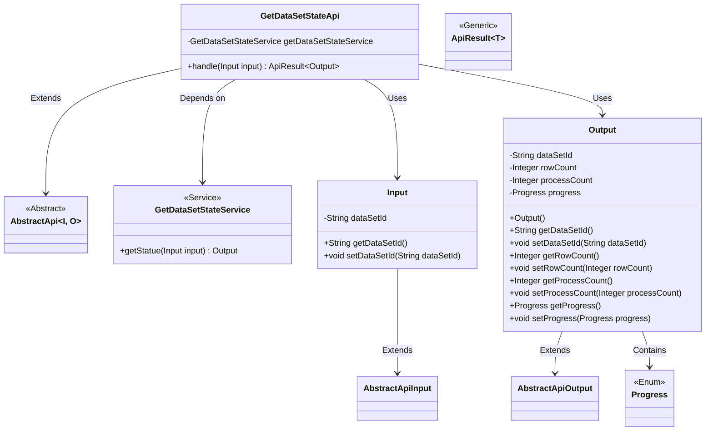
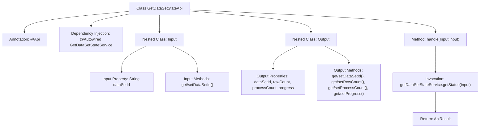

# Basic Information

|      |      |
|------|------|
| Name | GetDataSetStateApi |
| Language | .java |
| Code Path | WeFe/fusion/fusion-service/src/main/java/com/welab/wefe/data/fusion/service/api/dataset/GetDataSetStateApi.java |
| Package Name | com.welab.wefe.data.fusion.service.api.dataset |
| Dependencies | ['com.welab.wefe.common.exception.StatusCodeWithException', 'com.welab.wefe.common.fieldvalidate.annotation.Check', 'com.welab.wefe.common.web.api.base.AbstractApi', 'com.welab.wefe.common.web.api.base.Api', 'com.welab.wefe.common.web.dto.AbstractApiInput', 'com.welab.wefe.common.web.dto.AbstractApiOutput', 'com.welab.wefe.common.web.dto.ApiResult', 'com.welab.wefe.data.fusion.service.enums.Progress', 'com.welab.wefe.data.fusion.service.service.dataset.GetDataSetStateService', 'org.springframework.beans.factory.annotation.Autowired', 'java.io.IOException'] |
| Brief Description | API interface for retrieving dataset status. Requires login, accepts data source ID as input, and returns row count, processed count, and progress. |

# Description

This is an API interface named "Get Dataset Current State", with the path "data_set/get_state", which requires login to access. The API accepts input parameters containing the dataset ID, retrieves the dataset state information through the GetDataSetStateService, and returns an output result that includes details such as the dataset ID, row count, processed count, and progress. The input class Input defines the data source ID field along with its getter/setter methods, while the output class Output defines fields for dataset ID, row count, processed count, and progress, along with their corresponding getter/setter methods.

# Class Summary

| Name   | Type  | Description |
|-------|------|-------------|
| GetDataSetStateApi | class | API for retrieving dataset status. Requires login. Input the data source ID, returns dataset ID, row count, processed count, and progress. |

## Class GetDataSetStateApi

|      |      |
|------|------|
| Access Modifier | @Api(path = "data_set/get_state", name = "获取数据集当前状态", desc = "获取数据集当前状态", login = true);public |
| Type | class |
| Name | GetDataSetStateApi |
| Description | API for retrieving dataset status. Requires login. Input the data source ID, returns dataset ID, row count, processed count, and progress. |

### UML Class Diagram

This code describes the implementation of an API interface for retrieving dataset status. GetDataSetStateApi inherits from the generic abstract class AbstractApi, using Input as the parameter type and Output as the result type. The API fetches dataset status via the GetDataSetStateService, where Input contains the dataset ID field, and Output encapsulates status information such as dataset ID, row count, processed count, and progress. The class diagram clearly illustrates inheritance, dependency, and containment relationships among components, reflecting a layered architecture design.

### Internal Method Call Graph

This flowchart illustrates the complete structure of the GetDataSetStateApi class, including API annotations, service injection, and core processing methods. The class inherits from AbstractApi and defines two nested classes Input/Output. Input receives dataset ID parameters, while Output contains dataset status information. The handle method retrieves status via getDataSetStateService and returns encapsulated results, demonstrating a complete call chain from parameter validation to business processing.

### Field List

| Name  | Type  | Description |
|-------|-------|------|
| getDataSetStateService | GetDataSetStateService | Using @Autowired to automatically inject an instance of GetDataSetStateService. |

### Method List

| Name  | Type  | Description |
|-------|-------|------|
| handle | ApiResult<Output> | Java method override, calling getDataSetStateService.getStatue to process the input and return a successful result, may throw StatusCodeWithException and IOException. |

