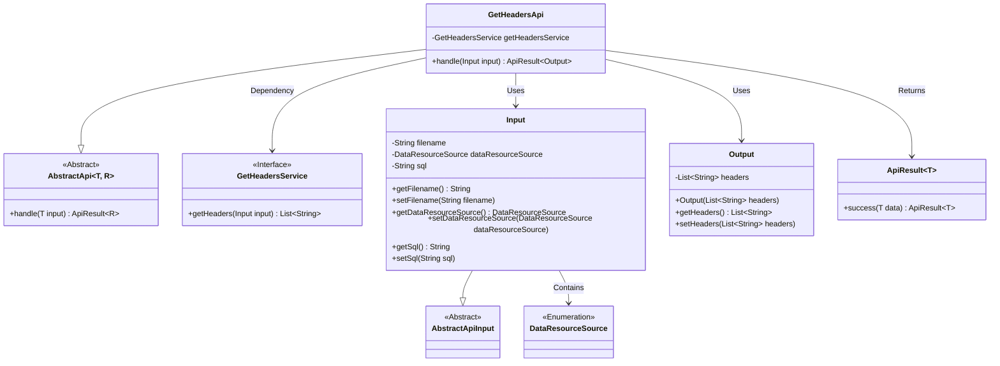
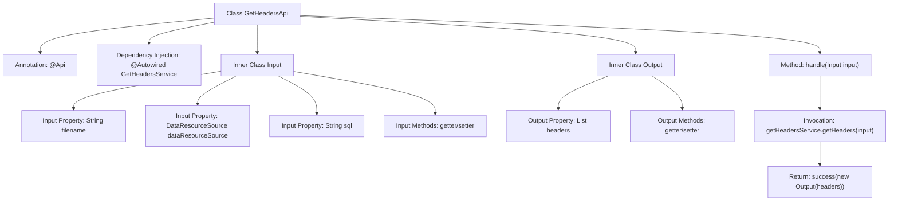

# Basic Information

|      |      |
|------|------|
| Name | GetHeadersApi |
| Language | .java |
| Code Path | WeFe/fusion/fusion-service/src/main/java/com/welab/wefe/data/fusion/service/api/dataset/GetHeadersApi.java |
| Package Name | com.welab.wefe.data.fusion.service.api.dataset |
| Dependencies | ['com.welab.wefe.common.exception.StatusCodeWithException', 'com.welab.wefe.common.fieldvalidate.annotation.Check', 'com.welab.wefe.common.web.api.base.AbstractApi', 'com.welab.wefe.common.web.api.base.Api', 'com.welab.wefe.common.web.dto.AbstractApiInput', 'com.welab.wefe.common.web.dto.ApiResult', 'com.welab.wefe.data.fusion.service.enums.DataResourceSource', 'com.welab.wefe.data.fusion.service.service.GetHeadersService', 'org.springframework.beans.factory.annotation.Autowired', 'java.util.List'] |
| Brief Description | The GetHeadersApi interface is used to retrieve the feature fields of a dataset. The input must include the file name, data source, and SQL script, and the output is a list of fields. |

# Description

The code defines an API class named `GetHeadersApi`, which is used to retrieve the feature fields of a dataset. The API path is `data_set/get_headers`, and its functional description is to add a dataset and obtain its feature fields. The class inherits from `AbstractApi` and includes two inner classes, `Input` and `Output`. The `Input` class contains required fields `filename`, `dataResourceSource`, and an optional field `sql`, with non-null validation applied. The `Output` class includes a `headers` list. The API processes the input via `GetHeadersService` and returns a list of feature fields.

# Class Summary

| Name   | Type  | Description |
|-------|------|-------------|
| GetHeadersApi | class | This API is used to retrieve dataset feature fields, accepting a file name, data source, and SQL script as inputs, and returning a list of fields. The request is processed by the GetHeadersService, which then returns the result. |

## Class GetHeadersApi

|      |      |
|------|------|
| Access Modifier | @Api(path = "data_set/get_headers", name = "添加数据集", desc = "获取特征字段");public |
| Type | class |
| Name | GetHeadersApi |
| Description | This API is used to retrieve dataset feature fields, accepting a file name, data source, and SQL script as inputs, and returning a list of fields. The request is processed by the GetHeadersService, which then returns the result. |

### UML Class Diagram

This code describes an API implementation for retrieving dataset feature fields. The core class GetHeadersApi inherits from the generic abstract class AbstractApi and utilizes the GetHeadersService to handle business logic. The input parameter Input inherits from AbstractApiInput and contains three validated fields: filename, data source type, and SQL script. The output result Output encapsulates the returned header list. The class diagram clearly illustrates inheritance, dependency, and usage relationships between components, demonstrating a typical API layered design pattern.

### Internal Method Call Graph

This code represents a Spring Framework-based API controller class designed to retrieve dataset feature fields. The flowchart illustrates class structure relationships: GetHeadersApi defines API paths through annotations, depends on GetHeadersService for business logic processing, and contains two inner classes (Input and Output) encapsulating request parameters and response data respectively. The core workflow involves the handle method calling the service layer to obtain header information, ultimately returning encapsulated results. Input parameters include filename, data source type, and SQL script, while the output consists of a header list. The entire process follows standard API design patterns.

### Field List

| Name  | Type  | Description |
|-------|-------|------|
| getHeadersService | GetHeadersService | Use @Autowired to automatically inject an instance of GetHeadersService. |

### Method List

| Name  | Type  | Description |
|-------|-------|------|
| handle | ApiResult<Output> | Rewrite the handle method, call getHeadersService to retrieve headers and encapsulate them as Output to return a successful result. |

