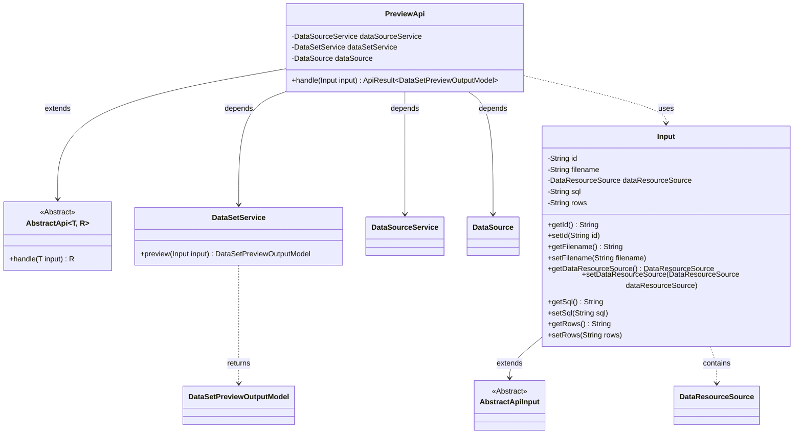

# Basic Information

|      |      |
|------|------|
| Name | PreviewApi |
| Language | .java |
| Code Path | WeFe/fusion/fusion-service/src/main/java/com/welab/wefe/data/fusion/service/api/dataset/PreviewApi.java |
| Package Name | com.welab.wefe.data.fusion.service.api.dataset |
| Dependencies | ['com.welab.wefe.common.fieldvalidate.annotation.Check', 'com.welab.wefe.common.web.api.base.AbstractApi', 'com.welab.wefe.common.web.api.base.Api', 'com.welab.wefe.common.web.dto.AbstractApiInput', 'com.welab.wefe.common.web.dto.ApiResult', 'com.welab.wefe.data.fusion.service.dto.entity.dataset.DataSetPreviewOutputModel', 'com.welab.wefe.data.fusion.service.enums.DataResourceSource', 'com.welab.wefe.data.fusion.service.service.DataSourceService', 'com.welab.wefe.data.fusion.service.service.dataset.DataSetService', 'org.springframework.beans.factory.annotation.Autowired', 'javax.sql.DataSource'] |
| Brief Description | The PreviewApi is used to preview dataset files. It takes inputs including data ID, file name, data source, SQL, and row count, processes them by calling the service, and returns the preview results. |

# Description

This is an API class designed for previewing dataset files, located at the path "data_set/preview". It inherits from AbstractApi, with the input type being PreviewApi.Input and the output type being DataSetPreviewOutputModel. The class injects three services: DataSourceService, DataSetService, and DataSource. The core processing logic resides in the handle method, which calls the dataSetService.preview method to process the input and return the result. The input class Input contains five fields: data ID, file name, data source origin, SQL statement, and row count, each with corresponding getter and setter methods.

# Class Summary

| Name   | Type  | Description |
|-------|------|-------------|
| PreviewApi | class | The PreviewApi class is used to preview dataset files, inheriting from AbstractApi. It processes input parameters such as data ID, file name, data source, etc., and invokes the dataSetService.preview method to return results. |

## Class PreviewApi

|      |      |
|------|------|
| Access Modifier | @Api(path = "data_set/preview", name = "Preview the dataset file");public |
| Type | class |
| Name | PreviewApi |
| Description | The PreviewApi class is used to preview dataset files, inheriting from AbstractApi. It processes input parameters such as data ID, file name, data source, etc., and invokes the dataSetService.preview method to return results. |

### UML Class Diagram

This code demonstrates the implementation structure of a dataset preview API. PreviewApi inherits from the generic abstract class AbstractApi, processes Input parameters, and returns DataSetPreviewOutputModel results. The core functionality is achieved through dependency-injected DataSetService for data preview, while the Input class encapsulates parameters including data ID, filename, and resource source. The class diagram clearly presents inheritance relationships, dependency injection, and service invocation chains, reflecting a typical layered architecture design pattern under the Spring framework.

### Internal Method Call Graph

```mermaid
graph TD
    A["Class PreviewApi"]
    B["Annotation: @Api(path='data_set/preview', name='Preview the dataset file')"]
    C["Inheritance: AbstractApi<Input, DataSetPreviewOutputModel>"]
    D["Dependency Injection: @Autowired DataSourceService"]
    E["Dependency Injection: @Autowired DataSetService"]
    F["Dependency Injection: @Autowired DataSource"]
    G["Overridden Method: handle(Input input)"]
    H["Inner Class: Input extends AbstractApiInput"]
    I["Property: String id"]
    J["Property: String filename"]
    K["Property: DataResourceSource dataResourceSource"]
    L["Property: String sql"]
    M["Property: String rows"]
    N["Getter/Setter Methods"]

    A --> B
    A --> C
    A --> D
    A --> E
    A --> F
    A --> G
    A --> H
    H --> I
    H --> J
    H --> K
    H --> L
    H --> M
    H --> N
    G -->|Calls| E["dataSetService.preview(input)"]
    G -->|Returns| C["ApiResult<DataSetPreviewOutputModel>"]
```

This code defines an API class PreviewApi for previewing dataset files, which inherits from AbstractApi and implements the handle method. The class includes three auto-injected service components and a static inner class Input as the input parameter. The Input class inherits from AbstractApiInput and contains five properties with corresponding getter/setter methods. The handle method calls the preview method of dataSetService to process the input parameters and returns the encapsulated result. The entire structure clearly illustrates the API request processing flow and parameter structure.

### Field List

| Name  | Type  | Description |
|-------|-------|------|
| dataSetService | DataSetService | The code snippet uses the @Autowired annotation to automatically inject an instance of DataSetService. |
| dataSourceService | DataSourceService | Automatically inject the DataSourceService instance. |
| dataSource | DataSource | Automatically inject protected data source objects. |

### Method List

| Name  | Type  | Description |
|-------|-------|------|
| handle | ApiResult<DataSetPreviewOutputModel> | Java method override, calling dataSetService.preview to process the input and return a successful result. |

