# Basic Information

|      |      |
|------|------|
| Name | QueryApi |
| Language | .java |
| Code Path | WeFe/fusion/fusion-service/src/main/java/com/welab/wefe/data/fusion/service/api/dataset/QueryApi.java |
| Package Name | com.welab.wefe.data.fusion.service.api.dataset |
| Dependencies | ['com.welab.wefe.common.fieldvalidate.annotation.Check', 'com.welab.wefe.common.web.api.base.AbstractApi', 'com.welab.wefe.common.web.api.base.Api', 'com.welab.wefe.common.web.dto.ApiResult', 'com.welab.wefe.data.fusion.service.dto.base.PagingInput', 'com.welab.wefe.data.fusion.service.dto.base.PagingOutput', 'com.welab.wefe.data.fusion.service.dto.entity.dataset.DataSetOutputModel', 'com.welab.wefe.data.fusion.service.enums.DataResourceSource', 'com.welab.wefe.data.fusion.service.service.dataset.DataSetService', 'org.springframework.beans.factory.annotation.Autowired'] |
| Brief Description | Query Dataset List API, which accepts pagination parameters along with IDs or names, and returns paginated dataset results including IDs, names, and data sources. |

# Description

This is a Java class named QueryApi, designed for querying dataset lists. It inherits from AbstractApi, accepts an Input parameter, and returns paginated DataSetOutputModel results. The Input class includes two fields: id and name, with the name field having validation annotations. The Output class contains id, name, and dataResourceSource fields, where the name field also has validation annotations. The query operation is executed through the injected DataSetService, and the processed results are returned. The entire API path is "data_set/query".

# Class Summary

| Name   | Type  | Description |
|-------|------|-------------|
| QueryApi | class | Query dataset list API, which accepts pagination parameters and ID, name as input, and returns paginated results containing ID, name, and data source. |


## Class QueryApi

|      |      |
|------|------|
| Access Modifier | @Api(path = "data_set/query", name = "查询数据集列表");public |
| Type | class |
| Name | QueryApi |
| Description | Query dataset list API, which accepts pagination parameters and ID, name as input, and returns paginated results containing ID, name, and data source. |


### UML Class Diagram

```mermaid
classDiagram
    class QueryApi {
        -DataSetService dataSetService
        +handle(Input input) ApiResult~PagingOutput~DataSetOutputModel~~
    }
    class Input {
        -String id
        -String name
        +String getId()
        +void setId(String id)
        +String getName()
        +void setName(String name)
    }
    class Output {
        -String id
        -String name
        -DataResourceSource dataResourceSource
        +String getId()
        +void setId(String id)
        +String getName()
        +void setName(String name)
        +DataResourceSource getDataResourceSource()
        +void setDataResourceSource(DataResourceSource dataResourceSource)
    }
    class PagingInput {
        <<Abstract>>
    }
    class AbstractApi~T, R~ {
        <<Abstract>>
    }
    class DataSetService {
        <<Interface>>
        +query(Input input) PagingOutput~DataSetOutputModel~
    }
    class PagingOutput~T~ {
        <<GenericType>>
    }
    class DataSetOutputModel {
        <<Model>>
    }
    class DataResourceSource {
        <<Enum>>
    }

    QueryApi --> DataSetService : Dependency
    QueryApi --|> AbstractApi~Input, PagingOutput~DataSetOutputModel~~
    Input --|> PagingInput
    AbstractApi~T, R~ <|-- QueryApi : Implements
    DataSetService ..|> QueryApi : Implements
```

This code implements an API interface for querying dataset lists, primarily consisting of the QueryApi class and its nested Input and Output classes. QueryApi inherits from the generic abstract class AbstractApi and relies on the DataSetService interface for data queries. The Input class inherits from PagingInput for pagination query parameters, while the Output class contains basic dataset information and data source types. The overall structure reflects a layered design philosophy, achieving code reuse through generics and inheritance.


### Internal Method Call Graph

```mermaid
graph TD
    A["Class QueryApi"]
    B["Annotation: @Api(path='data_set/query', name='Query Dataset List')"]
    C["Inheritance: AbstractApi<Input, PagingOutput<DataSetOutputModel>>"]
    D["Dependency Injection: @Autowired DataSetService"]
    E["Overridden Method: handle(Input input)"]
    F["Inner Class: Input extends PagingInput"]
    G["Inner Class: Output"]
    H["Input Property: String id"]
    I["Input Property: @Check String name"]
    J["Input Method: getter/setter"]
    K["Output Property: String id"]
    L["Output Property: @Check String name"]
    M["Output Property: DataResourceSource"]
    N["Output Method: getter/setter"]
    O["Call Chain: handle --> dataSetService.query"]

    A --> B
    A --> C
    A --> D
    A --> E
    A --> F
    A --> G
    F --> H
    F --> I
    F --> J
    G --> K
    G --> L
    G --> M
    G --> N
    E --> O
```



This flowchart illustrates the complete structure of the QueryApi class, including API annotations, parent class inheritance, service injection, and the detailed composition of two inner classes. The core processing flow involves invoking dataSetService.query through the handle method to complete dataset queries. The Input class inherits pagination parameters and extends ID and name fields, while the Output class defines the structure of returned data. All properties are equipped with standard getter/setter methods, with key fields annotated for parameter validation.

### Field List

| Name  | Type  | Description |
|-------|-------|------|
| dataSetService | DataSetService | Automatically inject the DataSetService instance. |

### Method List

| Name  | Type  | Description |
|-------|-------|------|
| handle | ApiResult<PagingOutput<DataSetOutputModel>> | Process the input and return the dataset query results, invoking the dataSetService.query method upon success. |


