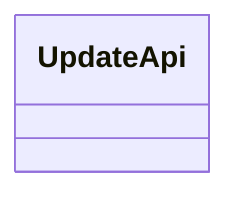
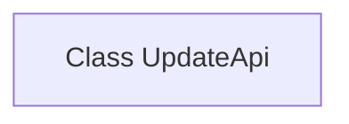

# Basic Information

|      |      |
|------|------|
| Name | UpdateApi |
| Language | .java |
| Code Path | WeFe/fusion/fusion-service/src/main/java/com/welab/wefe/data/fusion/service/api/dataset/UpdateApi.java |
| Package Name | com.welab.wefe.data.fusion.service.api.dataset |
| Dependencies | [] |
| Brief Description | Class definition: UpdateApi, functionality not specified. |

# Description

This is a public class definition named UpdateApi, currently implemented as empty without any member variables or methods. This class may be used to build functional modules related to API updates, serving as foundational infrastructure for future extensions. Based on naming conventions, its purpose likely involves encapsulating interfaces for system or service update operations. Since the class definition is empty, specific functionalities will need to be clarified through subsequent member implementations.

# Class Summary

| Name   | Type  | Description |
|-------|------|-------------|
| UpdateApi | class | This is a public class named UpdateApi, used to define the API interface for update operations. |

## Class UpdateApi

|      |      |
|------|------|
| Access Modifier | public |
| Type | class |
| Name | UpdateApi |
| Description | This is a public class named UpdateApi, used to define the API interface for update operations. |

### UML Class Diagram

This class diagram depicts an empty class named UpdateApi, which currently defines no member variables or methods. As a potential entry point for API update-related functionalities, this class may later incorporate core methods such as version control, update checks, or patch applications. Its current minimalist structure provides a foundational framework for future feature expansion, aligning with the open-closed principle of design.

### Internal Method Call Graph

This flowchart depicts an empty class structure named UpdateApi. Since the class doesn't define any attributes or methods, the diagram only contains a single node representing the class itself. Such basic structure typically serves as a starting point for API update operations, where features like version control or request processing can be added later. The empty class design might be used to reserve interfaces or serve as a parent class for subclasses to implement specific functionalities.

### Field List

| Name  | Type  | Description |
|-------|-------|------|

### Method List

| Name  | Type  | Description |
|-------|-------|------|

