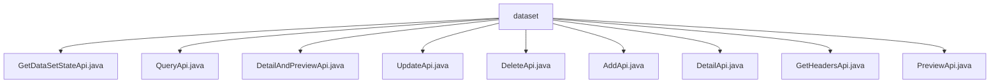

# Basic Information

|      |      |
|------|------|
| Name | dataset |
| Language | .java |
| Code Path | WeFe/fusion/fusion-service/src/main/java/com/welab/wefe/data/fusion/service/api/dataset |
| Package Name | docs.fusion.fusion-service.src.main.java.com.welab.wefe.data.fusion.service.api.dataset |
| Brief Description | A collection of API interfaces for obtaining dataset status, querying lists, detail previews, updates, deletions, additions, fetching details, feature fields, and preview files. All require login access and include input/output definitions and service invocation logic. |

# Description

## Overview  
The core responsibility of this module is to provide APIs for the full lifecycle management of datasets, including status querying, CRUD operations, and metadata retrieval. The interface specifications adhere to the RESTful style, uniformly inherit from the AbstractApi base class, and use the path prefix "data_set/", all requiring login authentication. Key data structures include the Input class (with fields such as ID), the OutputModel class (with fields like ID/name/data source), and paginated result sets. External dependencies primarily include internal services such as DataSetService. For example, the GetHeadersApi processes feature field requests via GetHeadersService, while the DeleteApi invokes DataSetService to perform deletion operations.

## Main Business Scenarios  
The module supports dataset CRUD operations and status monitoring, resembling a data middle platform model. Typical workflows include: creating datasets via AddApi (validating name/description, etc.), querying paginated lists with QueryApi, and viewing details with DetailApi. The interaction mode is exclusively request-response, such as PreviewApi receiving file parameters and returning preview data. API types encompass query-based (e.g., GetStateApi), operation-based (e.g., DeleteApi), and composite APIs (e.g., DetailAndPreviewApi). For instance, GetHeadersApi parses fields by combining SQL scripts, while UpdateApi reserves extension interfaces.

### Package Internal Structure View

This flowchart illustrates the hierarchical structure of the dataset API module, with the root node being the dataset folder containing 9 Java API files. These files handle various dataset operations such as querying, updating, deleting, previewing, etc. All files are directly subordinate to the dataset directory without intermediate subdirectory levels, forming a flat structure.

# File List

| Name   | Type  | Description |
|-------|------|-------------|
| [GetDataSetStateApi.java](GetDataSetStateApi.md) | file | API interface for retrieving dataset status. Requires login, accepts data source ID as input, and returns row count, processed count, and progress. |
| [QueryApi.java](QueryApi.md) | file | Query dataset list API, which accepts pagination parameters along with ID or name, and returns paginated dataset results including ID, name, and data source. |
| [DetailAndPreviewApi.java](DetailAndPreviewApi.md) | file | This is an API class named "Filter Details Preview" with the path "data_set/detail_and_preview". It takes a data ID as input and returns the dataset details preview result. |
| [UpdateApi.java](UpdateApi.md) | file | Class definition: UpdateApi, functionality not specified. |
| [DeleteApi.java](DeleteApi.md) | file | Delete Dataset API, requires login, accepts id parameter, calls dataSetService to delete data. |
| [AddApi.java](AddApi.md) | file | API interface for adding datasets, including input parameters such as name, description, and files, returning the data source ID and dataset ID. Login is required. |
| [DetailApi.java](DetailApi.md) | file | This is an API class named "Filter Details" with the path "data_set/detail", which requires login. It inherits from AbstractApi, accepts an Input class containing the mandatory id parameter, calls the detail method of dataSetService, and returns a DataSetOutputModel result. |
| [GetHeadersApi.java](GetHeadersApi.md) | file | The GetHeadersApi interface is used to retrieve the feature fields of a dataset. The input must include the file name, data source, and SQL script, and the output is a list of fields. |
| [PreviewApi.java](PreviewApi.md) | file | The PreviewApi is used to preview dataset files. It accepts inputs containing data ID, file name, data source, SQL, and row count, processes them by calling the service, and returns the preview results. |

