# Basic Information

|      |      |
|------|------|
| Name | AddApi |
| Language | .java |
| Code Path | WeFe/fusion/fusion-service/src/main/java/com/welab/wefe/data/fusion/service/api/datasource/AddApi.java |
| Package Name | com.welab.wefe.data.fusion.service.api.datasource |
| Dependencies | ['com.welab.wefe.common.exception.StatusCodeWithException', 'com.welab.wefe.common.fieldvalidate.annotation.Check', 'com.welab.wefe.common.jdbc.base.DatabaseType', 'com.welab.wefe.common.web.api.base.AbstractApi', 'com.welab.wefe.common.web.api.base.Api', 'com.welab.wefe.common.web.dto.AbstractApiInput', 'com.welab.wefe.common.web.dto.AbstractApiOutput', 'com.welab.wefe.common.web.dto.ApiResult', 'com.welab.wefe.data.fusion.service.service.DataSourceService', 'org.springframework.beans.factory.annotation.Autowired'] |
| Brief Description | Added a new data source API class, which includes input parameter validation and output result processing, enabling the data source addition functionality through the DataSourceService. Inputs include required fields such as name, type, and address, while the output returns the data source ID. |

# Description

This is a Java class named AddApi, used for adding a data source. It inherits from AbstractApi and defines two inner classes: DataSourceAddInput and DataSourceAddOutput. The input class includes required fields such as data source name, database type, host address, port, database name, username, and password, with validation for the name length. The output class contains an id field. The class processes the add request through the injected DataSourceService and returns the operation result. All fields are validated for non-null values using annotations.

# Class Summary

| Name   | Type  | Description |
|-------|------|-------------|
| AddApi | class | Added a new data source API class, including input parameter validation and output result processing. The input requires providing name, database type, IP, port, database name, username, and password. The output returns the data source ID. |

## Class AddApi

|      |      |
|------|------|
| Access Modifier | @Api(path = "data_source/add", name = "新增数据源");public |
| Type | class |
| Name | AddApi |
| Description | Added a new data source API class, including input parameter validation and output result processing. The input requires providing name, database type, IP, port, database name, username, and password. The output returns the data source ID. |

### UML Class Diagram

This class diagram illustrates the structure of a data source addition API. The AddApi inherits from the generic abstract class AbstractApi, processes DataSourceAddInput, and returns DataSourceAddOutput. The input and output classes inherit from their respective abstract base classes and contain data source-related fields. AddApi relies on DataSourceService to implement core business logic, demonstrating clear hierarchical relationships and division of responsibilities.

### Internal Method Call Graph

```mermaid
graph TD
    A["Class AddApi"]
    B["Annotation: @Api"]
    C["Inheritance: AbstractApi<DataSourceAddInput, DataSourceAddOutput>"]
    D["Dependency Injection: @Autowired DataSourceService"]
    E["Overridden Method: handle(DataSourceAddInput)"]
    F["Inner Class: DataSourceAddInput"]
    G["Inner Class: DataSourceAddOutput"]
    H["Method Call: dataSourceService.add(input)"]
    I["Return Result: success()"]

    A --> B
    A --> C
    A --> D
    A --> E
    E --> H
    H --> I
    A --> F
    A --> G

    subgraph DataSourceAddInput
        F1["Field: String name"]
        F2["Field: DatabaseType databaseType"]
        F3["Field: String host"]
        F4["Field: Integer port"]
        F5["Field: String databaseName"]
        F6["Field: String userName"]
        F7["Field: String password"]
        F8["getter/setter methods"]
    end

    subgraph DataSourceAddOutput
        G1["Field: String id"]
        G2["getter/setter methods"]
    end
```

This code demonstrates an AddApi class for adding data sources, which inherits from the abstract class AbstractApi and implements data processing logic. It mainly includes two inner classes for input parameter validation (DataSourceAddInput) and output results (DataSourceAddOutput), with core business operations performed through DataSourceService. The flowchart clearly illustrates the class structure, dependency relationships, and the main method call chain, particularly showing how the handle method invokes the service layer and returns results.

### Field List

| Name  | Type  | Description |
|-------|-------|------|
| dataSourceService | DataSourceService | Automatically inject the DataSourceService instance. |

### Method List

| Name  | Type  | Description |
|-------|-------|------|
| handle | ApiResult<DataSourceAddOutput> | This method overrides the parent class logic, invokes the data source service to add input parameters, and returns a successful result. |

