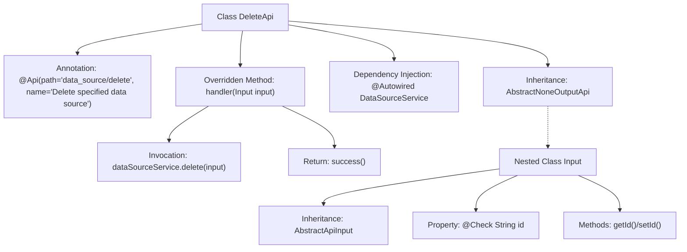

# Basic Information

|      |      |
|------|------|
| Name | DeleteApi |
| Language | .java |
| Code Path | WeFe/fusion/fusion-service/src/main/java/com/welab/wefe/data/fusion/service/api/datasource/DeleteApi.java |
| Package Name | com.welab.wefe.data.fusion.service.api.datasource |
| Dependencies | ['com.welab.wefe.common.exception.StatusCodeWithException', 'com.welab.wefe.common.fieldvalidate.annotation.Check', 'com.welab.wefe.common.web.api.base.AbstractNoneOutputApi', 'com.welab.wefe.common.web.api.base.Api', 'com.welab.wefe.common.web.dto.AbstractApiInput', 'com.welab.wefe.common.web.dto.ApiResult', 'com.welab.wefe.data.fusion.service.service.DataSourceService', 'org.springframework.beans.factory.annotation.Autowired'] |
| Brief Description | API class for deleting a data source, which accepts the data source ID parameter, invokes the service to delete it, and returns a success result. |

# Description

This is a Java class named DeleteApi, designed to delete a specified data source. It extends AbstractNoneOutputApi with a generic parameter of the inner class Input. The class is annotated with the @Api annotation, specifying the path as "data_source/delete" and the name as "Delete specified data source." The DataSourceService is injected via the @Autowired annotation. The handler method processes the input parameters, invokes the delete method of dataSourceService to perform the deletion, and returns a successful result. The inner class Input extends AbstractApiInput and includes a mandatory String-type id field to identify the data source to be deleted, which is validated using the @Check annotation on the field.

# Class Summary

| Name   | Type  | Description |
|-------|------|-------------|
| DeleteApi | class | API class for deleting a data source, which accepts the data source ID parameter, invokes the service layer's delete operation, and returns a success result. |


## Class DeleteApi

|      |      |
|------|------|
| Access Modifier | @Api(path = "data_source/delete", name = "删除指定数据源");public |
| Type | class |
| Name | DeleteApi |
| Description | API class for deleting a data source, which accepts the data source ID parameter, invokes the service layer's delete operation, and returns a success result. |


### UML Class Diagram

```mermaid
classDiagram
    class DeleteApi {
        -DataSourceService dataSourceService
        +handler(Input input) ApiResult~?~
    }
    
    class DataSourceService {
        <<Interface>>
        +delete(DeleteApi$Input input)
    }
    
    class AbstractNoneOutputApi~T~ {
        <<Abstract>>
        +handler(T input) ApiResult~?~
    }
    
    class DeleteApi$Input {
        -String id
        +String getId()
        +void setId(String id)
    }
    
    class AbstractApiInput {
        <<Abstract>>
    }
    
    DeleteApi --> AbstractNoneOutputApi~DeleteApi$Input~ : Extends
    DeleteApi --> DataSourceService : Depends on
    DeleteApi$Input --> AbstractApiInput : Extends
    DeleteApi ..> DeleteApi$Input : Nested
```

This code demonstrates the implementation of a data source deletion API, with the core structure comprising: 1) DeleteApi inheriting from the generic abstract class AbstractNoneOutputApi to handle deletion requests; 2) The nested Input class extending AbstractApiInput, containing data source ID validation logic; 3) The actual deletion operation executed via the DataSourceService interface. The class diagram clearly illustrates inheritance relationships (DeleteApi→AbstractNoneOutputApi, Input→AbstractApiInput), dependency (DeleteApi→DataSourceService), and nested class relationships, reflecting a Spring-style API layer design pattern where input parameter validation is separated from business logic, adhering to layered architecture principles.


### Internal Method Call Graph



This flowchart illustrates the structure of the DeleteApi class, which is a Spring component with API annotations, inheriting from a generic abstract class and overriding the handler method. The process includes service invocation through dependency injection and parameter validation in the nested Input class, depicting the complete call chain from request processing to data source deletion. The nested Input class encapsulates validated parameters, while the main class executes core business logic via the service layer before returning a unified response.

### Field List

| Name  | Type  | Description |
|-------|-------|------|
| dataSourceService | DataSourceService | Using @Autowired to automatically inject a DataSourceService instance. |

### Method List

| Name  | Type  | Description |
|-------|-------|------|
| handler | ApiResult<?> | Override the handler method, invoke the dataSourceService to delete the input data, and return the result upon success. A StatusCodeWithException may be thrown during processing. |


