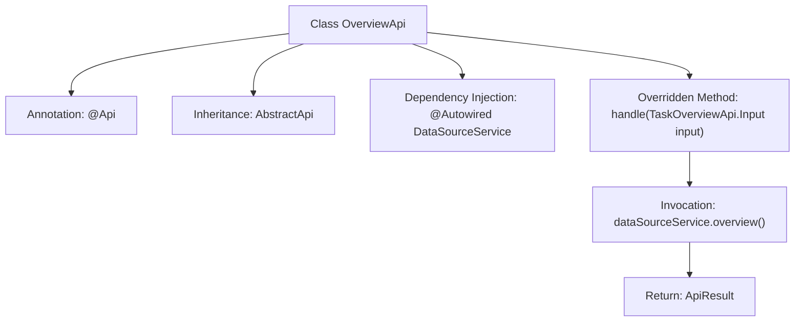

# Basic Information

|      |      |
|------|------|
| Name | OverviewApi |
| Language | .java |
| Code Path | WeFe/fusion/fusion-service/src/main/java/com/welab/wefe/data/fusion/service/api/datasource/OverviewApi.java |
| Package Name | com.welab.wefe.data.fusion.service.api.datasource |
| Dependencies | ['com.welab.wefe.common.exception.StatusCodeWithException', 'com.welab.wefe.common.web.api.base.AbstractApi', 'com.welab.wefe.common.web.api.base.Api', 'com.welab.wefe.common.web.dto.ApiResult', 'com.welab.wefe.data.fusion.service.api.system.TaskOverviewApi', 'com.welab.wefe.data.fusion.service.dto.entity.DataSourceOverviewOutput', 'com.welab.wefe.data.fusion.service.dto.entity.TaskOverviewOutput', 'com.welab.wefe.data.fusion.service.service.DataSourceService', 'org.springframework.beans.factory.annotation.Autowired', 'java.io.IOException'] |
| Brief Description | Overview API class, with the path "data_source/overview", handles data source overview requests and invokes DataSourceService to return overview data. |

# Description

This is a Java class named OverviewApi, which extends AbstractApi and is used to handle API requests for data source overviews. The class annotation defines the API path as "data_source/overview", with the name "data source overview" and the description "data source overview". The class utilizes the auto-injected DataSourceService to call the overview method for retrieving data source overview information, returning the result encapsulated in ApiResult as a DataSourceOverviewOutput. During processing, it may throw StatusCodeWithException and IOException exceptions.

# Class Summary

| Name   | Type  | Description |
|-------|------|-------------|
| OverviewApi | class | Overview API class, path "data_source/overview", handles data source overview requests, calls the overview method of DataSourceService to return results. |


## Class OverviewApi

|      |      |
|------|------|
| Access Modifier | @Api(path = "data_source/overview", name = "data source overview", desc = "data source overview");public |
| Type | class |
| Name | OverviewApi |
| Description | Overview API class, path "data_source/overview", handles data source overview requests, calls the overview method of DataSourceService to return results. |


### UML Class Diagram

```mermaid
classDiagram
    class AbstractApi~T, R~ {
        <<Abstract>>
        +ApiResult~R~ handle(T input) throws StatusCodeWithException, IOException
    }
    
    class OverviewApi {
        -DataSourceService dataSourceService
        +ApiResult~DataSourceOverviewOutput~ handle(TaskOverviewApi$Input input) throws StatusCodeWithException, IOException
    }
    
    class DataSourceService {
        +DataSourceOverviewOutput overview()
    }
    
    class TaskOverviewApi$Input
    class DataSourceOverviewOutput
    class ApiResult~T~
    class StatusCodeWithException
    class IOException
    
    OverviewApi --|> AbstractApi~TaskOverviewApi$Input, DataSourceOverviewOutput~ : Inheritance
    OverviewApi --> DataSourceService : Dependency
    OverviewApi ..> TaskOverviewApi$Input : Uses
    OverviewApi ..> DataSourceOverviewOutput : Generates
    AbstractApi ..> ApiResult~R~ : Returns
    AbstractApi ..> StatusCodeWithException : May throw
    AbstractApi ..> IOException : May throw
```

Class diagram description: This diagram illustrates that OverviewApi inherits from the generic abstract class AbstractApi and depends on DataSourceService to fetch data. AbstractApi defines the core processing method handle(), which returns an ApiResult object encapsulating the result and may throw two types of exceptions. OverviewApi overrides the handle() method to invoke the overview() functionality of the data source service, processes input parameters, and returns data source overview output results. The components collaborate through clear dependency and inheritance relationships to accomplish the data source overview functionality.


### Internal Method Call Graph



This code flowchart illustrates the structure and workflow of the OverviewApi class. The class defines API paths and descriptions through the @Api annotation, inherits from the AbstractApi base class with specified generic parameters. Its core functionality involves injecting DataSourceService via @Autowired, calling dataSourceService.overview() within the overridden handle method to retrieve data source overview information, and finally returning the encapsulated ApiResult. The entire process exemplifies a typical design pattern for API classes in the Spring framework, encompassing annotation configuration, dependency injection, and template method implementation.

### Field List

| Name  | Type  | Description |
|-------|-------|------|
| dataSourceService | DataSourceService | Using @Autowired to automatically inject an instance of DataSourceService. |

### Method List

| Name  | Type  | Description |
|-------|-------|------|
| handle | ApiResult<DataSourceOverviewOutput> | This method overrides the parent class logic, invokes the data source service to retrieve overview information, and returns a successful result. |


