# Basic Information

|      |      |
|------|------|
| Name | QueryApi |
| Language | .java |
| Code Path | WeFe/fusion/fusion-service/src/main/java/com/welab/wefe/data/fusion/service/api/datasource/QueryApi.java |
| Package Name | com.welab.wefe.data.fusion.service.api.datasource |
| Dependencies | ['com.welab.wefe.common.exception.StatusCodeWithException', 'com.welab.wefe.common.fieldvalidate.annotation.Check', 'com.welab.wefe.common.jdbc.base.DatabaseType', 'com.welab.wefe.common.web.api.base.AbstractApi', 'com.welab.wefe.common.web.api.base.Api', 'com.welab.wefe.common.web.dto.ApiResult', 'com.welab.wefe.data.fusion.service.dto.base.PagingInput', 'com.welab.wefe.data.fusion.service.dto.base.PagingOutput', 'com.welab.wefe.data.fusion.service.dto.entity.AbstractOutputModel', 'com.welab.wefe.data.fusion.service.service.DataSourceService', 'org.springframework.beans.factory.annotation.Autowired'] |
| Brief Description | Query Data Source API class, including pagination input parameters id and name, outputting data source name, type, host, port, database name, and username. |

# Description

The code defines an API class named QueryApi for querying data sources. The API path is data_source/query, which inherits from AbstractApi. It takes an Input class as input and outputs a paginated Output class. The Input class includes two queryable fields, data source ID and name, and inherits from PagingInput. The Output class contains fields such as data source name, database type, host, port, database name, and username, and inherits from AbstractOutputModel. The API processing logic implements the query functionality through the query method of DataSourceService and returns paginated results.

# Class Summary

| Name   | Type  | Description |
|-------|------|-------------|
| QueryApi | class | API class for querying data sources, including pagination input parameters and output results. The output contains database information such as name, type, host, port, etc. |


## Class QueryApi

|      |      |
|------|------|
| Access Modifier | @Api(path = "data_source/query", name = "查询数据源");public |
| Type | class |
| Name | QueryApi |
| Description | API class for querying data sources, including pagination input parameters and output results. The output contains database information such as name, type, host, port, etc. |


### UML Class Diagram

```mermaid
classDiagram
    class QueryApi {
        -DataSourceService dataSourceService
        +handle(Input input) ApiResult~PagingOutput~Output~~
    }
    
    class PagingInput {
        <<Abstract>>
    }
    
    class Input {
        -String id
        -String name
        +String getId()
        +void setId(String id)
        +String getName()
        +void setName(String name)
    }
    
    class AbstractOutputModel {
        <<Abstract>>
    }
    
    class Output {
        -String name
        -DatabaseType databaseType
        -String host
        -Integer port
        -String databaseName
        -String userName
        +getters/setters...
    }
    
    class PagingOutput~T~ {
        <<Generic>>
    }
    
    class ApiResult~T~ {
        <<Generic>>
    }
    
    class DataSourceService {
        <<Interface>>
        +query(Input input) PagingOutput~Output~
    }
    
    QueryApi --> DataSourceService : Dependency
    Input --|> PagingInput : Inheritance
    Output --|> AbstractOutputModel : Inheritance
    QueryApi ..> Input : Uses
    QueryApi ..> Output : Uses
    QueryApi ..> PagingOutput~Output~ : Uses
    QueryApi ..> ApiResult~PagingOutput~Output~~ : Uses
```

This code describes a data source query API class `QueryApi`, which inherits from `AbstractApi` and handles paginated query requests. The class diagram illustrates the relationship between `QueryApi` and its inner classes `Input` (inheriting `PagingInput`) and `Output` (inheriting `AbstractOutputModel`), as well as its dependency injection usage of the `DataSourceService` interface for data queries. Generic classes `PagingOutput` and `ApiResult` are used to wrap paginated results and API responses. The overall structure reflects clear hierarchical relationships and type constraints.


### Internal Method Call Graph

```mermaid
graph TD
    A["Class QueryApi"]
    B["Annotation: @Api(path='data_source/query', name='Query Data Source')"]
    C["Inheritance: AbstractApi<Input, PagingOutput<Output>>"]
    D["Dependency Injection: @Autowired DataSourceService"]
    E["Overridden Method: handle(Input input)"]
    F["Inner Class: Input extends PagingInput"]
    G["Inner Class: Output extends AbstractOutputModel"]
    H["Input Properties: String id, String name"]
    I["Input Methods: getter/setter"]
    J["Output Properties: name, databaseType, host, port, databaseName, userName"]
    K["Output Methods: getter/setter"]
    L["Process: handle calls dataSourceService.query(input)"]
    M["Return: ApiResult<PagingOutput<Output>>"]

    A --> B
    A --> C
    A --> D
    A --> E
    A --> F
    A --> G
    F --> H
    F --> I
    G --> J
    G --> K
    E --> L
    L --> M
```



This code defines a QueryApi class for querying data sources, which inherits from the AbstractApi base class with Input parameters and paginated output PagingOutput<Output>. The main process involves calling the dataSourceService.query service through the handle method, returning paginated query results. The Input class includes two query conditions: id and name, while the Output class defines detailed data source attributes such as name, database type, connection information, etc. The entire class specifies the API path and name through annotations and obtains the data source service via dependency injection.

### Field List

| Name  | Type  | Description |
|-------|-------|------|
| dataSourceService | DataSourceService | Automatically inject the DataSourceService instance. |

### Method List

| Name  | Type  | Description |
|-------|-------|------|
| handle | ApiResult<PagingOutput<Output>> | Java method override, calling the data source service to query input and return paginated results, encapsulated as ApiResult upon success. |


