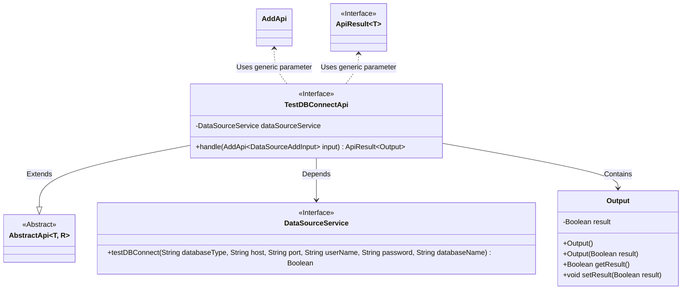
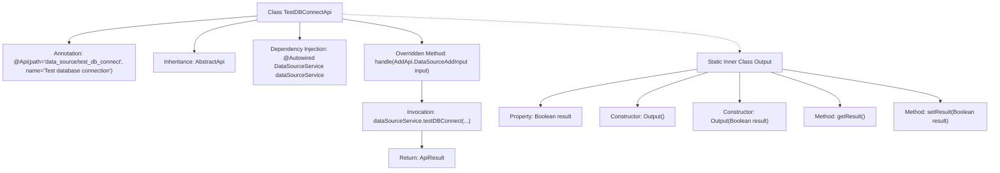

# Basic Information

|      |      |
|------|------|
| Name | TestDBConnectApi |
| Language | .java |
| Code Path | WeFe/fusion/fusion-service/src/main/java/com/welab/wefe/data/fusion/service/api/datasource/TestDBConnectApi.java |
| Package Name | com.welab.wefe.data.fusion.service.api.datasource |
| Dependencies | ['com.welab.wefe.common.exception.StatusCodeWithException', 'com.welab.wefe.common.web.api.base.AbstractApi', 'com.welab.wefe.common.web.api.base.Api', 'com.welab.wefe.common.web.dto.AbstractApiOutput', 'com.welab.wefe.common.web.dto.ApiResult', 'com.welab.wefe.data.fusion.service.service.DataSourceService', 'org.springframework.beans.factory.annotation.Autowired'] |
| Brief Description | This API is used to test database connections, accepting database type, host, port, username, password, and database name as inputs, and returning the connection test result. |

# Description

This is a Java class named TestDBConnectApi, designed for testing database connections. It extends AbstractApi, accepts DataSourceAddInput as input, and returns an Output containing a boolean result. The class validates connection parameters (database type, host, port, username, password, database name) through the testDBConnect method of DataSourceService. The Output class encapsulates the test result `result` along with its getter and setter methods. The API path is `data_source/test_db_connect`, and its functional description is to test whether the database can be connected normally.

# Class Summary

| Name   | Type  | Description |
|-------|------|-------------|
| TestDBConnectApi | class | This is an API class for testing database connections, which accepts parameters such as database type, host, port, etc., calls the service to test the connection, and returns a boolean result. |

## Class TestDBConnectApi

|      |      |
|------|------|
| Access Modifier | @Api(path = "data_source/test_db_connect", name = "测试数据库是否能正常连接");public |
| Type | class |
| Name | TestDBConnectApi |
| Description | This is an API class for testing database connections, which accepts parameters such as database type, host, port, etc., calls the service to test the connection, and returns a boolean result. |

### UML Class Diagram

Class Diagram Description:
This diagram illustrates the structure of the TestDBConnectApi class and its relationships. TestDBConnectApi inherits from the generic AbstractApi class, depends on the DataSourceService interface for database connection testing, and contains the static nested Output class for encapsulating test results. AbstractApi is an abstract generic base class, DataSourceService provides the database connection test method, and the Output class includes a Boolean result field with its accessor methods. The classes are organized through inheritance, dependency, and containment relationships, demonstrating a clear hierarchical structure and division of responsibilities.

### Internal Method Call Graph

This code defines a TestDBConnectApi class for testing database connections, which inherits from AbstractApi with specified input/output types. Its core functionality involves invoking the testDBConnect method through the injected DataSourceService to test database connectivity, returning an ApiResult containing a boolean result. The inner class Output encapsulates the test result with a result property and related getter/setter methods. The flowchart illustrates the class structure, dependencies, and method invocation chain, demonstrating the complete workflow from API entry to database testing.

### Field List

| Name  | Type  | Description |
|-------|-------|------|
| dataSourceService | DataSourceService | Automatically inject the DataSourceService instance. |

### Method List

| Name  | Type  | Description |
|-------|-------|------|
| handle | ApiResult<Output> | Override the method, test the database connection, and return the result. Parameters include database type, host, port, username, password, and database name. |

