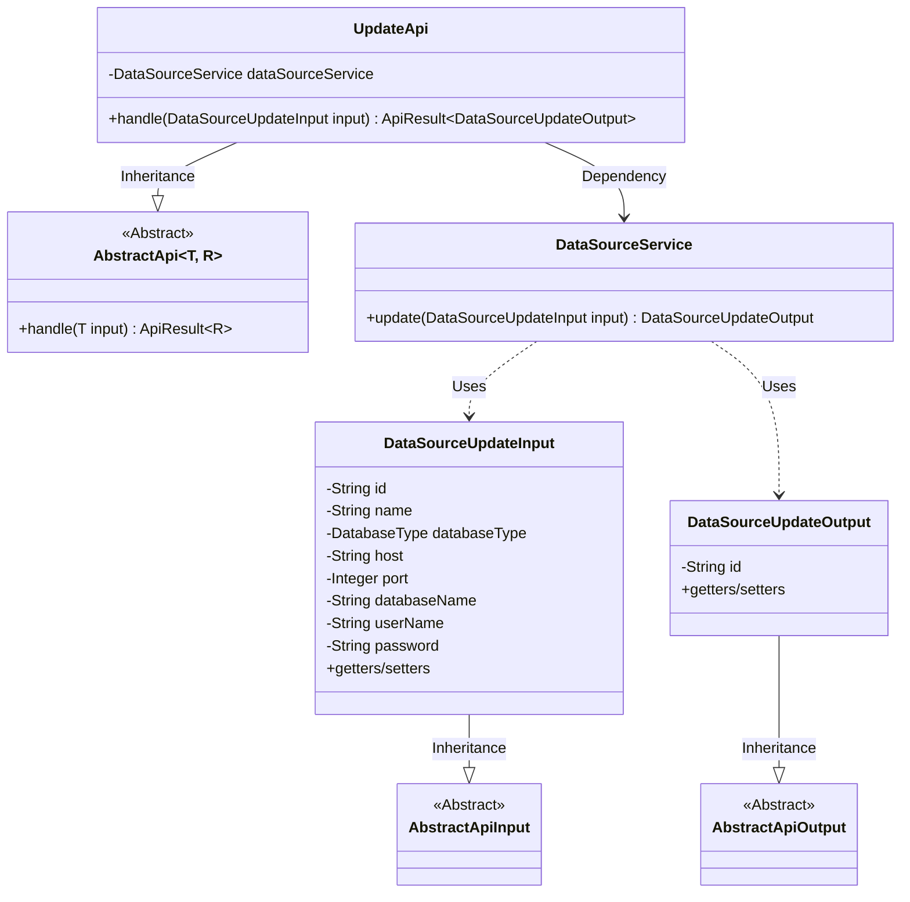
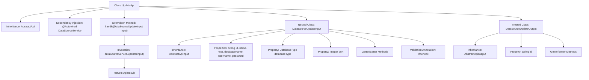

# Basic Information

|      |      |
|------|------|
| Name | UpdateApi |
| Language | .java |
| Code Path | WeFe/fusion/fusion-service/src/main/java/com/welab/wefe/data/fusion/service/api/datasource/UpdateApi.java |
| Package Name | com.welab.wefe.data.fusion.service.api.datasource |
| Dependencies | ['com.welab.wefe.common.exception.StatusCodeWithException', 'com.welab.wefe.common.fieldvalidate.annotation.Check', 'com.welab.wefe.common.jdbc.base.DatabaseType', 'com.welab.wefe.common.web.api.base.AbstractApi', 'com.welab.wefe.common.web.api.base.Api', 'com.welab.wefe.common.web.dto.AbstractApiInput', 'com.welab.wefe.common.web.dto.AbstractApiOutput', 'com.welab.wefe.common.web.dto.ApiResult', 'com.welab.wefe.data.fusion.service.service.DataSourceService', 'org.springframework.beans.factory.annotation.Autowired'] |
| Brief Description | API class for updating data sources, including input parameter validation and output result processing. The input requires providing the data source ID, name, type, host, port, database name, username, and password. The output returns the updated data source ID. |

# Description

The code defines an API class named UpdateApi, which is used to add a new data source. The API path is data_source/update, inheriting from AbstractApi, processing DataSourceUpdateInput as input and returning DataSourceUpdateOutput as output. The input class includes mandatory fields such as data source ID, name, database type, host address, port, database name, username, and password, with format validation applied. The output class contains the data source ID field. The API handles the request by invoking the update method through the injected DataSourceService and returns the operation result.

# Class Summary

| Name   | Type  | Description |
|-------|------|-------------|
| UpdateApi | class | API class for updating data sources, including input parameter validation and output result processing. The inputs include ID, name, database type, host, port, database name, username, and password. The output is the updated data source ID. |

## Class UpdateApi

|      |      |
|------|------|
| Access Modifier | @Api(path = "data_source/update", name = "新增数据源");public |
| Type | class |
| Name | UpdateApi |
| Description | API class for updating data sources, including input parameter validation and output result processing. The inputs include ID, name, database type, host, port, database name, username, and password. The output is the updated data source ID. |

### UML Class Diagram

This code demonstrates the implementation structure of a data source update API. The UpdateApi inherits from the generic abstract class AbstractApi, processes DataSourceUpdateInput and returns DataSourceUpdateOutput. The core business logic is delegated to DataSourceService, with both input and output classes inheriting from their respective abstract base classes. The input class includes validation annotations for various data source parameters, while the output class simply encapsulates the operation result ID. The overall design reflects clear hierarchical structure and separation of responsibilities.

### Internal Method Call Graph

This code defines an API class UpdateApi for updating data sources, which inherits from the abstract class AbstractApi and implements data processing logic. The class contains two nested classes: DataSourceUpdateInput for encapsulating input parameters with validation, and DataSourceUpdateOutput for encapsulating return results. The main class utilizes dependency injection of DataSourceService to perform data source updates. The workflow starts from the handle method and ultimately returns an ApiResult object containing the operation result. The input parameter class includes multiple fields with validation annotations to ensure data integrity and validity.

### Field List

| Name  | Type  | Description |
|-------|-------|------|
| dataSourceService | DataSourceService | The code snippet uses the @Autowired annotation to automatically inject an instance of DataSourceService. |

### Method List

| Name  | Type  | Description |
|-------|-------|------|
| handle | ApiResult<DataSourceUpdateOutput> | Java method overriding, handling data source update requests, invoking the service layer and returning results. |

