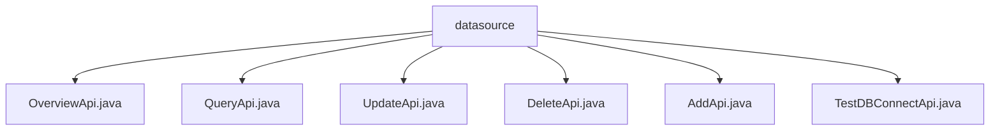

# Basic Information

|      |      |
|------|------|
| Name | datasource |
| Language | .java |
| Code Path | WeFe/fusion/fusion-service/src/main/java/com/welab/wefe/data/fusion/service/api/datasource |
| Package Name | docs.fusion.fusion-service.src.main.java.com.welab.wefe.data.fusion.service.api.datasource |
| Brief Description | OverviewApi handles data source overview requests, with the path data_source/overview. QueryApi queries data sources, with the path data_source/query, supporting pagination. UpdateApi updates data sources, with the path data_source/update. DeleteApi deletes data sources, with the path data_source/delete. AddApi adds new data sources. TestDBConnectApi tests database connections, with the path data_source/test_db_connect. All inherit from AbstractApi and implement functionality through DataSourceService. |

# Description

## Overview  
This module is a collection of APIs for data source management, with its core responsibilities including providing CRUD operations for data sources, connection testing, and overview functionality, similar to database management systems. The interface specifications adhere to the RESTful style, with paths uniformly prefixed by "data_source/" and inheriting the AbstractApi base class. Key data structures include DataSourceOverviewOutput (overview), PagingInput (paged queries), and Input classes containing database connection parameters. The only external dependency is the DataSourceService. For example, UpdateApi handles data source updates, while TestDBConnectApi validates the effectiveness of connection parameters.  

## Core Business Scenarios  
The module supports full lifecycle management of data sources: additions and deletions via AddApi/DeleteApi, paged queries through QueryApi, and configuration changes processed by UpdateApi. A typical workflow involves first validating connections using TestDBConnectApi, followed by creating data sources via AddApi. The interaction model is exclusively request-response, such as queries returning paged results and overview interfaces providing aggregated information. API types cover basic CRUD and auxiliary functions, with integration use cases including data source configuration interfaces and automated testing workflows.

### Package Internal Structure View

This flowchart illustrates the hierarchical structure of the data source APIs in the WeFe data fusion service. The root node "datasource" contains six child nodes, each corresponding to different API implementation class files, including functional modules for data overview, query, update, delete, add, and database connection testing. All Java files reside at the same directory level without deeper nesting relationships.

# File List

| Name   | Type  | Description |
|-------|------|-------------|
| [OverviewApi.java](OverviewApi.md) | file | Overview API class, with the path "data_source/overview", handles data source overview requests and invokes DataSourceService to return overview data. |
| [QueryApi.java](QueryApi.md) | file | API class for querying data sources, including pagination input parameters id and name, outputting data source name, type, host, port, database name, and username. |
| [UpdateApi.java](UpdateApi.md) | file | API class for updating data sources, including input parameter validation and output result processing. The input requires providing the data source ID, name, type, host, port, database name, username, and password. The output returns the updated data source ID. |
| [DeleteApi.java](DeleteApi.md) | file | API class for deleting a data source, which accepts the data source ID parameter, calls the service to delete it, and returns a success result. |
| [AddApi.java](AddApi.md) | file | Added a new data source API class, which includes input parameter validation and output result processing, implementing the data source addition functionality through DataSourceService. The input includes required fields such as name, type, address, etc., and the output returns the data source ID. |
| [TestDBConnectApi.java](TestDBConnectApi.md) | file | This API is used to test database connections. It takes the database type, host, port, username, password, and database name as inputs and returns the connection test result. |

