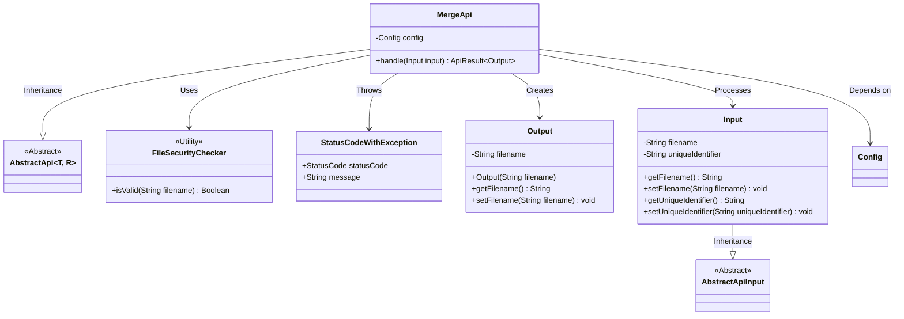
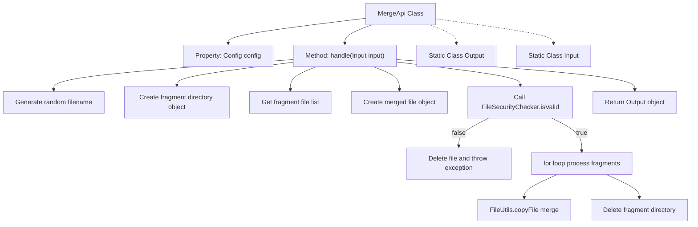
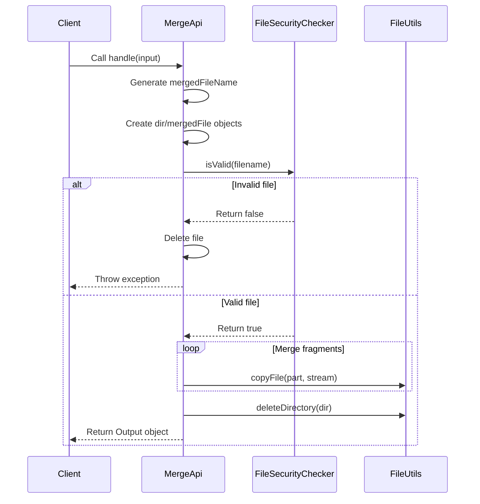

# Basic Information

|      |      |
|------|------|
| Name | MergeApi |
| Language | .java |
| Code Path | WeFe/fusion/fusion-service/src/main/java/com/welab/wefe/data/fusion/service/api/file/MergeApi.java |
| Package Name | com.welab.wefe.data.fusion.service.api.file |
| Dependencies | ['com.welab.wefe.common.StatusCode', 'com.welab.wefe.common.exception.StatusCodeWithException', 'com.welab.wefe.common.web.api.base.AbstractApi', 'com.welab.wefe.common.web.api.base.Api', 'com.welab.wefe.common.web.dto.AbstractApiInput', 'com.welab.wefe.common.web.dto.ApiResult', 'com.welab.wefe.data.fusion.service.config.Config', 'com.welab.wefe.data.fusion.service.utils.FileSecurityChecker', 'org.apache.commons.io.FileUtils', 'org.springframework.beans.factory.annotation.Autowired', 'java.io.File', 'java.io.FileOutputStream', 'java.io.IOException', 'java.util.UUID'] |
| Brief Description | This API is used to merge uploaded file chunks, generate a unique filename, and supports only .csv, .xls, and .xlsx formats. It deletes the chunk directory after merging and returns the merged filename. |

# Description

The code defines a class named MergeApi, which handles the merging of file chunks after upload. It accepts input containing a filename and a unique identifier, then generates a randomly merged filename. First, it checks whether the file type is among the allowed formats (.csv, .xls, .xlsx). If invalid, it deletes the related files and throws an exception. By iterating through the chunked files, it merges them sequentially into the target file and deletes the chunk directory upon completion. If an error occurs during merging, a system error is thrown. Upon success, it returns an output object containing the merged filename.

# Class Summary

| Name   | Type  | Description |
|-------|------|-------------|
| MergeApi | class | The MergeApi class handles file chunk merging, verifies the file type, merges the chunks, and returns the new filename. If it fails, it deletes the file and reports an error. |

## Class MergeApi

|      |      |
|------|------|
| Access Modifier | @Api(path = "file/merge", name = "文件上传完毕后合并分片");public |
| Type | class |
| Name | MergeApi |
| Description | The MergeApi class handles file chunk merging, verifies the file type, merges the chunks, and returns the new filename. If it fails, it deletes the file and reports an error. |

### UML Class Diagram

This code demonstrates an API implementation for file chunk merging. The MergeApi inherits from the generic abstract class AbstractApi, processes Input parameters, and returns an Output result containing the merged filename. The core workflow includes: validating file type security, merging chunked files, and cleaning temporary directories. The class diagram clearly reflects inheritance relationships (MergeApi→AbstractApi, Input→AbstractApiInput), utility class invocations (FileSecurityChecker), and exception handling (StatusCodeWithException), embodying modular design principles. File operations involve chunk reading, stream merging, and directory cleanup, requiring attention to IO exception handling and thread safety.

### Internal Method Call Graph

This code implements a file fragment merging API with core functionalities including: 1) Generating merged filename; 2) Checking file type security; 3) Merging fragment files; 4) Cleaning temporary files. The flowchart illustrates the class structure and main processing logic, while the sequence diagram details the complete process from client invocation to final return. The code ensures filename uniqueness through UUID, utilizes FileUtils utility class for efficient file operations, and strictly intercepts illegal file types.

### Field List

| Name  | Type  | Description |
|-------|-------|------|
| config | Config | Use @Autowired to automatically inject the Config configuration object. |

### Method List

| Name  | Type  | Description |
|-------|-------|------|
| handle | ApiResult<Output> | Handling file chunk merging: Check the validity of the file type, merge the chunked files, clean up temporary files, and return the merged file name. If the file type is invalid, report an error and delete the temporary files. |

