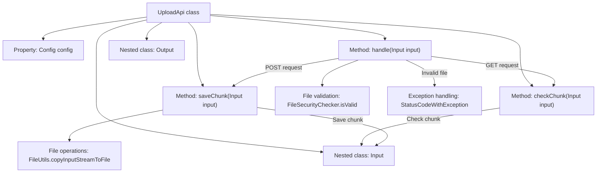
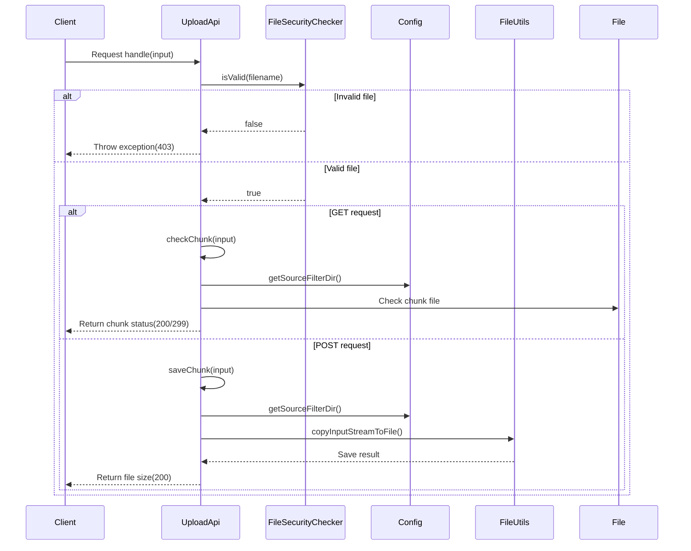

# Basic Information

|      |      |
|------|------|
| Name | UploadApi |
| Language | .java |
| Code Path | WeFe/fusion/fusion-service/src/main/java/com/welab/wefe/data/fusion/service/api/file/UploadApi.java |
| Package Name | com.welab.wefe.data.fusion.service.api.file |
| Dependencies | ['com.welab.wefe.common.StatusCode', 'com.welab.wefe.common.exception.StatusCodeWithException', 'com.welab.wefe.common.web.api.base.AbstractApi', 'com.welab.wefe.common.web.api.base.Api', 'com.welab.wefe.common.web.dto.AbstractWithFilesApiInput', 'com.welab.wefe.common.web.dto.ApiResult', 'com.welab.wefe.data.fusion.service.config.Config', 'com.welab.wefe.data.fusion.service.utils.FileSecurityChecker', 'org.apache.commons.io.FileUtils', 'org.springframework.beans.factory.annotation.Autowired', 'org.springframework.web.multipart.MultipartFile', 'java.io.File', 'java.io.IOException', 'java.io.InputStream'] |
| Brief Description | File upload API, supporting chunk verification and saving, only allowing .csv, .xls, .xlsx files, including input/output parameters and exception handling. |

# Description

This is a file upload API class named UploadApi, which inherits from AbstractApi. It handles file upload requests, supporting both POST and GET methods. The POST method is used to save file chunks, while the GET method checks for the existence of chunks. The file type is restricted to .csv, .xls, or .xlsx; otherwise, an exception is thrown. Input parameters include the file identifier, chunk number, size, total size, and other details. The output includes the file length. File chunks are saved in the directory specified by the configuration, named with the chunk number and a .part suffix. During processing, file type validation and chunk existence checks are performed.

# Class Summary

| Name   | Type  | Description |
|-------|------|-------------|
| UploadApi | class | File upload API, supporting chunk verification and saving, only allowing .csv, .xls, .xlsx files. POST saves chunks, GET checks if chunks exist, returning chunk status or file size. |


## Class UploadApi

|      |      |
|------|------|
| Access Modifier | @Api(path = "file/upload", name = "Upload a file");public |
| Type | class |
| Name | UploadApi |
| Description | File upload API, supporting chunk verification and saving, only allowing .csv, .xls, .xlsx files. POST saves chunks, GET checks if chunks exist, returning chunk status or file size. |


### UML Class Diagram

```mermaid
classDiagram
    class UploadApi {
        -Config config
        +handle(Input input) ApiResult~Output~
        -checkChunk(Input input) ApiResult~Output~
        -saveChunk(Input input) ApiResult~Output~
    }
    <<Interface>> UploadApi {
        <<AbstractApi~Input, Output~>>
    }

    class Output {
        -long length
        +Output(long length)
        +getLength() long
        +setLength(long length) void
    }

    class Input {
        -Long id
        -Integer chunkNumber
        -Long chunkSize
        -Long currentChunkSize
        -Long totalSize
        -String identifier
        -String filename
        -String relativePath
        -Integer totalChunks
        -String type
        // getter/setter methods omitted
    }
    <<Interface>> Input {
        <<AbstractWithFilesApiInput>>
    }

    class Config {
        // Configuration class
    }

    class FileSecurityChecker {
        <<static>>
        +isValid(String filename) Boolean
    }

    class StatusCodeWithException {
        +StatusCodeWithException(StatusCode code, String message)
    }

    class ApiResult~T~ {
        +setMessage(String message) ApiResult~T~
        +setHttpCode(Integer code) ApiResult~T~
    }

    UploadApi --> Config : Dependency
    UploadApi --> FileSecurityChecker : Uses
    UploadApi --> StatusCodeWithException : Throws
    UploadApi --> ApiResult~Output~ : Returns
    Input --|> AbstractWithFilesApiInput : Inherits
    UploadApi --|> AbstractApi~Input, Output~ : Inherits
```

Class diagram description: This diagram illustrates the core structure of a file upload API. UploadApi inherits from the AbstractApi generic class, handling Input and Output types. It includes file security checks, chunk verification, and save functionality. The Input class inherits from AbstractWithFilesApiInput and contains parameters for chunked file uploads. The Output class records file length. UploadApi depends on the Config configuration class and FileSecurityChecker security check class, may throw StatusCodeWithException, and returns results encapsulated in ApiResult.


### Internal Method Call Graph





This code implements a chunked file upload API, primarily consisting of three core functionalities: file type validation, chunk checking, and chunk saving. The flowchart illustrates the class structure and method invocation relationships, while the sequence diagram details the complete processing flow from client request to final response. When receiving a request, the system first validates the file type, then processes chunk checking or saving operations based on GET/POST methods respectively. During the process, it dynamically reads configuration paths and performs file system operations, finally returning corresponding status codes and messages.

### Field List

| Name  | Type  | Description |
|-------|-------|------|
| config | Config | Use @Autowired to automatically inject the Config configuration object. |

### Method List

| Name  | Type  | Description |
|-------|-------|------|
| handle | ApiResult<Output> | The code processes file upload requests, checks if the file type is CSV or Excel, supports POST for saving chunks and GET for checking chunks, and throws exceptions for invalid types or methods. |
| checkChunk | ApiResult<Output> | Check if the file fragment exists. If the fragment number is empty, set it to 0, then verify whether the corresponding fragment file exists. Return a success message if it exists, or a status code 299 with a prompt if it does not. |
| saveChunk | ApiResult<Output> | The method `saveChunk` takes an `Input` parameter and handles the saving of chunked files. It checks the chunk number and sets it to 0 if empty. It creates the target file path and writes the input stream to the file. Throws `StatusCodeWithException` in case of exceptions. Upon success, it returns an `Output` result containing the file size. |


