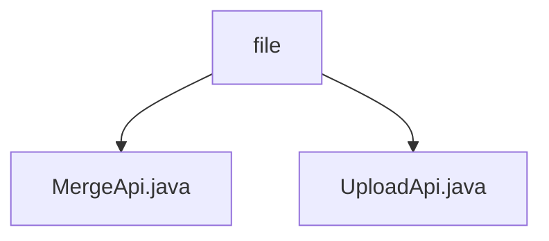

# Basic Information

|      |      |
|------|------|
| Name | file |
| Language | .java |
| Code Path | WeFe/fusion/fusion-service/src/main/java/com/welab/wefe/data/fusion/service/api/file |
| Package Name | docs.fusion.fusion-service.src.main.java.com.welab.wefe.data.fusion.service.api.file |
| Brief Description | The MergeApi class handles file chunk merging, verifying file types before combining chunks and deleting temporary files. The UploadApi class manages file uploads, supporting chunked storage and validation while restricting file types to csv/xls/xlsx. |

# Description

## Overview  
The core responsibility of this module is to handle file chunk uploads and merging, supporting CSV/Excel formats. It provides a unified interface specification: MergeApi is responsible for chunk merging, generating random filenames, and validating formats; UploadApi handles chunk uploads and existence checks, inheriting AbstractApi to support GET/POST methods. Key data structures include file identifiers, chunk numbers, and merged filenames. It relies on the file system to store chunks (e.g., files with .part suffixes) and format validation logic. For example, invalid formats trigger exceptions and file cleanup, while the merging process adopts a sequential append mode.  

## Key Business Scenarios  
A typical workflow involves triggering a merge after a user uploads chunks, resembling a divide-and-conquer processing pattern. The complete interaction chain includes: 1) UploadApi receiving and storing chunks; 2) MergeApi validating the format and merging chunks by number. Functional completeness is reflected in chunk checks, type filtering, and exception handling (e.g., deleting invalid files). API types cover status queries (GET) and data submissions (POST), with integration cases including Excel data merging scenarios. The system employs directory-level transactions, automatically cleaning up temporary files after a successful merge.

### Package Internal Structure View

This flowchart illustrates the hierarchical structure of the file API module, with the root node being the "file" directory, which contains two Java interface files: MergeApi.java and UploadApi.java. These files handle file merging and uploading functionalities respectively, serving as parallel modules at the same hierarchical level and collectively forming the implementation part of the file service API.

# File List

| Name   | Type  | Description |
|-------|------|-------------|
| [MergeApi.java](MergeApi.md) | file | This API is used to merge uploaded file chunks, generate a unique filename, and supports only .csv, .xls, and .xlsx formats. After merging, it deletes the chunk directory and returns the merged filename. |
| [UploadApi.java](UploadApi.md) | file | File upload API, supporting chunk verification and storage, only allowing .csv, .xls, .xlsx files, including input/output parameters and exception handling. |

