# Basic Information

|      |      |
|------|------|
| Name | LogQueryApi |
| Language | .java |
| Code Path | WeFe/fusion/fusion-service/src/main/java/com/welab/wefe/data/fusion/service/api/operation/LogQueryApi.java |
| Package Name | com.welab.wefe.data.fusion.service.api.operation |
| Dependencies | ['com.welab.wefe.common.exception.StatusCodeWithException', 'com.welab.wefe.common.fieldvalidate.annotation.Check', 'com.welab.wefe.common.web.api.base.AbstractApi', 'com.welab.wefe.common.web.api.base.Api', 'com.welab.wefe.common.web.dto.ApiResult', 'com.welab.wefe.data.fusion.service.dto.base.PagingInput', 'com.welab.wefe.data.fusion.service.dto.base.PagingOutput', 'com.welab.wefe.data.fusion.service.dto.entity.OperationLogOutputModel', 'com.welab.wefe.data.fusion.service.service.OperationLogService', 'org.springframework.beans.factory.annotation.Autowired'] |
| Brief Description | Log query API class, inherits from abstract API, takes inputs including interface name, caller, and time range, outputs paginated operation logs, and invokes OperationLogService to handle the query. |

# Description

The LogQueryApi is an API class designed for querying operation logs, inheriting from AbstractApi. It processes input of type Input and outputs paginated OperationLogOutputModel. The query operation is executed via OperationLogService. The Input class includes pagination parameters and four filterable fields: apiName, callerName, startTime, and endTime, each with corresponding getter and setter methods. The API path is "log/query", and its name is "query log".

# Class Summary

| Name   | Type  | Description |
|-------|------|-------------|
| LogQueryApi | class | Log query API class, inherits from an abstract class to handle paginated input and returns paginated operation log results. The input includes fields such as interface name, caller name, time range, etc., and queries data through a service class. |


## Class LogQueryApi

|      |      |
|------|------|
| Access Modifier | @Api(path = "log/query", name = "query log");public |
| Type | class |
| Name | LogQueryApi |
| Description | Log query API class, inherits from an abstract class to handle paginated input and returns paginated operation log results. The input includes fields such as interface name, caller name, time range, etc., and queries data through a service class. |


### UML Class Diagram

```mermaid
classDiagram
    class AbstractApi~T, R~ {
        <<Abstract>>
        +handle(T input) ApiResult~R~
    }

    class LogQueryApi {
        -OperationLogService service
        +handle(Input input) ApiResult~PagingOutput~OperationLogOutputModel~~
    }

    class PagingInput {
        <<Abstract>>
    }

    class Input {
        -String apiName
        -String callerName
        -Long startTime
        -Long endTime
        +getApiName() String
        +setApiName(String apiName) void
        +getCallerName() String
        +setCallerName(String callerName) void
        +getStartTime() Long
        +setStartTime(Long startTime) void
        +getEndTime() Long
        +setEndTime(Long endTime) void
    }

    class OperationLogService {
        <<Interface>>
        +query(Input input) PagingOutput~OperationLogOutputModel~
    }

    class PagingOutput~T~ {
        +List~T~ items
        +Integer total
    }

    class OperationLogOutputModel {
        // Log output model fields not displayed
    }

    class ApiResult~T~ {
        +T data
        +Integer code
        +String message
    }

    LogQueryApi --> AbstractApi~Input, PagingOutput~OperationLogOutputModel~~ : Inherits
    LogQueryApi --> OperationLogService : Depends on
    Input --|> PagingInput : Inherits
    OperationLogService ..> PagingOutput~OperationLogOutputModel~ : Creates
    OperationLogService ..> Input : Uses
    PagingOutput~OperationLogOutputModel~ --> OperationLogOutputModel : Contains
```

This code demonstrates the implementation architecture of a log query API. LogQueryApi inherits from the generic abstract class AbstractApi and processes paginated query requests through the OperationLogService. The input parameter Input inherits from PagingInput and includes query conditions such as API name, caller name, and time range. The system uses PagingOutput to wrap paginated results, which contain a list of OperationLogOutputModel and the total count. The overall design reflects clear hierarchical relationships and separation of responsibilities.


### Internal Method Call Graph

```mermaid
graph TD
    A["Class LogQueryApi"]
    B["Annotation: @Api(path='log/query', name='query log')"]
    C["Inheritance: AbstractApi<Input, PagingOutput<OperationLogOutputModel>>"]
    D["Dependency Injection: @Autowired OperationLogService service"]
    E["Overridden Method: handle(Input input)"]
    F["Inner Class: Input"]
    G["Field: String apiName @Check"]
    H["Field: String callerName @Check"]
    I["Field: Long startTime @Check"]
    J["Field: Long endTime @Check"]
    K["Getter/Setter Method Group"]
    L["Method Invocation: service.query(input)"]
    M["Return: success(query result)"]

    A --> B
    A --> C
    A --> D
    A --> E
    A --> F
    F --> G
    F --> H
    F --> I
    F --> J
    F --> K
    E --> L
    L --> M
```



This code describes the implementation class LogQueryApi for a log query API, which inherits from the abstract base class AbstractApi and implements the core handle method. The flowchart illustrates key components of the class structure: class-level API annotations, dependency-injected service instances, the implementation of the handle method for processing requests, and the definition of the Input inner class as a parameter. The Input class contains four query conditions with validation annotations and corresponding getter/setter methods. The core processing flow involves executing queries through OperationLogService and returning paginated results, reflecting a typical API layer implementation pattern.

### Field List

| Name  | Type  | Description |
|-------|-------|------|
| service | OperationLogService | Use @Autowired to automatically inject an instance of OperationLogService. |

### Method List

| Name  | Type  | Description |
|-------|-------|------|
| handle | ApiResult<PagingOutput<OperationLogOutputModel>> | Rewrite the method to process input and return paginated query results. |


