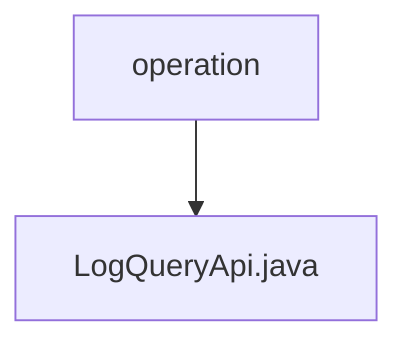

# Basic Information

|      |      |
|------|------|
| Name | operation |
| Language | .java |
| Code Path | WeFe/fusion/fusion-service/src/main/java/com/welab/wefe/data/fusion/service/api/operation |
| Package Name | docs.fusion.fusion-service.src.main.java.com.welab.wefe.data.fusion.service.api.operation |
| Brief Description | Log query API class, inherits from abstract API, takes inputs including interface name, caller, and time range, outputs paginated operation logs, and invokes OperationLogService to handle the query. |

# Description

The LogQueryApi is an API class designed for querying operation logs, inheriting from AbstractApi. It processes input of type Input and outputs paginated OperationLogOutputModel. The query operation is executed via OperationLogService. The Input class includes pagination parameters and four filterable fields: apiName, callerName, startTime, and endTime, each with corresponding getter and setter methods. The API path is "log/query", and its name is "query log".

### Package Internal Structure View

This flowchart illustrates the API operation path structure within the fusion-service module of the WeFe project. The `operation` serves as the parent directory, containing a specific API implementation file `LogQueryApi.java`. This structure reflects a typical Java project layered design, where the `operation` directory is used to organize various operation-related API interfaces, while individual files host the concrete interface implementations.

# File List

| Name   | Type  | Description |
|-------|------|-------------|
| [LogQueryApi.java](LogQueryApi.md) | file | Log Query API class, inherits from the abstract API, takes inputs including interface name, caller, and time range, outputs paginated operation logs, and delegates the query processing to OperationLogService. |

