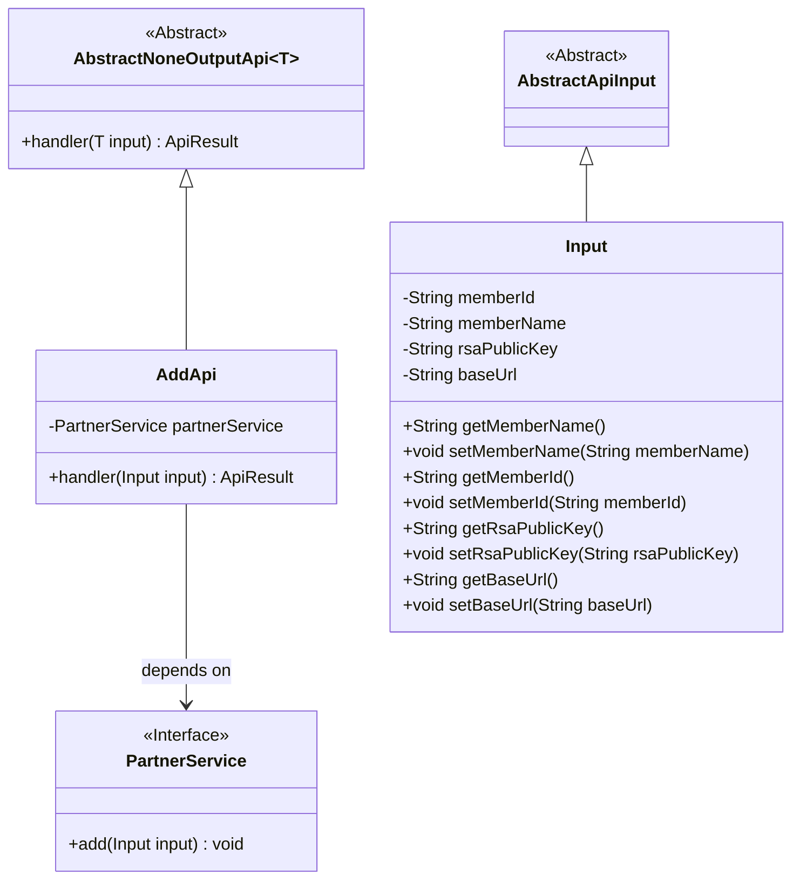

# Basic Information

|      |      |
|------|------|
| Name | AddApi |
| Language | .java |
| Code Path | WeFe/fusion/fusion-service/src/main/java/com/welab/wefe/data/fusion/service/api/partner/AddApi.java |
| Package Name | com.welab.wefe.data.fusion.service.api.partner |
| Dependencies | ['com.welab.wefe.common.exception.StatusCodeWithException', 'com.welab.wefe.common.fieldvalidate.annotation.Check', 'com.welab.wefe.common.web.api.base.AbstractNoneOutputApi', 'com.welab.wefe.common.web.api.base.Api', 'com.welab.wefe.common.web.dto.AbstractApiInput', 'com.welab.wefe.common.web.dto.ApiResult', 'com.welab.wefe.data.fusion.service.service.PartnerService', 'org.springframework.beans.factory.annotation.Autowired'] |
| Brief Description | Add Partner API requires inputting member ID, name, public key, and request path, then invokes PartnerService to complete the addition operation. |

# Description

The code defines an API class named `AddApi`, which is used to add partners. The API path is `"partner/add"`, and its name is `"Add Partner"`. This class inherits from `AbstractNoneOutputApi`, with the input parameter being the inner class `Input`. `Input` includes four required fields: federation member ID, name, RSA public key, and request path. The processing logic is implemented through the `add` method of `PartnerService`, returning an empty result upon success. All input fields are validated for non-null values using the `@Check` annotation, and corresponding getter and setter methods are provided.

# Class Summary

| Name   | Type  | Description |
|-------|------|-------------|
| AddApi | class | Add Partner API requires providing member ID, name, public key, and request path, then invokes PartnerService to complete the addition operation. |

## Class AddApi

|      |      |
|------|------|
| Access Modifier | @Api(path = "partner/add", name = "添加合作伙伴", desc = "添加合作伙伴");public |
| Type | class |
| Name | AddApi |
| Description | Add Partner API requires providing member ID, name, public key, and request path, then invokes PartnerService to complete the addition operation. |

### UML Class Diagram

This code describes the implementation of an API for adding partners. The AddApi inherits from the generic AbstractNoneOutputApi class, specifying Input as the parameter type, and relies on the PartnerService interface to fulfill business logic. The Input class inherits from AbstractApiInput, containing four mandatory fields (memberId, memberName, rsaPublicKey, baseUrl) along with their getter/setter methods. The overall structure demonstrates clear hierarchical relationships: abstract base classes define the framework, concrete implementation classes handle business logic, input classes encapsulate parameters, and service interfaces provide business capabilities.

### Internal Method Call Graph

```mermaid
graph TD
    A["Class AddApi"]
    B["Annotation: @Api"]
    C["Inheritance: AbstractNoneOutputApi<Input>"]
    D["Dependency Injection: @Autowired PartnerService"]
    E["Overridden Method: handler(Input input)"]
    F["Inner Class: Input"]
    G["Parent Class: AbstractApiInput"]
    H["Validation Annotation: @Check"]
    I["Fields: memberId/memberName/rsaPublicKey/baseUrl"]
    J["Getter/Setter Methods"]

    A --> B
    A --> C
    A --> D
    A --> E
    A --> F
    F --> G
    F --> H
    F --> I
    F --> J
    E --> D["Calls partnerService.add"]
    E --> K["Returns success()"]
```

This code describes an AddApi implementation class for adding partners, which inherits from the abstract class AbstractNoneOutputApi with specified input parameter type Input. The flowchart illustrates class structural relationships, including annotations, inheritance, injected dependencies, core handler() method, and the definition of inner Input parameter class. The Input class contains multiple fields with validation annotations and corresponding access methods. The handler method executes the add operation via partnerService and returns a success result. The entire design demonstrates clear hierarchical structure and parameter validation mechanisms.

### Field List

| Name  | Type  | Description |
|-------|-------|------|
| partnerService | PartnerService | Automatically inject the PartnerService instance. |

### Method List

| Name  | Type  | Description |
|-------|-------|------|
| handler | ApiResult | This method overrides the parent class handler, accepts an Input parameter, invokes partnerService.add to process the input, returns an ApiResult success response upon success, and throws a StatusCodeWithException in case of exceptions. |

