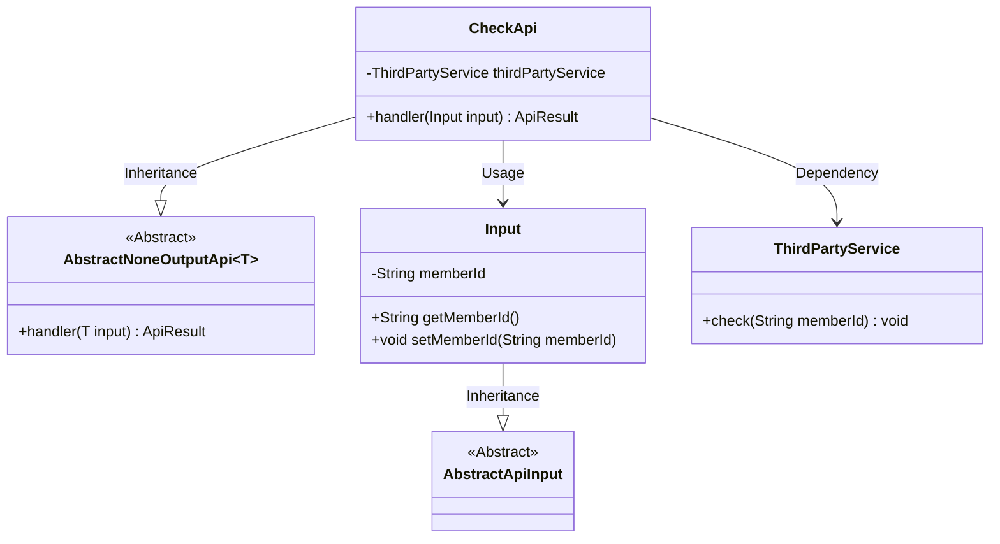
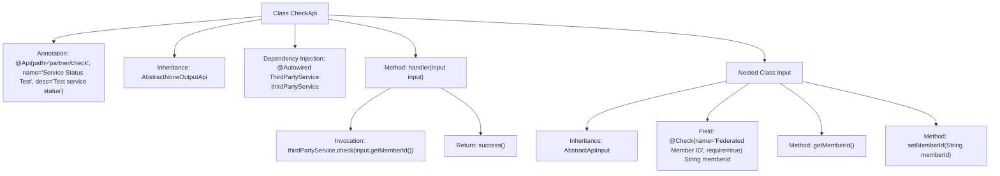

# Basic Information

|      |      |
|------|------|
| Name | CheckApi |
| Language | .java |
| Code Path | WeFe/fusion/fusion-service/src/main/java/com/welab/wefe/data/fusion/service/api/partner/CheckApi.java |
| Package Name | com.welab.wefe.data.fusion.service.api.partner |
| Dependencies | ['com.welab.wefe.common.exception.StatusCodeWithException', 'com.welab.wefe.common.fieldvalidate.annotation.Check', 'com.welab.wefe.common.web.api.base.AbstractNoneOutputApi', 'com.welab.wefe.common.web.api.base.Api', 'com.welab.wefe.common.web.dto.AbstractApiInput', 'com.welab.wefe.common.web.dto.ApiResult', 'com.welab.wefe.data.fusion.service.service.ThirdPartyService', 'org.springframework.beans.factory.annotation.Autowired'] |
| Brief Description | This is an API class for testing service status, with the path `partner/check`. It relies on a third-party service to verify member IDs, and the input must include the mandatory federal member ID field. |

# Description

The code defines an API class named `CheckApi`, which is used to test the service status. It inherits from `AbstractNoneOutputApi` with the generic parameter as the inner class `Input`. The API path is `"partner/check"`, and its name is `"Test Service Status"`. The class injects `ThirdPartyService` and invokes its `check` method via the `handler` method, passing the `memberId` parameter from `Input`.  

The `Input` class inherits from `AbstractApiInput` and contains a required string-type `memberId` field, annotated with a validation note `"Federated Member ID"`, along with getter and setter methods. Upon successful execution, the `handler` method returns a `success` result.

# Class Summary

| Name   | Type  | Description |
|-------|------|-------------|
| CheckApi | class | The CheckApi class is used to test service status by verifying member IDs through third-party services. The input must include the member ID field, and a successful verification returns a successful result. |

## Class CheckApi

|      |      |
|------|------|
| Access Modifier | @Api(path = "partner/check", name = "测试服务状态", desc = "测试服务状态");public |
| Type | class |
| Name | CheckApi |
| Description | The CheckApi class is used to test service status by verifying member IDs through third-party services. The input must include the member ID field, and a successful verification returns a successful result. |

### UML Class Diagram

This code demonstrates an API implementation for checking service status, including the core class CheckApi and its nested input class Input. CheckApi inherits from the generic abstract class AbstractNoneOutputApi and relies on the third-party service ThirdPartyService for member ID validation. The Input class inherits from AbstractApiInput and contains a member ID field along with accessor methods. The overall structure reflects clear hierarchical relationships and separation of responsibilities, with API metadata annotated through labels, and input validation achieved via the Check annotation.

### Internal Method Call Graph

This code demonstrates an API class named CheckApi for testing service status. It inherits from AbstractNoneOutputApi and processes input parameters of type Input. The class contains a ThirdPartyService instance injected via @Autowired, where the handler method invokes the service's check method to validate the member ID and returns a success result. Input is a nested static class containing a memberId field with validation annotations and its getter/setter methods. The entire structure clearly reflects the API's request processing flow and input validation mechanism.

### Field List

| Name  | Type  | Description |
|-------|-------|------|
| thirdPartyService | ThirdPartyService | Automatically inject third-party service instances. |

### Method List

| Name  | Type  | Description |
|-------|-------|------|
| handler | ApiResult | Rewrite the method to handle input, call a third-party service to check the member ID, and return the result upon success. |

