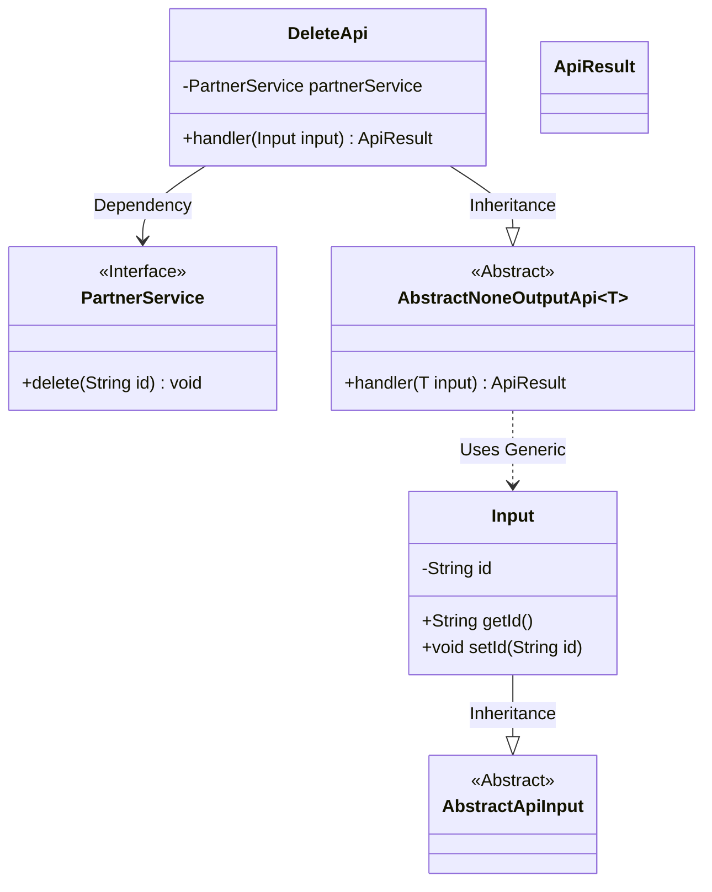
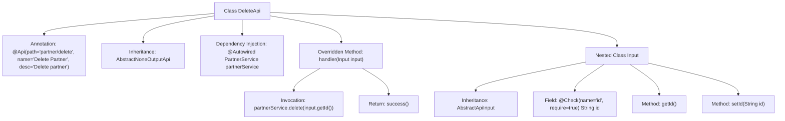

# Basic Information

|      |      |
|------|------|
| Name | DeleteApi |
| Language | .java |
| Code Path | WeFe/fusion/fusion-service/src/main/java/com/welab/wefe/data/fusion/service/api/partner/DeleteApi.java |
| Package Name | com.welab.wefe.data.fusion.service.api.partner |
| Dependencies | ['com.welab.wefe.common.exception.StatusCodeWithException', 'com.welab.wefe.common.fieldvalidate.annotation.Check', 'com.welab.wefe.common.web.api.base.AbstractNoneOutputApi', 'com.welab.wefe.common.web.api.base.Api', 'com.welab.wefe.common.web.dto.AbstractApiInput', 'com.welab.wefe.common.web.dto.ApiResult', 'com.welab.wefe.data.fusion.service.service.PartnerService', 'org.springframework.beans.factory.annotation.Autowired'] |
| Brief Description | Delete the partner's API class, inherit from the no-output abstract class, and remove the partner with the specified ID through PartnerService. The input parameter is the mandatory ID field. |

# Description

The code defines an API class named DeleteApi, which is used to delete a partner. The API path is "partner/delete", and its functional description is "Delete a partner". This class inherits from AbstractNoneOutputApi, using generics to specify the input parameter type as the inner class Input. The PartnerService is injected via @Autowired, and the handler method invokes the partnerService.delete method to perform the deletion. The input parameter id is passed through the Input class and marked as a required field using the @Check annotation. Upon successful operation, it returns an ApiResult.

# Class Summary

| Name   | Type  | Description |
|-------|------|-------------|
| DeleteApi | class | Delete the partner's API interface, call the PartnerService by ID to perform the deletion operation, and the input must include the mandatory ID field. |

## Class DeleteApi

|      |      |
|------|------|
| Access Modifier | @Api(path = "partner/delete", name = "删除合作方", desc = "删除合作方");public |
| Type | class |
| Name | DeleteApi |
| Description | Delete the partner's API interface, call the PartnerService by ID to perform the deletion operation, and the input must include the mandatory ID field. |

### UML Class Diagram

Class Diagram Description: The diagram illustrates that the DeleteApi class inherits from AbstractNoneOutputApi<Input> and depends on the PartnerService interface. The Input class inherits from AbstractApiInput, containing an id attribute with getter/setter methods. AbstractNoneOutputApi is a generic abstract class that processes input type T and returns ApiResult. The PartnerService interface defines the delete method. The overall structure reflects a typical layered design for API request processing.

### Internal Method Call Graph

This code flowchart illustrates the structure and key components of the DeleteApi class. DeleteApi is an annotated API class that inherits from AbstractNoneOutputApi and handles partner deletion requests. It injects PartnerService via @Autowired and overrides the handler method to perform deletion. The nested Input class extends AbstractApiInput, containing a mandatory id field with its getter/setter methods. The workflow starts from the API entry point, validates parameters, and invokes the service layer to complete the deletion operation.

### Field List

| Name  | Type  | Description |
|-------|-------|------|
| partnerService | PartnerService | Automatically inject the PartnerService instance. |

### Method List

| Name  | Type  | Description |
|-------|-------|------|
| handler | ApiResult | Delete the partner with the specified ID and return a successful result. |

