# Basic Information

|      |      |
|------|------|
| Name | PagingApi |
| Language | .java |
| Code Path | WeFe/fusion/fusion-service/src/main/java/com/welab/wefe/data/fusion/service/api/partner/PagingApi.java |
| Package Name | com.welab.wefe.data.fusion.service.api.partner |
| Dependencies | ['com.welab.wefe.common.exception.StatusCodeWithException', 'com.welab.wefe.common.fieldvalidate.annotation.Check', 'com.welab.wefe.common.web.api.base.AbstractApi', 'com.welab.wefe.common.web.api.base.Api', 'com.welab.wefe.common.web.dto.ApiResult', 'com.welab.wefe.data.fusion.service.database.entity.PartnerMySqlModel', 'com.welab.wefe.data.fusion.service.dto.base.PagingInput', 'com.welab.wefe.data.fusion.service.dto.base.PagingOutput', 'com.welab.wefe.data.fusion.service.service.PartnerService', 'org.springframework.beans.factory.annotation.Autowired'] |
| Brief Description | This is an API class named "Partner" designed for paginated queries of partner data. It accepts input parameters containing partner IDs and names, invokes the PartnerService for pagination processing, and returns the paginated results. The input class includes getter and setter methods for member IDs and names. |

# Description

This is a Java class named PagingApi, designed for handling partner pagination queries. It extends AbstractApi, takes the Input class as an input parameter, and returns a paginated result PagingOutput containing PartnerMySqlModel. The Input class includes two verifiable fields: memberId (partner ID) and memberName (partner name). This class processes pagination requests by invoking the paging method through the injected PartnerService and returns a successful result. The entire API path is "partner/paging," with the name "Partner" and the description "Task List."

# Class Summary

| Name   | Type  | Description |
|-------|------|-------------|
| PagingApi | class | Partner pagination query API, takes ID and name as input, outputs paginated results, and invokes PartnerService for processing. |


## Class PagingApi

|      |      |
|------|------|
| Access Modifier | @Api(path = "partner/paging", name = "合作伙伴", desc = "任务列表");public |
| Type | class |
| Name | PagingApi |
| Description | Partner pagination query API, takes ID and name as input, outputs paginated results, and invokes PartnerService for processing. |


### UML Class Diagram

```mermaid
classDiagram
    class AbstractApi~T, R~ {
        <<Abstract>>
        +handle(T input) R
    }
    
    class PagingApi {
        -PartnerService partnerService
        +handle(Input input) ApiResult~PagingOutput~PartnerMySqlModel~~
    }
    
    class PagingInput {
        <<Abstract>>
    }
    
    class Input {
        -String memberId
        -String memberName
        +String getMemberId()
        +void setMemberId(String memberId)
        +String getMemberName()
        +void setMemberName(String memberName)
    }
    
    class PartnerService {
        <<Interface>>
        +paging(Input input) PagingOutput~PartnerMySqlModel~
    }
    
    class PagingOutput~T~ {
        +List~T~ items
        +long total
    }
    
    class PartnerMySqlModel {
        // Partner model
    }
    
    class ApiResult~T~ {
        +T data
        +boolean success
    }
    
    AbstractApi~T, R~ <|-- PagingApi
    PagingInput <|-- Input
    PagingApi --> PartnerService : depends
    PagingApi --> Input : uses
    PartnerService --> PagingOutput~PartnerMySqlModel~ : returns
    PagingApi --> ApiResult~PagingOutput~PartnerMySqlModel~~ : returns
    PagingOutput~T~ --> PartnerMySqlModel : contains
```

This class diagram illustrates the structure of a paging API for querying partners. PagingApi inherits from the generic abstract class AbstractApi and implements paging functionality through the PartnerService interface. The Input class extends PagingInput and contains query condition fields. PartnerService returns a paged result PagingOutput containing PartnerMySqlModel, which is ultimately wrapped by ApiResult for return. The design follows a layered approach with clear responsibilities, achieving type safety through generics.


### Internal Method Call Graph

```mermaid
graph TD
    A["Class PagingApi"]
    B["Annotation: @Api"]
    C["Inheritance: AbstractApi<Input, PagingOutput<PartnerMySqlModel>>"]
    D["Dependency Injection: @Autowired PartnerService"]
    E["Overridden Method: handle(Input input)"]
    F["Inner Class: Input"]
    G["Inheritance: PagingInput"]
    H["Field: @Check String memberId"]
    I["Field: @Check String memberName"]
    J["Method: getter/setter"]

    A --> B
    A --> C
    A --> D
    A --> E
    A --> F
    F --> G
    F --> H
    F --> I
    F --> J
    E --> D
    E --> F
```



This flowchart illustrates the structure of the PagingApi class, which is a REST interface class annotated with @Api and inherits from the generic base class AbstractApi. The core logic involves invoking the pagination query functionality of PartnerService through the handle method, where the input parameters are defined using a nested Input class containing two fields (memberId and memberName) with validation annotations. The flow clearly presents class inheritance relationships, dependency injection, method call chains, and the attribute structure of inner classes.

### Field List

| Name  | Type  | Description |
|-------|-------|------|
| partnerService | PartnerService | Automatically inject the PartnerService instance. |

### Method List

| Name  | Type  | Description |
|-------|-------|------|
| handle | ApiResult<PagingOutput<PartnerMySqlModel>> | Handle pagination requests and return paginated results of partner data. |


