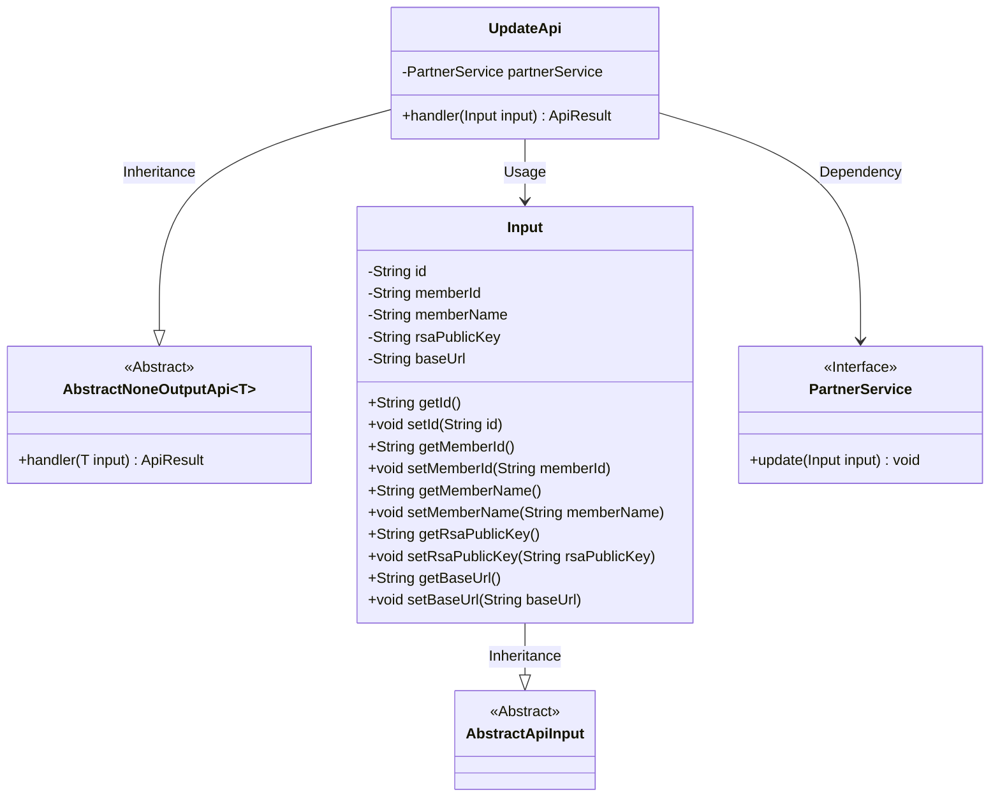

# Basic Information

|      |      |
|------|------|
| Name | UpdateApi |
| Language | .java |
| Code Path | WeFe/fusion/fusion-service/src/main/java/com/welab/wefe/data/fusion/service/api/partner/UpdateApi.java |
| Package Name | com.welab.wefe.data.fusion.service.api.partner |
| Dependencies | ['com.welab.wefe.common.exception.StatusCodeWithException', 'com.welab.wefe.common.fieldvalidate.annotation.Check', 'com.welab.wefe.common.web.api.base.AbstractNoneOutputApi', 'com.welab.wefe.common.web.api.base.Api', 'com.welab.wefe.common.web.dto.AbstractApiInput', 'com.welab.wefe.common.web.dto.ApiResult', 'com.welab.wefe.data.fusion.service.service.PartnerService', 'org.springframework.beans.factory.annotation.Autowired'] |
| Brief Description | Update the partner API with the path `partner/update`. The input must include ID, member ID, name, public key, and request path. Call the `PartnerService` to update the data. |

# Description

This is a Java class named UpdateApi, used for adding partners. It inherits from AbstractNoneOutputApi and uses the Input class as its input parameter. The Input class contains five mandatory fields: id, federation member ID, federation member name, federation member fusion system public key, and request path. The class injects PartnerService and processes the input data by calling partnerService.update through the handler method. All fields have corresponding getter and setter methods.

# Class Summary

| Name   | Type  | Description |
|-------|------|-------------|
| UpdateApi | class | API interface for updating partner information, including required fields: ID, member ID, name, public key, and request path. Calls PartnerService to process the input and returns a successful result. |

## Class UpdateApi

|      |      |
|------|------|
| Access Modifier | @Api(path = "partner/update", name = "添加合作伙伴", desc = "添加合作伙伴");public |
| Type | class |
| Name | UpdateApi |
| Description | API interface for updating partner information, including required fields: ID, member ID, name, public key, and request path. Calls PartnerService to process the input and returns a successful result. |

### UML Class Diagram

This code describes an API interface named UpdateApi for updating partner information. It inherits from the generic abstract class AbstractNoneOutputApi and uses the nested class Input as its parameter. The Input class contains fields such as partner ID, member ID, name, public key, and request path, and it inherits from AbstractApiInput. UpdateApi implements business logic through dependency injection of the PartnerService interface, with its primary function being to handle partner information update requests. The overall design demonstrates a clear hierarchical structure and separation of responsibilities: the Input class handles data validation and transfer, PartnerService manages business operations, and UpdateApi coordinates the processing flow.

### Internal Method Call Graph

```mermaid
graph TD
    A["Class UpdateApi"]
    B["Annotation: @Api(path='partner/update', name='Add Partner', desc='Add Partner')"]
    C["Inheritance: AbstractNoneOutputApi<Input>"]
    D["Dependency Injection: @Autowired PartnerService partnerService"]
    E["Overridden Method: handler(Input input)"]
    F["Inner Class: Input"]
    G["Field: String id (with @Check validation)"]
    H["Field: String memberId (with @Check validation)"]
    I["Field: String memberName (with @Check validation)"]
    J["Field: String rsaPublicKey (with @Check validation)"]
    K["Field: String baseUrl (with @Check validation)"]
    L["getter/setter method group"]
    M["Invocation: partnerService.update(input)"]
    N["Return: success()"]

    A --> B
    A --> C
    A --> D
    A --> E
    E --> M
    E --> N
    A --> F
    F --> G
    F --> H
    F --> I
    F --> J
    F --> K
    F --> L
```

This code describes an API class UpdateApi for updating partner information, which inherits from an abstract base class and implements the core handler method. The flowchart illustrates class structure relationships, including annotation declarations, service injection, input parameter validation, and business processing flow. The inner class Input encapsulates 5 mandatory fields with their validation rules, while the handler method executes the update operation via partnerService and returns a success result. The entire design demonstrates a clear hierarchical structure and parameter validation mechanism.

### Field List

| Name  | Type  | Description |
|-------|-------|------|
| partnerService | PartnerService | Automatically inject the PartnerService instance. |

### Method List

| Name  | Type  | Description |
|-------|-------|------|
| handler | ApiResult | Rewrite the handler method to call the partnerService for updating the input data, returning an ApiResult upon success. Throw a StatusCodeWithException in case of exceptions. |

