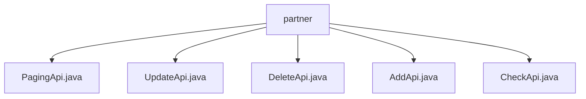

# Basic Information

|      |      |
|------|------|
| Name | partner |
| Language | .java |
| Code Path | WeFe/fusion/fusion-service/src/main/java/com/welab/wefe/data/fusion/service/api/partner |
| Package Name | docs.fusion.fusion-service.src.main.java.com.welab.wefe.data.fusion.service.api.partner |
| Brief Description | PagingApi handles partner pagination queries, with inputs including memberId and memberName, and returns paginated results. UpdateApi updates partner information, with inputs containing five mandatory fields. DeleteApi deletes a partner, requiring an id as input. AddApi adds a partner, with inputs containing four mandatory fields. CheckApi tests the service status, requiring memberId as input. |

# Description

## Overview  
This module is a collection of partner management APIs, with its core responsibility being to provide CRUD-like operations and status checks for partners, functioning as an operational hub. The API specifications uniformly inherit from the AbstractApi base class, with inputs and outputs using specific structures—for example, PagingApi returns paginated results, while other operations return empty results. Key data structures include PartnerMySqlModel, Input classes (containing fields such as member ID/name), and PagingOutput. External dependencies include PartnerService and ThirdPartyService. For instance, AddApi requires an RSA public key, and DeleteApi requires ID validation.  

## Key Business Scenarios  
The module supports end-to-end partner lifecycle management: paginated queries (PagingApi), additions (AddApi), updates (UpdateApi), deletions (DeleteApi), and service status checks (CheckApi). The interaction model involves HTTP requests triggering Service calls—for example, UpdateApi updates data via PartnerService. Typical use cases include federated member management, such as adding a new member requiring a public key and path. API types encompass data operations (e.g., POST for additions) and status queries (e.g., GET for checks). Integration examples include paginated partner list displays and member information maintenance.

### Package Internal Structure View

This flowchart illustrates the API file structure under the partner directory in the fusion-service module of the WeFe project. The root node is the partner folder, which contains five Java interface files: PagingApi, UpdateApi, DeleteApi, AddApi, and CheckApi. These files are directly located under the partner directory without any deeper subdirectory hierarchy.

# File List

| Name   | Type  | Description |
|-------|------|-------------|
| [PagingApi.java](PagingApi.md) | file | This is an API class named "Partner" designed for paginated queries of partner data. It accepts input parameters containing partner IDs and names, invokes the PartnerService for pagination processing, and returns the paginated results. The input class includes getter and setter methods for member IDs and names. |
| [UpdateApi.java](UpdateApi.md) | file | Update the partner API with the path partner/update. The input must include ID, member ID, name, public key, and request path. Call PartnerService to update the data. |
| [DeleteApi.java](DeleteApi.md) | file | Delete the partner's API class, inherit from the no-output abstract class, and delete the partner with the specified ID through PartnerService. The input parameter is the mandatory ID field. |
| [AddApi.java](AddApi.md) | file | Add Partner API requires inputting member ID, name, public key, and request path, then invoking PartnerService to complete the addition operation. |
| [CheckApi.java](CheckApi.md) | file | This is an API class for testing service status, with the path partner/check. It relies on a third-party service to verify member IDs, and the input must include the mandatory federal member ID field. |

