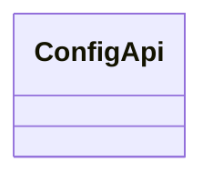
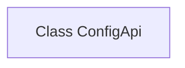

# Basic Information

|      |      |
|------|------|
| Name | ConfigApi |
| Language | .java |
| Code Path | WeFe/fusion/fusion-service/src/main/java/com/welab/wefe/data/fusion/service/api/system/ConfigApi.java |
| Package Name | com.welab.wefe.data.fusion.service.api.system |
| Dependencies | [] |
| Brief Description | Configure API class for managing configuration-related operations. |

# Description

This is a public Java class named ConfigApi, currently implemented as an empty class without any member variables or methods. As a configuration-related API class, it may be used to centrally manage application configuration information, but its specific functionality will depend on the business logic implemented later. The class name follows the UpperCamelCase naming convention, and the public modifier indicates that it allows external access.

# Class Summary

| Name   | Type  | Description |
|-------|------|-------------|
| ConfigApi | class | ConfigApi is a public configuration API class. |

## Class ConfigApi

|      |      |
|------|------|
| Access Modifier | public |
| Type | class |
| Name | ConfigApi |
| Description | ConfigApi is a public configuration API class. |

### UML Class Diagram

This class diagram depicts a simple ConfigApi class, which is currently empty with no defined attributes or methods. The ConfigApi may serve as a foundational class for configuration management, potentially extendable for storing or processing application configuration data. The current structure provides a basic framework for future feature expansion but requires further implementation of specific configuration management logic.

### Internal Method Call Graph

This flowchart describes an empty class structure named ConfigApi. The diagram contains only a single node representing the class definition, with no attributes or method declarations. Since the class implements no functionality, the flowchart merely presents the most basic class declaration framework, reserving space for future extensions. Such a structure is commonly seen in placeholder classes during the initial design phase or interface definition stage.

### Field List

| Name  | Type  | Description |
|-------|-------|------|

### Method List

| Name  | Type  | Description |
|-------|-------|------|

