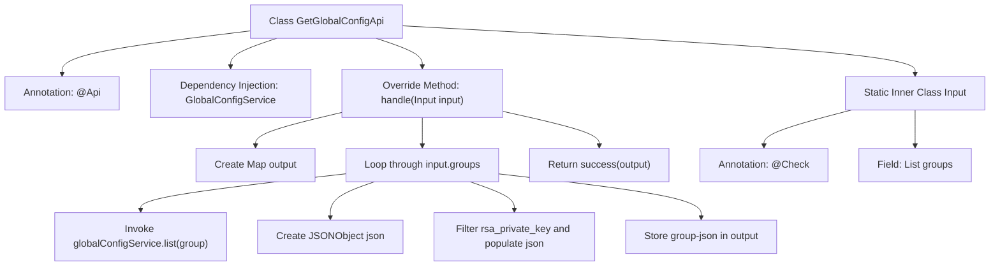

# Basic Information

|      |      |
|------|------|
| Name | GetGlobalConfigApi |
| Language | .java |
| Code Path | WeFe/fusion/fusion-service/src/main/java/com/welab/wefe/data/fusion/service/api/system/GetGlobalConfigApi.java |
| Package Name | com.welab.wefe.data.fusion.service.api.system |
| Dependencies | ['com.alibaba.fastjson.JSONObject', 'com.welab.wefe.common.exception.StatusCodeWithException', 'com.welab.wefe.common.fieldvalidate.annotation.Check', 'com.welab.wefe.common.web.api.base.AbstractApi', 'com.welab.wefe.common.web.api.base.Api', 'com.welab.wefe.common.web.dto.AbstractApiInput', 'com.welab.wefe.common.web.dto.ApiResult', 'com.welab.wefe.data.fusion.service.database.entity.GlobalConfigMysqlModel', 'com.welab.wefe.data.fusion.service.service.globalconfig.GlobalConfigService', 'org.springframework.beans.factory.annotation.Autowired', 'java.util.HashMap', 'java.util.List', 'java.util.Map'] |
| Brief Description | API class for retrieving system-wide global configurations. It returns key-value pairs of corresponding configuration items by inputting a list of group names, filtering out private key fields. It relies on GlobalConfigService to query data and outputs as grouped JSON objects. |

# Description

The code defines an API class named `GetGlobalConfigApi`, which is used to retrieve system-wide global configurations. The API path is `system/global_config/detail`, and it accepts a list containing configuration group names as input parameters. It queries the configuration items of the specified groups via the `GlobalConfigService` service, filters out sensitive information such as `rsa_private_key`, and returns the results as a JSON object with group names as keys and configuration items as values. The input parameter `groups` undergoes non-null validation, and the final output is a Map structure containing all requested group configurations.

# Class Summary

| Name   | Type  | Description |
|-------|------|-------------|
| GetGlobalConfigApi | class | API class for retrieving system-wide configurations, which returns key-value pairs of corresponding configuration items based on the input group name list, filtering out the `rsa_private_key` field. |


## Class GetGlobalConfigApi

|      |      |
|------|------|
| Access Modifier | @Api(path = "system/global_config/detail", name = "get system global configs");public |
| Type | class |
| Name | GetGlobalConfigApi |
| Description | API class for retrieving system-wide configurations, which returns key-value pairs of corresponding configuration items based on the input group name list, filtering out the `rsa_private_key` field. |


### UML Class Diagram

```mermaid
classDiagram
    class GetGlobalConfigApi {
        -GlobalConfigService globalConfigService
        +handle(Input input) ApiResult~Map~String,JSONObject~~
    }

    class AbstractApi~I~Input, R~ {
        <<Abstract>>
        +handle(I input) ApiResult~R~
    }

    class GlobalConfigService {
        +list(String group) List~GlobalConfigMysqlModel~
    }

    class GlobalConfigMysqlModel {
        -String name
        -String value
        +String getName()
        +String getValue()
    }

    class Input {
        -List~String~ groups
    }

    class AbstractApiInput {
        <<Abstract>>
    }

    class JSONObject {
        +put(String key, Object value) JSONObject
    }

    class ApiResult~T~ {
        +success(T data) ApiResult~T~
    }

    GetGlobalConfigApi --> AbstractApi~Input, Map~String,JSONObject~~ : extends
    GetGlobalConfigApi --> GlobalConfigService : depends on
    GetGlobalConfigApi --> Input : uses
    Input --> AbstractApiInput : extends
    GlobalConfigService --> GlobalConfigMysqlModel : returns
    GetGlobalConfigApi --> JSONObject : creates
    GetGlobalConfigApi --> ApiResult~Map~String,JSONObject~~ : returns
```

This code describes a system global configuration API class `GetGlobalConfigApi`, which inherits from the generic abstract class `AbstractApi` and retrieves configuration data through the `GlobalConfigService` service. Its primary function is to query configuration items based on a list of input group names, filter sensitive fields, and return the configuration data in JSON format. The class diagram clearly illustrates inheritance, dependency, and association relationships between classes, including core business logic processing, data models, and service invocation components.


### Internal Method Call Graph



This flowchart illustrates the core processing logic of the GetGlobalConfigApi class, starting from receiving input parameters, iterating through configuration groups, invoking the service layer to retrieve data, filtering sensitive fields to construct the response structure, and finally returning the processed result. The static inner class Input defines the required validation parameters, clearly presenting the complete data processing path of the API from request to response.

### Field List

| Name  | Type  | Description |
|-------|-------|------|
| globalConfigService | GlobalConfigService | Use @Autowired to automatically inject an instance of GlobalConfigService. |

### Method List

| Name  | Type  | Description |
|-------|-------|------|
| handle | ApiResult<Map<String, JSONObject>> | The method processes the input data, iterates through the input groups, retrieves the configuration list from the service, filters out private key entries, constructs a JSON object, and finally returns a mapping result of the configurations for each group. |


