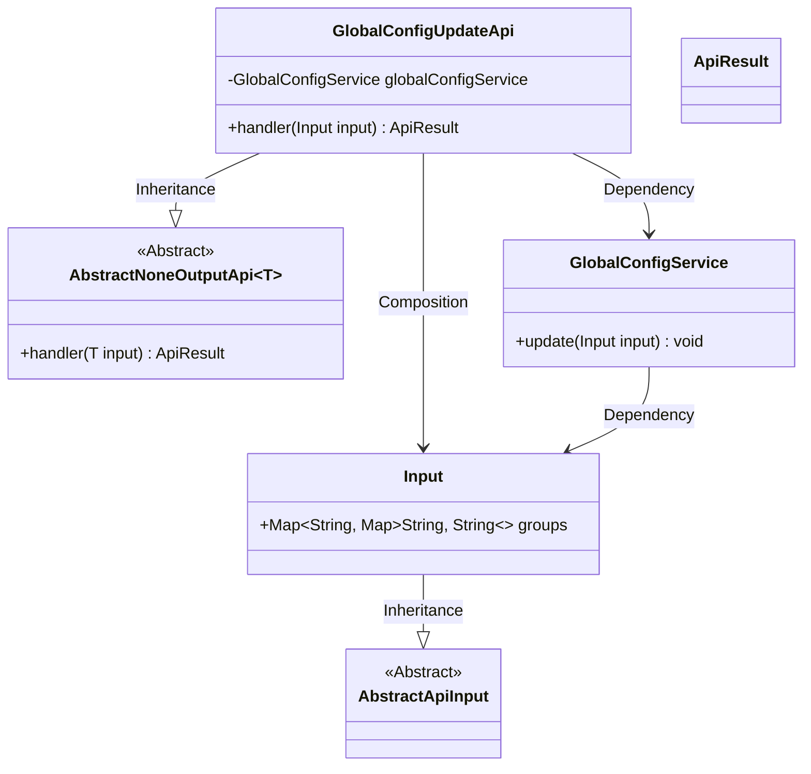

# Basic Information

|      |      |
|------|------|
| Name | GlobalConfigUpdateApi |
| Language | .java |
| Code Path | WeFe/fusion/fusion-service/src/main/java/com/welab/wefe/data/fusion/service/api/system/GlobalConfigUpdateApi.java |
| Package Name | com.welab.wefe.data.fusion.service.api.system |
| Dependencies | ['com.welab.wefe.common.exception.StatusCodeWithException', 'com.welab.wefe.common.web.api.base.AbstractNoneOutputApi', 'com.welab.wefe.common.web.api.base.Api', 'com.welab.wefe.common.web.dto.AbstractApiInput', 'com.welab.wefe.common.web.dto.ApiResult', 'com.welab.wefe.data.fusion.service.service.globalconfig.GlobalConfigService', 'org.springframework.beans.factory.annotation.Autowired', 'java.util.Map'] |
| Brief Description | This is an API class for updating global configurations, with the path "global_config/update". It processes the input parameter `groups` through the `GlobalConfigService` and returns a successful result. The input parameter is a Map containing group information. |

# Description

This is a Java class named GlobalConfigUpdateApi, designed for updating global configuration information. The class extends AbstractNoneOutputApi with its generic parameter set to the inner class Input. The @Api annotation defines the API path as "global_config/update" and the name as "Update Configuration Information." The class injects the GlobalConfigService and overrides the handler method, which invokes the service's update method to process input parameters before returning a successful result. The Input inner class extends AbstractApiInput and contains a groups field, structured as a nested Map, for storing grouped configuration data. The entire class implements the core logic for configuration updates.

# Class Summary

| Name   | Type  | Description |
|-------|------|-------------|
| GlobalConfigUpdateApi | class | This is an API class for updating global configurations, which processes input parameters through the GlobalConfigService and returns a successful result. The input parameters consist of grouped configuration information. |

## Class GlobalConfigUpdateApi

|      |      |
|------|------|
| Access Modifier | @Api(path = "global_config/update", name = "更新配置信息");public |
| Type | class |
| Name | GlobalConfigUpdateApi |
| Description | This is an API class for updating global configurations, which processes input parameters through the GlobalConfigService and returns a successful result. The input parameters consist of grouped configuration information. |

### UML Class Diagram

Class Diagram Description: This diagram illustrates the class structure of GlobalConfigUpdateApi, which inherits from the generic class AbstractNoneOutputApi<Input>, contains a dependency on GlobalConfigService, and includes a static nested class Input. Input inherits from AbstractApiInput and contains a nested Map structure. GlobalConfigService provides an update method to process Input parameters. The overall structure reflects the input handling and service invocation relationships of the configuration update API.

### Internal Method Call Graph

```mermaid
graph TD
    A["Class GlobalConfigUpdateApi"]
    B["Annotation: @Api(path='global_config/update', name='Update configuration')"]
    C["Inheritance: AbstractNoneOutputApi<Input>"]
    D["Dependency Injection: @Autowired GlobalConfigService"]
    E["Overridden Method: handler(Input input)"]
    F["Inner Class: Input extends AbstractApiInput"]
    G["Property: Map<String, Map<String, String>> groups"]
    H["Invocation: globalConfigService.update(input)"]
    I["Return: ApiResult.success()"]

    A --> B
    A --> C
    A --> D
    A --> E
    E --> H
    H --> I
    A --> F
    F --> G
```

This flowchart illustrates the structure and workflow of the GlobalConfigUpdateApi class. The class defines an API path through the @Api annotation, inherits from an abstract parent class, and injects the GlobalConfigService. The core handler method invokes the service layer's update method when processing input parameters, ultimately returning a success result. The inner Input class defines a nested Map-structured configuration group data field for receiving hierarchical configuration data from the frontend. The overall process clearly demonstrates the complete chain from request handling to service invocation.

### Field List

| Name  | Type  | Description |
|-------|-------|------|
| globalConfigService | GlobalConfigService | Using @Autowired to automatically inject an instance of GlobalConfigService. |

### Method List

| Name  | Type  | Description |
|-------|-------|------|
| handler | ApiResult | Java method override, calls the global configuration service to update input parameters, and returns the result upon success. |

