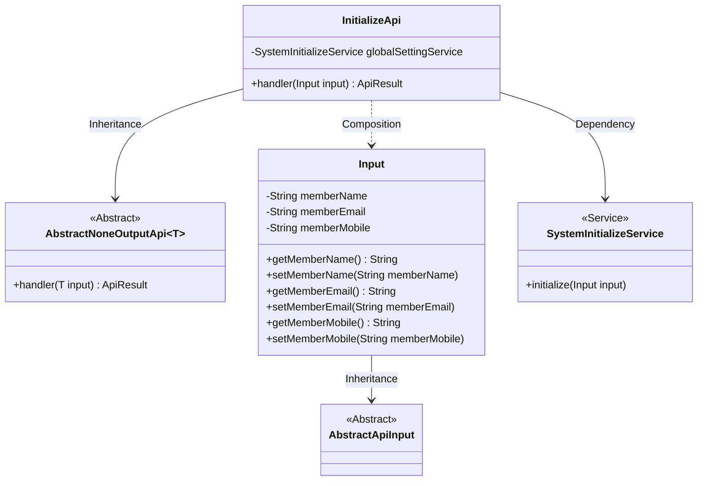

# Basic Information

|      |      |
|------|------|
| Name | InitializeApi |
| Language | .java |
| Code Path | WeFe/fusion/fusion-service/src/main/java/com/welab/wefe/data/fusion/service/api/system/InitializeApi.java |
| Package Name | com.welab.wefe.data.fusion.service.api.system |
| Dependencies | ['com.welab.wefe.common.exception.StatusCodeWithException', 'com.welab.wefe.common.fieldvalidate.StandardFieldType', 'com.welab.wefe.common.fieldvalidate.annotation.Check', 'com.welab.wefe.common.web.api.base.AbstractNoneOutputApi', 'com.welab.wefe.common.web.api.base.Api', 'com.welab.wefe.common.web.dto.AbstractApiInput', 'com.welab.wefe.common.web.dto.ApiResult', 'com.welab.wefe.data.fusion.service.service.SystemInitializeService', 'org.springframework.beans.factory.annotation.Autowired'] |
| Brief Description | The `InitializeApi` class is used for system initialization, including input validation for member name, email, and phone number. The name is mandatory and must be 3-12 characters long, the email must conform to the correct format, and the phone number must be 6-18 digits or symbols. |

# Description

This is a Java class named InitializeApi, used for system initialization. It inherits from AbstractNoneOutputApi and is located at the path system/initialize. The class injects the SystemInitializeService and processes input parameters through the handler method. The input parameter class Input contains three fields: memberName (required, supports Chinese, English, and numbers, length 3-12), memberEmail (email format), and memberMobile (phone format, 6-18 digits or symbols). Each field has corresponding validation rules and error messages. The class also provides getter and setter methods for these fields.

# Class Summary

| Name   | Type  | Description |
|-------|------|-------------|
| InitializeApi | class | This is a system initialization API class that includes input validation for member names, emails, and phone numbers, and performs initialization operations through the SystemInitializeService. |

## Class InitializeApi

|      |      |
|------|------|
| Access Modifier | @Api(path = "system/initialize", name = "initialize system");public |
| Type | class |
| Name | InitializeApi |
| Description | This is a system initialization API class that includes input validation for member names, emails, and phone numbers, and performs initialization operations through the SystemInitializeService. |

### UML Class Diagram

This code demonstrates the structure of a system initialization API. InitializeApi inherits from AbstractNoneOutputApi, processes parameters of type Input, and performs initialization operations through SystemInitializeService. The Input class contains fields such as member name, email, and phone number, annotated with data validation markers. The class diagram clearly illustrates inheritance relationships (InitializeApi→AbstractNoneOutputApi, Input→AbstractApiInput), dependency relationships (InitializeApi→SystemInitializeService), and composition relationships (InitializeApi contains the Input inner class).

### Internal Method Call Graph

```mermaid
graph TD
    A["Class InitializeApi"]
    B["Annotation: @Api(path='system/initialize', name='initialize system')"]
    C["Inheritance: AbstractNoneOutputApi<Input>"]
    D["Dependency Injection: @Autowired SystemInitializeService"]
    E["Overridden Method: handler(Input input)"]
    F["Nested Class Input"]
    G["Field: String memberName @Check"]
    H["Field: String memberEmail @Check"]
    I["Field: String memberMobile @Check"]
    J["Method: getter/setter"]

    A --> B
    A --> C
    A --> D
    A --> E
    A --> F
    F --> G
    F --> H
    F --> I
    F --> J
    E --> D
    E -->|invokes| F
```

The flowchart describes the structure of the InitializeApi class, which is an API class with system initialization functionality. It inherits from an abstract parent class and includes input parameter validation logic. The class injects a service via @Autowired, overrides the handler method to process initialization requests, and contains a nested Input class defining three fields with validation rules and corresponding getter/setter methods. Together, these elements form a complete parameter validation and initialization workflow.

### Field List

| Name  | Type  | Description |
|-------|-------|------|
| globalSettingService | SystemInitializeService | Automatic injection system initializes service instances into global configuration service variables. |

### Method List

| Name  | Type  | Description |
|-------|-------|------|
| handler | ApiResult<?> | This method overrides the parent class handler, calls globalSettingService to initialize the input parameters, and returns an ApiResult upon success. It throws a StatusCodeWithException in case of exceptions. |

