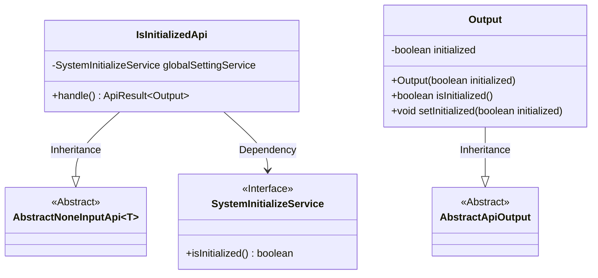
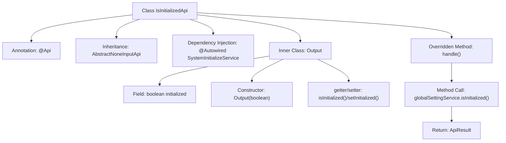

# Basic Information

|      |      |
|------|------|
| Name | IsInitializedApi |
| Language | .java |
| Code Path | WeFe/fusion/fusion-service/src/main/java/com/welab/wefe/data/fusion/service/api/system/IsInitializedApi.java |
| Package Name | com.welab.wefe.data.fusion.service.api.system |
| Dependencies | ['com.welab.wefe.common.exception.StatusCodeWithException', 'com.welab.wefe.common.web.api.base.AbstractNoneInputApi', 'com.welab.wefe.common.web.api.base.Api', 'com.welab.wefe.common.web.dto.AbstractApiOutput', 'com.welab.wefe.common.web.dto.ApiResult', 'com.welab.wefe.data.fusion.service.service.SystemInitializeService', 'org.springframework.beans.factory.annotation.Autowired'] |
| Brief Description | This is an API interface that checks whether the system is initialized. It returns a boolean value indicating the initialization status. The system cannot use functional modules when uninitialized. |

# Description

The code defines an API class named `IsInitializedApi`, which is used to check whether the system has completed initialization. The API path is `"system/is_initialized"`, and the functional description indicates that no functional modules can be accessed before system initialization. This class inherits from `AbstractNoneInputApi` and returns an `Output` object containing the initialization status. The initialization status is obtained through the `isInitialized` method of `SystemInitializeService` and encapsulated in the `Output` class, which provides getter and setter methods for the `initialized` property. The entire API processing logic is concise, simply returning the system initialization status.

# Class Summary

| Name   | Type  | Description |
|-------|------|-------------|
| IsInitializedApi | class | This is an API class for checking whether the system is initialized, with the path "system/is_initialized". Function modules cannot be accessed if the system is uninitialized. It retrieves the initialization status via SystemInitializeService and returns a boolean result. |

## Class IsInitializedApi

|      |      |
|------|------|
| Access Modifier | @Api(;        path = "system/is_initialized",;        name = "is the system initialized",;        desc = "The system cannot access any functional modules before initialization";);public |
| Type | class |
| Name | IsInitializedApi |
| Description | This is an API class for checking whether the system is initialized, with the path "system/is_initialized". Function modules cannot be accessed if the system is uninitialized. It retrieves the initialization status via SystemInitializeService and returns a boolean result. |

### UML Class Diagram

This class diagram illustrates the structure of IsInitializedApi and its related classes. IsInitializedApi inherits from the generic class AbstractNoneInputApi<Output> and depends on the SystemInitializeService interface. The Output class inherits from AbstractApiOutput and contains a boolean value for initialization status along with its accessor methods. SystemInitializeService serves as an interface providing the isInitialized() method. The overall structure reflects the division of responsibilities for API handling of system initialization status checks.

### Internal Method Call Graph

The flowchart illustrates the structure and execution flow of the IsInitializedApi class. This class defines interface metadata via the @Api annotation, inherits from AbstractNoneInputApi, and overrides the handle() method. During processing, it invokes SystemInitializeService to check initialization status and returns an ApiResult containing the Output. The inner class Output encapsulates a boolean initialized state with standard getter/setter methods. The complete workflow demonstrates the call chain from request processing to result return.

### Field List

| Name  | Type  | Description |
|-------|-------|------|
| globalSettingService | SystemInitializeService | Initializing service instance for automatic injection system. |

### Method List

| Name  | Type  | Description |
|-------|-------|------|
| handle | ApiResult<Output> | Process the request and return the API result for global settings initialization status. |

