# Basic Information

|      |      |
|------|------|
| Name | OptionsApi |
| Language | .java |
| Code Path | WeFe/fusion/fusion-service/src/main/java/com/welab/wefe/data/fusion/service/api/system/OptionsApi.java |
| Package Name | com.welab.wefe.data.fusion.service.api.system |
| Dependencies | ['com.welab.wefe.common.exception.StatusCodeWithException', 'com.welab.wefe.common.web.api.base.AbstractApi', 'com.welab.wefe.common.web.api.base.Api', 'com.welab.wefe.common.web.dto.AbstractApiInput', 'com.welab.wefe.common.web.dto.ApiResult', 'com.welab.wefe.data.fusion.service.enums.Options', 'java.util.EnumSet'] |
| Brief Description | Defined an API class named OptionsApi with the path system/options, used to handle operation-type requests. This class inherits from AbstractApi, takes the Input class as input, and returns an enumeration collection Options. The handle method returns all Options enumeration values. The Input class is empty and inherits from AbstractApiInput. |

# Description

The code defines an API class named `OptionsApi`, which inherits from `AbstractApi` and handles requests with input type `Input` and output type `EnumSet<Options>`. The API path is `"system/options"`, and its name is "Operation Types". The class includes a `handle` method that returns a collection of all `Options` enum values, wrapping the result using the `success` method. The `Input` class inherits from `AbstractApiInput` and currently has an empty implementation. This entire API is used to retrieve a list of operation type options.

# Class Summary

| Name   | Type  | Description |
|-------|------|-------------|
| OptionsApi | class | The Java class `OptionsApi` defines a system operation type API with the path `system/options`, which returns all enum option sets. It inherits from `AbstractApi`, takes no input, and has straightforward processing logic. |


## Class OptionsApi

|      |      |
|------|------|
| Access Modifier | @Api(path = "system/options", name = "操作类型", desc = "操作类型");public |
| Type | class |
| Name | OptionsApi |
| Description | The Java class `OptionsApi` defines a system operation type API with the path `system/options`, which returns all enum option sets. It inherits from `AbstractApi`, takes no input, and has straightforward processing logic. |


### UML Class Diagram

```mermaid
classDiagram
    class OptionsApi {
        +handle(Input input) ApiResult~EnumSet~Options~~
    }
    class AbstractApi~T, R~ {
        <<Abstract>>
        #handle(T input) ApiResult~R~
    }
    class ApiResult~T~ {
        <<GenericType>>
    }
    class Input {
        <<NestedClass>>
    }
    class AbstractApiInput {
        <<Abstract>>
    }
    class "EnumSet~Options~" {
        <<EnumSet>>
    }

    OptionsApi --|> AbstractApi~Input, EnumSet~Options~~ : Inheritance
    Input --|> AbstractApiInput : Inheritance
    OptionsApi --> Input : Uses
    AbstractApi~T, R~ --> ApiResult~R~ : Returns
    OptionsApi --> "EnumSet~Options~" : Returns
```

Class Diagram Description: This diagram illustrates a generic-based API class structure where OptionsApi inherits from the abstract class AbstractApi and implements functionality to process input and return an enum set. Input, as a nested class inheriting from AbstractApiInput, encapsulates request parameters. AbstractApi defines the core abstract handle method, returning a generic ApiResult. The entire structure demonstrates a typical Template Method pattern implementation, ensuring type safety through generic parameters.


### Internal Method Call Graph

```mermaid
graph TD
    A["Class OptionsApi"]
    B["Annotation: @Api(path='system/options', name='Operation Type', desc='Operation Type')"]
    C["Parent Class: AbstractApi<Input, EnumSet<Options>>"]
    D["Method: handle(Input input)"]
    E["Inner Class: Input extends AbstractApiInput"]
    F["Step: EnumSet.allOf(Options.class)"]
    G["Step: return success(options)"]

    A --> B
    A --> C
    A --> D
    A --> E
    D --> F
    F --> G
```



This code defines a class named `OptionsApi`, which inherits from `AbstractApi` and is annotated with `@Api`. The class contains a method `handle` that processes input and returns an `EnumSet` containing all values of the `Options` enum. The inner class `Input` extends `AbstractApiInput` and defines the structure of input parameters. The flowchart clearly illustrates the class structure and method invocation flow.

### Field List

| Name  | Type  | Description |
|-------|-------|------|

### Method List

| Name  | Type  | Description |
|-------|-------|------|
| handle | ApiResult<EnumSet<Options>> | Method override, processes the input and returns a successful result containing all enum values of Options. |


