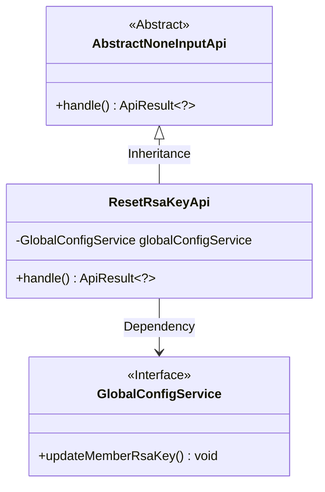
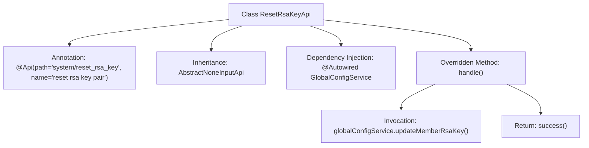

# Basic Information

|      |      |
|------|------|
| Name | ResetRsaKeyApi |
| Language | .java |
| Code Path | WeFe/fusion/fusion-service/src/main/java/com/welab/wefe/data/fusion/service/api/system/ResetRsaKeyApi.java |
| Package Name | com.welab.wefe.data.fusion.service.api.system |
| Dependencies | ['com.welab.wefe.common.exception.StatusCodeWithException', 'com.welab.wefe.common.web.api.base.AbstractNoneInputApi', 'com.welab.wefe.common.web.api.base.Api', 'com.welab.wefe.common.web.dto.ApiResult', 'com.welab.wefe.data.fusion.service.service.globalconfig.GlobalConfigService', 'org.springframework.beans.factory.annotation.Autowired'] |
| Brief Description | API class for resetting RSA key pair, which invokes the global configuration service to update the keys. No input parameters are required, and it returns a successful result. |

# Description

This is an API class named ResetRsaKeyApi, designed to reset RSA key pairs. It inherits from the AbstractNoneInputApi base class, indicating that this interface requires no input parameters. The class is annotated with @Api, specifying the path as system/reset_rsa_key. It utilizes the auto-injected GlobalConfigService to call the updateMemberRsaKey method for executing the key update operation. Upon successful processing, it returns an empty result. The entire class is concise and focused solely on accomplishing the RSA key reset functionality.

# Class Summary

| Name   | Type  | Description |
|-------|------|-------------|
| ResetRsaKeyApi | class | API class for resetting RSA key pairs, which updates member RSA keys via GlobalConfigService. No input parameters are required, and it returns a successful result. |

## Class ResetRsaKeyApi

|      |      |
|------|------|
| Access Modifier | @Api(path = "system/reset_rsa_key", name = "reset rsa key pair");public |
| Type | class |
| Name | ResetRsaKeyApi |
| Description | API class for resetting RSA key pairs, which updates member RSA keys via GlobalConfigService. No input parameters are required, and it returns a successful result. |

### UML Class Diagram

Class Diagram Description: ResetRsaKeyApi inherits from the abstract class AbstractNoneInputApi, implementing API handling logic without input parameters. This class updates member RSA key pairs through dependency injection of the GlobalConfigService interface, reflecting the dependency injection feature of the Spring framework. AbstractNoneInputApi defines the core abstract handle method, while ResetRsaKeyApi performs the key reset operation through concrete implementation. The overall structure clearly demonstrates the application of Inversion of Control and the Template Method pattern.

### Internal Method Call Graph

This flowchart illustrates the structure and execution flow of the ResetRsaKeyApi class. The class defines its API path and name via the @Api annotation, inherits from the AbstractNoneInputApi base class, and injects the GlobalConfigService. The core logic is implemented in the handle() method, which first calls updateMemberRsaKey() to update the RSA key pair and finally returns a success result. The entire process demonstrates Spring Boot's dependency injection and API handling mechanisms.

### Field List

| Name  | Type  | Description |
|-------|-------|------|
| globalConfigService | GlobalConfigService | Using @Autowired to automatically inject an instance of GlobalConfigService. |

### Method List

| Name  | Type  | Description |
|-------|-------|------|
| handle | ApiResult<?> | Method override, call the update member RSA key service, and return the result upon success. |

