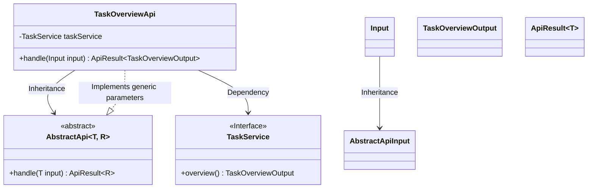

# Basic Information

|      |      |
|------|------|
| Name | TaskOverviewApi |
| Language | .java |
| Code Path | WeFe/fusion/fusion-service/src/main/java/com/welab/wefe/data/fusion/service/api/system/TaskOverviewApi.java |
| Package Name | com.welab.wefe.data.fusion.service.api.system |
| Dependencies | ['com.welab.wefe.common.exception.StatusCodeWithException', 'com.welab.wefe.common.fieldvalidate.annotation.Check', 'com.welab.wefe.common.web.api.base.AbstractApi', 'com.welab.wefe.common.web.api.base.AbstractNoneOutputApi', 'com.welab.wefe.common.web.api.base.Api', 'com.welab.wefe.common.web.dto.AbstractApiInput', 'com.welab.wefe.common.web.dto.ApiResult', 'com.welab.wefe.data.fusion.service.dto.entity.TaskOverviewOutput', 'com.welab.wefe.data.fusion.service.service.TaskService', 'org.springframework.beans.factory.annotation.Autowired', 'java.io.IOException'] |
| Brief Description | This is a task overview API class that inherits from the abstract API class, using TaskService to process requests and return task overview results. The input is empty, and the output is TaskOverviewOutput. |

# Description

The code defines an API class named `TaskOverviewApi`, which inherits from `AbstractApi` and is used to handle task overview-related requests. The class annotation specifies the path as `"task/overview"`, the name as `"task overview"`, and the description as `"task overview"`. This class injects the `TaskService` service and calls `taskService.overview()` via the `handle` method to retrieve task overview data, returning a successful result. The input parameters use a static inner class `Input`, which inherits from `AbstractApiInput`, and currently no additional fields are defined. The entire API design is concise, focusing on the implementation of the task overview functionality.

# Class Summary

| Name   | Type  | Description |
|-------|------|-------------|
| TaskOverviewApi | class | The TaskOverviewApi class is an API that handles task overviews, inheriting from AbstractApi. It uses TaskService to retrieve overview data and returns a TaskOverviewOutput result. The input class Input is empty. |

## Class TaskOverviewApi

|      |      |
|------|------|
| Access Modifier | @Api(path = "task/overview", name = "task overview", desc = "task overview");public |
| Type | class |
| Name | TaskOverviewApi |
| Description | The TaskOverviewApi class is an API that handles task overviews, inheriting from AbstractApi. It uses TaskService to retrieve overview data and returns a TaskOverviewOutput result. The input class Input is empty. |

### UML Class Diagram

Class diagram description: This diagram illustrates that the TaskOverviewApi class inherits from the generic class AbstractApi<Input, TaskOverviewOutput> and implements the handle method. TaskOverviewApi injects the TaskService interface via @Autowired, with its inner class Input inheriting from AbstractApiInput. The overall structure reflects a Spring-style API controller design pattern, where TaskService handles business logic and AbstractApi provides foundational framework support.

### Internal Method Call Graph

```mermaid
graph TD
    A["Class TaskOverviewApi"]
    B["Annotation: @Api"]
    C["Inheritance: AbstractApi<Input, TaskOverviewOutput>"]
    D["Dependency Injection: @Autowired TaskService"]
    E["Overridden Method: handle(Input input)"]
    F["Inner Class: Input extends AbstractApiInput"]
    G["Invocation: taskService.overview()"]
    H["Return: ApiResult<TaskOverviewOutput>"]

    A --> B
    A --> C
    A --> D
    A --> E
    E --> G
    G --> H
    A --> F
```

This flowchart illustrates the structure and key behaviors of the TaskOverviewApi class. The class is defined with @Api annotation for API metadata, inherits from the AbstractApi template class with specified input/output types. The core processing logic resides in the overridden handle method, which retrieves task overview data through the injected TaskService and encapsulates the response. The inner class Input serves as the base class extension for API parameters. The diagram demonstrates a complete call chain from request handling to result return, reflecting typical Spring Boot API layer design patterns.

### Field List

| Name  | Type  | Description |
|-------|-------|------|
| taskService | TaskService | Automatically inject the TaskService instance. |

### Method List

| Name  | Type  | Description |
|-------|-------|------|
| handle | ApiResult<TaskOverviewOutput> | This is a Java method that overrides a parent class method, processes input, and returns task overview results. The method calls taskService.overview() to retrieve data, returning encapsulated results upon success, and may throw exceptions or IO errors. |

