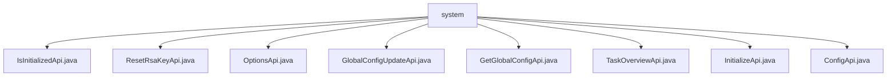

# Basic Information

|      |      |
|------|------|
| Name | system |
| Language | .java |
| Code Path | WeFe/fusion/fusion-service/src/main/java/com/welab/wefe/data/fusion/service/api/system |
| Package Name | docs.fusion.fusion-service.src.main.java.com.welab.wefe.data.fusion.service.api.system |
| Brief Description | The IsInitializedApi checks the system initialization status. The ResetRsaKeyApi resets RSA keys. The OptionsApi retrieves operation type options. The GlobalConfigUpdateApi updates global configurations. The GetGlobalConfigApi fetches global configurations. The TaskOverviewApi obtains task overviews. The InitializeApi handles system initialization. The ConfigApi serves as an empty configuration class. |

# Description

## Overview  
The core responsibility of this module is to manage system initialization status, global configurations, and security keys, functioning similarly to a control hub pattern. The interface specifications follow a unified design: inheriting from the AbstractApi base class and using the @Api annotation to define paths, such as "system/is_initialized" to check initialization status and "system/reset_rsa_key" to reset keys. Key data structures include an Output class with an initialized attribute, a Map structure for storing grouped configurations, and an Input class containing member information. External dependencies include SystemInitializeService (handling initialization), GlobalConfigService (managing configurations), and TaskService (task overview). For example, InitializeApi completes system initialization by validating fields like memberName.

## Main Business Scenarios  
The module supports full lifecycle management of the system: checking status via IsInitializedApi before initialization and completing initialization via InitializeApi; maintaining configurations during operation through GlobalConfigUpdateApi/GetGlobalConfigApi, such as filtering sensitive fields like rsa_private_key; and providing security features like ResetRsaKeyApi for key rotation. The interaction mode is uniformly RESTful, such as OptionsApi returning an EnumSet<Options>. Typical applications include: 1) Checking/executing initialization during system startup 2) Administrators updating global configurations 3) Periodic RSA key rotation. API types cover status queries (no input), data processing (Map structure), and enumeration retrieval, such as TaskOverviewApi returning task statistics views.

### Package Internal Structure View

This flowchart illustrates the API file structure under the system module in the WeFe data fusion service. All API files (such as IsInitializedApi.java, ResetRsaKeyApi.java, etc.) are directly subordinate to the system directory without deeper subdirectories. These API files primarily handle system initialization, RSA key reset, global configuration management, and other functions, forming the core system configuration interfaces of the data fusion service.

# File List

| Name   | Type  | Description |
|-------|------|-------------|
| [IsInitializedApi.java](IsInitializedApi.md) | file | This is an API interface that checks whether the system is initialized. It returns a boolean value indicating the initialization status. The system's functional modules cannot be used when uninitialized. |
| [ResetRsaKeyApi.java](ResetRsaKeyApi.md) | file | API class for resetting RSA key pair, which calls the global configuration service to update the keys. It has no input parameters and returns a success result. |
| [OptionsApi.java](OptionsApi.md) | file | Defined an API class named OptionsApi with the path system/options, used to handle operation-type requests. This class inherits from AbstractApi, takes the Input class as input, and returns an enumeration collection Options. The handle method returns all Options enumeration values. The Input class is empty and inherits from AbstractApiInput. |
| [GlobalConfigUpdateApi.java](GlobalConfigUpdateApi.md) | file | This is an API class for updating global configurations, with the path "global_config/update". It processes the input parameter `groups` through the `GlobalConfigService` and returns a successful result. The input parameter is a Map containing group information. |
| [GetGlobalConfigApi.java](GetGlobalConfigApi.md) | file | API class for retrieving system-wide configurations, which returns key-value pairs of corresponding configuration items by inputting a list of group names, filtering out private key fields. It relies on GlobalConfigService to query data and outputs as grouped JSON objects. |
| [TaskOverviewApi.java](TaskOverviewApi.md) | file | This is a task overview API class that inherits from the abstract API class, using TaskService to process requests and return task overview results. The input is empty, and the output is TaskOverviewOutput. |
| [InitializeApi.java](InitializeApi.md) | file | The `InitializeApi` class is used for system initialization, including input validation for member name, email, and phone number. The name is mandatory and must be 3-12 characters in length, the email must conform to the required format, and the phone number must be 6-18 digits or symbols. |
| [ConfigApi.java](ConfigApi.md) | file | Configure API class for managing configuration-related operations. |

