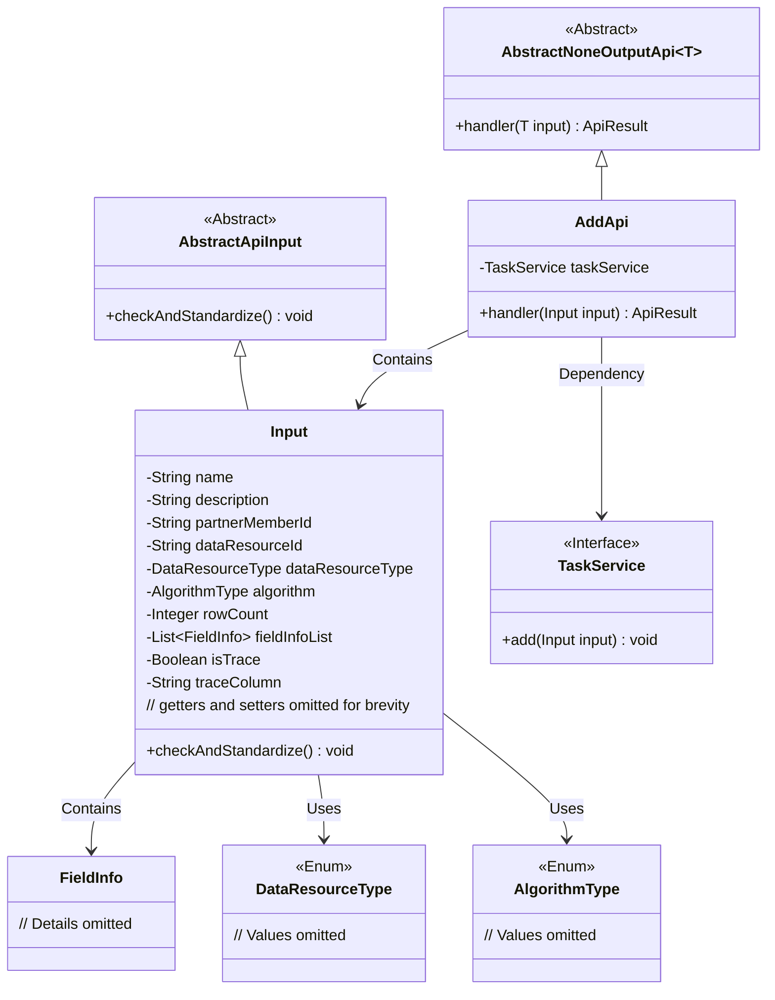

# Basic Information

|      |      |
|------|------|
| Name | AddApi |
| Language | .java |
| Code Path | WeFe/fusion/fusion-service/src/main/java/com/welab/wefe/data/fusion/service/api/task/AddApi.java |
| Package Name | com.welab.wefe.data.fusion.service.api.task |
| Dependencies | ['com.welab.wefe.common.StatusCode', 'com.welab.wefe.common.exception.StatusCodeWithException', 'com.welab.wefe.common.fieldvalidate.annotation.Check', 'com.welab.wefe.common.util.StringUtil', 'com.welab.wefe.common.web.api.base.AbstractNoneOutputApi', 'com.welab.wefe.common.web.api.base.Api', 'com.welab.wefe.common.web.dto.AbstractApiInput', 'com.welab.wefe.common.web.dto.ApiResult', 'com.welab.wefe.data.fusion.service.enums.AlgorithmType', 'com.welab.wefe.data.fusion.service.enums.DataResourceType', 'com.welab.wefe.data.fusion.service.service.TaskService', 'com.welab.wefe.data.fusion.service.utils.primarykey.FieldInfo', 'org.apache.commons.collections4.CollectionUtils', 'org.springframework.beans.factory.annotation.Autowired', 'java.util.List'] |
| Brief Description | Add an API interface for alignment tasks, including parameters such as task name, description, partner member ID, data resource ID, etc., and perform parameter validation. |

# Description

The code defines an API class named `AddApi` for adding alignment tasks. The API path is `task/add`, which accepts an input parameter `Input` containing attributes such as task name, description, collaborator member ID, data resource ID, data resource type, algorithm type, sample size, primary key processing field list, whether to trace, and trace fields. The input parameters are validated via annotations, including mandatory fields and length constraints. The `handler` method invokes `taskService.add` to process the input data. The `Input` class also includes custom validation logic to ensure the validity of mandatory fields like data samples, collaborators, and primary key settings, while checking that trace fields do not conflict with primary key fields. All attributes are provided with getter and setter methods.

# Class Summary

| Name   | Type  | Description |
|-------|------|-------------|
| AddApi | class | Add an API interface for alignment tasks, including parameters such as task name, description, partner member ID, data resource ID, etc., with parameter validation and standardization processing. |

## Class AddApi

|      |      |
|------|------|
| Access Modifier | @Api(path = "task/add", name = "添加对齐任务", desc = "添加对齐任务");public |
| Type | class |
| Name | AddApi |
| Description | Add an API interface for alignment tasks, including parameters such as task name, description, partner member ID, data resource ID, etc., with parameter validation and standardization processing. |

### UML Class Diagram

This code describes the implementation of an API for adding alignment tasks. The AddApi inherits from AbstractNoneOutputApi, processes input parameters of type Input, and performs the actual task addition operation through TaskService. The Input class inherits from AbstractApiInput and includes fields such as task name, description, partner member ID, etc., with parameter validation and standardization handled via the checkAndStandardize method. The class diagram illustrates inheritance, dependency, and containment relationships between components, reflecting a clear hierarchical structure and division of responsibilities.

### Internal Method Call Graph

```mermaid
graph TD
    A["Class AddApi"]
    B["Inheritance: AbstractNoneOutputApi<Input>"]
    C["Dependency: TaskService taskService"]
    D["Overridden Method: handler(Input input)"]
    E["Nested Class: Input"]
    F["Property: String name"]
    G["Property: String description"]
    H["Property: String partnerMemberId"]
    I["Property: String dataResourceId"]
    J["Property: DataResourceType dataResourceType"]
    K["Property: AlgorithmType algorithm"]
    L["Property: Integer rowCount"]
    M["Property: List<FieldInfo> fieldInfoList"]
    N["Property: Boolean isTrace"]
    O["Property: String traceColumn"]
    P["Method: checkAndStandardize()"]
    Q["Method: Standard getters/setters for all properties"]

    A --> B
    A --> C
    A --> D
    A --> E
    E --> F
    E --> G
    E --> H
    E --> I
    E --> J
    E --> K
    E --> L
    E --> M
    E --> N
    E --> O
    E --> P
    E --> Q
```

This flowchart illustrates the complete structure of the AddApi class, including its inheritance relationship, dependent service, core processing method, and nested Input class. The Input class contains 12 properties with validation rules and a parameter standardization method. The handler method processes input parameters through taskService.add(). All properties are equipped with standard getters/setters, and the checkAndStandardize() method implements 7 types of business parameter validation logic, including core validation rules such as null checks and field mutual exclusion validation.

### Field List

| Name  | Type  | Description |
|-------|-------|------|
| taskService | TaskService | Automatically inject the TaskService instance. |

### Method List

| Name  | Type  | Description |
|-------|-------|------|
| handler | ApiResult | The method overrides the input handling, invokes the task service to add the input, and returns a successful result. If an exception occurs, it throws a status code exception. |

