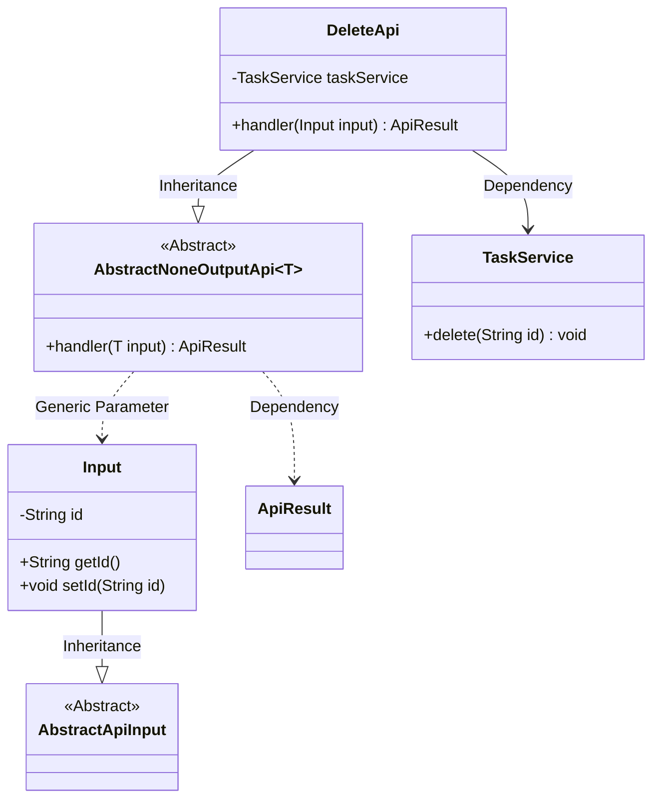

# Basic Information

|      |      |
|------|------|
| Name | DeleteApi |
| Language | .java |
| Code Path | WeFe/fusion/fusion-service/src/main/java/com/welab/wefe/data/fusion/service/api/task/DeleteApi.java |
| Package Name | com.welab.wefe.data.fusion.service.api.task |
| Dependencies | ['com.welab.wefe.common.exception.StatusCodeWithException', 'com.welab.wefe.common.fieldvalidate.annotation.Check', 'com.welab.wefe.common.web.api.base.AbstractNoneOutputApi', 'com.welab.wefe.common.web.api.base.Api', 'com.welab.wefe.common.web.dto.AbstractApiInput', 'com.welab.wefe.common.web.dto.ApiResult', 'com.welab.wefe.data.fusion.service.service.TaskService', 'org.springframework.beans.factory.annotation.Autowired'] |
| Brief Description | Delete the partner's API interface, login required, call taskService to delete the specified partner by ID, returns empty result upon success. The input parameter is a mandatory ID string. |

# Description

This is a Java class named DeleteApi, designed for deleting partner tasks. The class extends AbstractNoneOutputApi, using generics to specify the input parameter type as the inner class Input. The @Api annotation defines the API path as "task/delete" and requires login authentication. The core logic resides in the handler method, which invokes the delete method of taskService to perform the deletion. The input parameter Input includes a mandatory field id, validated via the @Check annotation. The overall API design is concise, implementing basic deletion functionality.

# Class Summary

| Name   | Type  | Description |
|-------|------|-------------|
| DeleteApi | class | Delete the partner's API interface, requiring login, which accepts the id parameter and invokes taskService to perform the deletion operation. |

## Class DeleteApi

|      |      |
|------|------|
| Access Modifier | @Api(path = "task/delete", name = "删除合作方", desc = "删除合作方", login = true);public |
| Type | class |
| Name | DeleteApi |
| Description | Delete the partner's API interface, requiring login, which accepts the id parameter and invokes taskService to perform the deletion operation. |

### UML Class Diagram

This code defines a task deletion API interface `DeleteApi`, which inherits from the generic abstract class `AbstractNoneOutputApi` and processes input parameters of type `Input`. The `DeleteApi` performs actual deletion operations through `TaskService`, with the input parameter `Input` inheriting from `AbstractApiInput` and containing a mandatory `id` field. The class diagram clearly illustrates the inheritance, dependency, and generic relationships between classes, demonstrating the collaboration of components in the API processing flow.

### Internal Method Call Graph

```mermaid
graph TD
    A["Class DeleteApi"]
    B["Annotation: @Api"]
    C["Inheritance: AbstractNoneOutputApi<Input>"]
    D["Dependency Injection: @Autowired TaskService"]
    E["Overridden Method: handler(Input input)"]
    F["Static Inner Class: Input"]
    G["Validation Annotation: @Check String id"]
    H["Methods: getId/setId"]
    I["Invocation: taskService.delete"]
    J["Return: success()"]

    A --> B
    A --> C
    A --> D
    A --> E
    E --> I
    E --> J
    A --> F
    F --> G
    F --> H
```

The flowchart illustrates the structure and workflow of the DeleteApi class. This class defines interface metadata through the @Api annotation and inherits an abstract template class to handle input parameters. The core handler method invokes taskService to perform deletion and returns a success result, while the inner Input class contains a validated id field with accessor methods. The complete process clearly demonstrates the full chain from request processing to service invocation.

### Field List

| Name  | Type  | Description |
|-------|-------|------|
| taskService | TaskService | Automatically inject the TaskService instance. |

### Method List

| Name  | Type  | Description |
|-------|-------|------|
| handler | ApiResult | Delete the task with the specified ID and return a successful result. |

