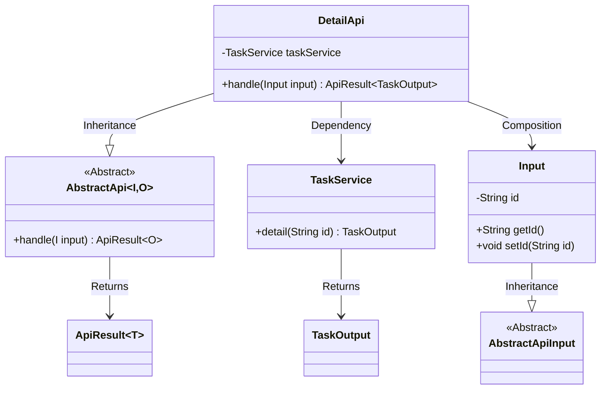

# Basic Information

|      |      |
|------|------|
| Name | DetailApi |
| Language | .java |
| Code Path | WeFe/fusion/fusion-service/src/main/java/com/welab/wefe/data/fusion/service/api/task/DetailApi.java |
| Package Name | com.welab.wefe.data.fusion.service.api.task |
| Dependencies | ['com.welab.wefe.common.exception.StatusCodeWithException', 'com.welab.wefe.common.fieldvalidate.annotation.Check', 'com.welab.wefe.common.web.api.base.AbstractApi', 'com.welab.wefe.common.web.api.base.Api', 'com.welab.wefe.common.web.dto.AbstractApiInput', 'com.welab.wefe.common.web.dto.ApiResult', 'com.welab.wefe.data.fusion.service.dto.entity.TaskOutput', 'com.welab.wefe.data.fusion.service.service.TaskService', 'org.springframework.beans.factory.annotation.Autowired'] |
| Brief Description | Task Details API class, which queries task details by taskId, inherits from the abstract API class, uses TaskService to process requests, and returns the task output results. |

# Description

The code defines an API class named `DetailApi` for handling task detail queries. The class path is `"task/detail"`, and its name is `"Task List"`. It inherits from `AbstractApi`, with the input type as `DetailApi.Input` and the output type as `TaskOutput`. It uses the auto-injected `TaskService` to call the `detail` method and retrieve task details. The input class `Input` inherits from `AbstractApiInput` and includes a required field `id` to specify the task ID to query. The API processing logic is encapsulated in the `handle` method, which returns task detail data upon success.

# Class Summary

| Name   | Type  | Description |
|-------|------|-------------|
| DetailApi | class | Task Details API class, with the path `task/detail`, queries task details by `taskId` and returns a `TaskOutput` result. The input parameter requires a mandatory `id` field. |

## Class DetailApi

|      |      |
|------|------|
| Access Modifier | @Api(path = "task/detail", name = "任务列表", desc = "任务列表");public |
| Type | class |
| Name | DetailApi |
| Description | Task Details API class, with the path `task/detail`, queries task details by `taskId` and returns a `TaskOutput` result. The input parameter requires a mandatory `id` field. |

### UML Class Diagram

This code demonstrates the implementation structure of a task detail API. DetailApi inherits from the generic abstract class AbstractApi, processes Input and returns ApiResult containing TaskOutput. The inner class Input inherits from AbstractApiInput and contains a task ID field. DetailApi retrieves task details through the dependency-injected TaskService, reflecting clear hierarchical relationships and responsibility division. Annotations indicate this is a REST interface for handling task details, requiring non-null input parameter validation. The overall design adheres to object-oriented principles, achieving code reuse through generics and inheritance.

### Internal Method Call Graph

```mermaid
graph TD
    A["Class DetailApi"]
    B["Annotation: @Api"]
    C["Inheritance: AbstractApi<Input, TaskOutput>"]
    D["Dependency Injection: @Autowired TaskService"]
    E["Overridden Method: handle(Input input)"]
    F["Static Inner Class: Input"]
    G["Field: String id"]
    H["Validation Annotation: @Check"]
    I["Method: getId()"]
    J["Method: setId(String id)"]
    K["Invocation: taskService.detail(input.id)"]
    L["Return: ApiResult.success()"]

    A --> B
    A --> C
    A --> D
    A --> E
    E --> K
    K --> L
    A --> F
    F --> G
    F --> H
    F --> I
    F --> J
```

This flowchart illustrates the structure of the DetailApi class, which is a REST interface class annotated with @Api. It inherits from AbstractApi and injects TaskService. The core method handle queries task details through taskService and returns the result. Input, as a static inner class, contains the task ID field with its getter/setter methods and performs parameter validation via the @Check annotation. The overall flow clearly demonstrates the call chain from request processing to result return.

### Field List

| Name  | Type  | Description |
|-------|-------|------|
| taskService | TaskService | Automatically inject the TaskService instance. |

### Method List

| Name  | Type  | Description |
|-------|-------|------|
| handle | ApiResult<TaskOutput> | Processing the task details request, calling the task service to retrieve the details and returning a successful result. |

