# Basic Information

|      |      |
|------|------|
| Name | HandleApi |
| Language | .java |
| Code Path | WeFe/fusion/fusion-service/src/main/java/com/welab/wefe/data/fusion/service/api/task/HandleApi.java |
| Package Name | com.welab.wefe.data.fusion.service.api.task |
| Dependencies | ['com.welab.wefe.common.StatusCode', 'com.welab.wefe.common.exception.StatusCodeWithException', 'com.welab.wefe.common.fieldvalidate.annotation.Check', 'com.welab.wefe.common.util.StringUtil', 'com.welab.wefe.common.web.api.base.AbstractNoneOutputApi', 'com.welab.wefe.common.web.api.base.Api', 'com.welab.wefe.common.web.dto.AbstractApiInput', 'com.welab.wefe.common.web.dto.ApiResult', 'com.welab.wefe.data.fusion.service.enums.DataResourceType', 'com.welab.wefe.data.fusion.service.service.TaskService', 'com.welab.wefe.data.fusion.service.utils.primarykey.FieldInfo', 'org.springframework.beans.factory.annotation.Autowired', 'java.util.List'] |
| Brief Description | Task Processing API class, which receives parameters such as task ID, data resource ID, type, sample size, etc., verifies the primary key and traceability fields, and then invokes the task service for processing. |

# Description

The HandleApi is a task processing interface that inherits from AbstractNoneOutputApi, with the path `task/handle`. It relies on TaskService to process the input parameter `Input`. The `Input` class includes attributes such as task ID, data resource ID, data resource type, sample size, primary key processing field list, whether to trace, and trace fields, all annotated with validation constraints. The input parameters must meet specific conditions: if the data resource type is `DataSet`, the primary key processing field list cannot be empty; if tracing is enabled, the trace fields cannot be empty. The class provides getter and setter methods for each attribute and performs parameter validation in the `checkAndStandardize` method.

# Class Summary

| Name   | Type  | Description |
|-------|------|-------------|
| HandleApi | class | The HandleApi is a task processing interface that inherits from AbstractNoneOutputApi. Its input parameters include task ID, data resource ID, type, sample size, primary key processing field, whether to trace, and trace fields. Parameter validation ensures the primary key is non-null for dataset types and trace fields are non-null when tracing is enabled. It invokes taskService to process the task and returns a success result. |


## Class HandleApi

|      |      |
|------|------|
| Access Modifier | @Api(path = "task/handle", name = "任务处理", desc = "任务处理");public |
| Type | class |
| Name | HandleApi |
| Description | The HandleApi is a task processing interface that inherits from AbstractNoneOutputApi. Its input parameters include task ID, data resource ID, type, sample size, primary key processing field, whether to trace, and trace fields. Parameter validation ensures the primary key is non-null for dataset types and trace fields are non-null when tracing is enabled. It invokes taskService to process the task and returns a success result. |


### UML Class Diagram

```mermaid
classDiagram
    class HandleApi {
        -TaskService taskService
        +handler(HandleApi~Input~ input) ApiResult
    }
    HandleApi --> TaskService : Dependency
    HandleApi --> AbstractNoneOutputApi~HandleApi~Input~~ : Inheritance

    class AbstractNoneOutputApi~T~ {
        <<Abstract>>
        +handler(T input) ApiResult
    }

    class HandleApi~Input~ {
        -String id
        -String dataResourceId
        -DataResourceType dataResourceType
        -Integer rowCount
        -List~FieldInfo~ fieldInfoList
        -Boolean isTrace
        -String traceColumn
        +checkAndStandardize() void
        // getters/setters omitted
    }
    HandleApi~Input~ --> AbstractApiInput : Inheritance

    class AbstractApiInput {
        <<Abstract>>
        +checkAndStandardize() void
    }

    class TaskService {
        +handle(HandleApi~Input~ input) void
    }
```

This code illustrates the class structure of a task processing API (HandleApi) that inherits from the generic abstract class AbstractNoneOutputApi. The core consists of three layers: 1) HandleApi serves as the entry class, depending on TaskService for specific processing; 2) Input, as a nested static class, inherits from AbstractApiInput and contains the parameters and validation logic required for task processing; 3) The abstract base classes provide common behaviors. The class diagram clearly demonstrates the inheritance relationships, dependencies, and the use of generic parameters, particularly the special usage of the Input class as a generic parameter. Validation logic is centralized in the Input class to ensure parameter validity.


### Internal Method Call Graph

```mermaid
graph TD
    A["Class HandleApi"]
    B["Annotation: @Api"]
    C["Inheritance: AbstractNoneOutputApi<Input>"]
    D["Dependency Injection: @Autowired TaskService"]
    E["Overridden Method: handler(Input input)"]
    F["Inner Class: Input"]
    G["Property: String id"]
    H["Property: String dataResourceId"]
    I["Property: DataResourceType dataResourceType"]
    J["Property: Integer rowCount"]
    K["Property: List<FieldInfo> fieldInfoList"]
    L["Property: Boolean isTrace"]
    M["Property: String traceColumn"]
    N["Method: checkAndStandardize()"]
    O["Method: getter/setter"]

    A --> B
    A --> C
    A --> D
    A --> E
    A --> F
    F --> G
    F --> H
    F --> I
    F --> J
    F --> K
    F --> L
    F --> M
    F --> N
    F --> O
    E -->|Calls| D
    E -->|Returns| C
    N -->|Validates| G
    N -->|Validates| H
    N -->|Validates| I
    N -->|Validates| J
    N -->|Validates| K
    N -->|Validates| L
    N -->|Validates| M
```



This code demonstrates a task processing API class HandleApi, which inherits from the abstract class AbstractNoneOutputApi and contains an inner class Input for parameters. The flowchart clearly presents the class structure, property dependencies, and method invocation relationships, highlighting key aspects including API annotations, service injection, input parameter validation logic, and constraint relationships between parameters. The Input class implements parameter validation through the checkAndStandardize() method, ensuring the matching of data resource types with primary key settings and the completeness of trace fields.

### Field List

| Name  | Type  | Description |
|-------|-------|------|
| taskService | TaskService | Automatically inject the TaskService instance. |

### Method List

| Name  | Type  | Description |
|-------|-------|------|
| handler | ApiResult | Java method override, calling taskService to process the input and return a successful result. |


