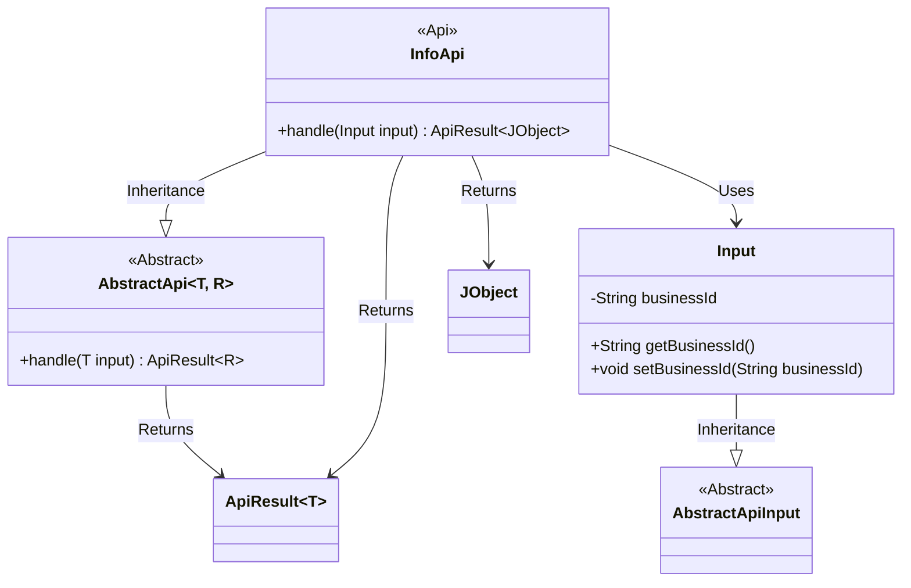

# Basic Information

|      |      |
|------|------|
| Name | InfoApi |
| Language | .java |
| Code Path | WeFe/fusion/fusion-service/src/main/java/com/welab/wefe/data/fusion/service/api/task/InfoApi.java |
| Package Name | com.welab.wefe.data.fusion.service.api.task |
| Dependencies | ['com.welab.wefe.common.exception.StatusCodeWithException', 'com.welab.wefe.common.fieldvalidate.annotation.Check', 'com.welab.wefe.common.util.JObject', 'com.welab.wefe.common.web.api.base.AbstractApi', 'com.welab.wefe.common.web.api.base.Api', 'com.welab.wefe.common.web.dto.AbstractApiInput', 'com.welab.wefe.common.web.dto.ApiResult', 'com.welab.wefe.data.fusion.service.manager.ActuatorManager'] |
| Brief Description | Task Information API class, retrieves task information via businessId. The input must include the required field taskId. |

# Description

The code defines an API class named InfoApi for retrieving task information. The API path is "task/info", which accepts an input parameter Input containing the mandatory field businessId. It retrieves task information via the ActuatorManager.getTaskInfo method and returns the result in JObject format. The input class Input inherits from AbstractApiInput and includes getter and setter methods for businessId. The entire API processing logic is encapsulated in the handle method, which returns JObject data wrapped in ApiResult upon success.

# Class Summary

| Name   | Type  | Description |
|-------|------|-------------|
| InfoApi | class | This is an API class for retrieving task information, with the path "task/info". It requires the mandatory parameter businessId and returns task information. |

## Class InfoApi

|      |      |
|------|------|
| Access Modifier | @Api(path = "task/info", name = "获取任务信息", desc = "获取任务信息");public |
| Type | class |
| Name | InfoApi |
| Description | This is an API class for retrieving task information, with the path "task/info". It requires the mandatory parameter businessId and returns task information. |

### UML Class Diagram

This code demonstrates the implementation structure of a task information retrieval API. InfoApi inherits from the generic abstract class AbstractApi, specifying the input type as the internal class Input and the return type as JObject. The Input class inherits from AbstractApiInput and contains a required businessId field along with its getter/setter methods. InfoApi processes input parameters through the handle method, invokes ActuatorManager to retrieve task information, and returns the result encapsulated in ApiResult. The overall design follows common API development patterns, achieving separation between request parameters and business logic.

### Internal Method Call Graph

```mermaid
graph TD
    A["Class InfoApi"]
    B["Inherits: AbstractApi<Input, JObject>"]
    C["Annotation: @Api"]
    D["Method: handle(Input input)"]
    E["Invokes: ActuatorManager.getTaskInfo"]
    F["Returns: success(JObject)"]
    G["Nested Class Input"]
    H["Inherits: AbstractApiInput"]
    I["Property: String businessId"]
    J["Annotation: @Check"]
    K["Method: getBusinessId()"]
    L["Method: setBusinessId()"]

    A --> B
    A --> C
    A --> D
    D --> E
    D --> F
    A --> G
    G --> H
    G --> I
    G --> J
    G --> K
    G --> L
```

This code defines an API class named InfoApi for retrieving task information. The class inherits from AbstractApi and contains a handle method to process requests, which obtains task information through ActuatorManager and returns a success result. The inner class Input encapsulates input parameters, including a mandatory businessId field with its getter/setter methods. The flowchart clearly illustrates the inheritance relationships, method call chains, and attribute structure between classes.

### Field List

| Name  | Type  | Description |
|-------|-------|------|

### Method List

| Name  | Type  | Description |
|-------|-------|------|
| handle | ApiResult<JObject> | Rewrite the handle method to call ActuatorManager for task information and return a successful result. |

