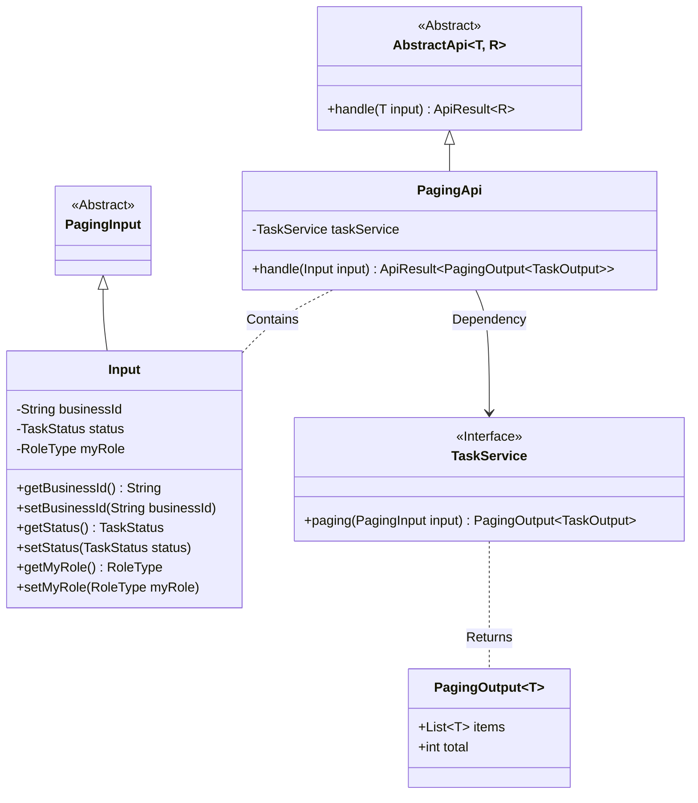

# Basic Information

|      |      |
|------|------|
| Name | PagingApi |
| Language | .java |
| Code Path | WeFe/fusion/fusion-service/src/main/java/com/welab/wefe/data/fusion/service/api/task/PagingApi.java |
| Package Name | com.welab.wefe.data.fusion.service.api.task |
| Dependencies | ['com.welab.wefe.common.exception.StatusCodeWithException', 'com.welab.wefe.common.fieldvalidate.annotation.Check', 'com.welab.wefe.common.web.api.base.AbstractApi', 'com.welab.wefe.common.web.api.base.Api', 'com.welab.wefe.common.web.dto.ApiResult', 'com.welab.wefe.data.fusion.service.dto.base.PagingInput', 'com.welab.wefe.data.fusion.service.dto.base.PagingOutput', 'com.welab.wefe.data.fusion.service.dto.entity.TaskOutput', 'com.welab.wefe.data.fusion.service.enums.RoleType', 'com.welab.wefe.data.fusion.service.enums.TaskStatus', 'com.welab.wefe.data.fusion.service.service.TaskService', 'org.springframework.beans.factory.annotation.Autowired'] |
| Brief Description | Task pagination query API, which accepts business ID, status, and role parameters, and returns a paginated task list. |

# Description

The PagingApi is an API class designed to handle paginated task lists, with the endpoint at task/paging. It inherits from AbstractApi, accepts an Input class as input, and outputs a paginated TaskOutput. The Input class includes three fields: businessId, status, and myRole, representing the task ID, task status, and role type respectively, along with corresponding getter and setter methods. The API processes the input and returns results via the paging method of taskService.

# Class Summary

| Name   | Type  | Description |
|-------|------|-------------|
| PagingApi | class | Pagination Query Task API, which accepts parameters such as business ID, task status, and role type, and returns a paginated task list. |

## Class PagingApi

|      |      |
|------|------|
| Access Modifier | @Api(path = "task/paging", name = "任务列表", desc = "任务列表");public |
| Type | class |
| Name | PagingApi |
| Description | Pagination Query Task API, which accepts parameters such as business ID, task status, and role type, and returns a paginated task list. |

### UML Class Diagram

This class diagram illustrates the structure of a paging API, where PagingApi inherits from the generic abstract class AbstractApi, processes Input parameters, and returns paginated results. The Input class inherits from PagingInput and includes fields such as business ID, task status, and role type. The TaskService interface provides pagination query functionality, returning a PagingOutput object containing a task list. The overall design demonstrates clear hierarchical relationships and dependencies, achieving type-safe input and output handling through generics.

### Internal Method Call Graph

```mermaid
graph TD
    A["Class PagingApi"]
    B["Annotation: @Api(path='task/paging', name='Task List', desc='Task List')"]
    C["Inheritance: AbstractApi<Input, PagingOutput<TaskOutput>>"]
    D["Dependency Injection: @Autowired TaskService"]
    E["Overridden Method: handle(Input input)"]
    F["Inner Class: Input"]
    G["Inheritance: PagingInput"]
    H["Field: @Check String businessId"]
    I["Field: @Check TaskStatus status"]
    J["Field: @Check RoleType myRole"]
    K["Getter/Setter Method Group"]

    A --> B
    A --> C
    A --> D
    A --> E
    A --> F
    F --> G
    F --> H
    F --> I
    F --> J
    F --> K
    E --> D
    E --> F
```

This flowchart illustrates the complete structure of the PagingApi class, including API annotations, parent class inheritance relationships, service injection, and input parameter processing flow. The core is the handle method processing pagination requests through taskService, with the Input inner class inheriting PagingInput and containing three fields with validation annotations along with their access methods. The diagram presents the complete invocation chain from API entry to business processing, reflecting a typical controller layer structure in Spring Boot applications.

### Field List

| Name  | Type  | Description |
|-------|-------|------|
| taskService | TaskService | Automatically inject the TaskService instance. |

### Method List

| Name  | Type  | Description |
|-------|-------|------|
| handle | ApiResult<PagingOutput<TaskOutput>> | Rewrite the handle method to call the taskService for paginated query and return the results. |

