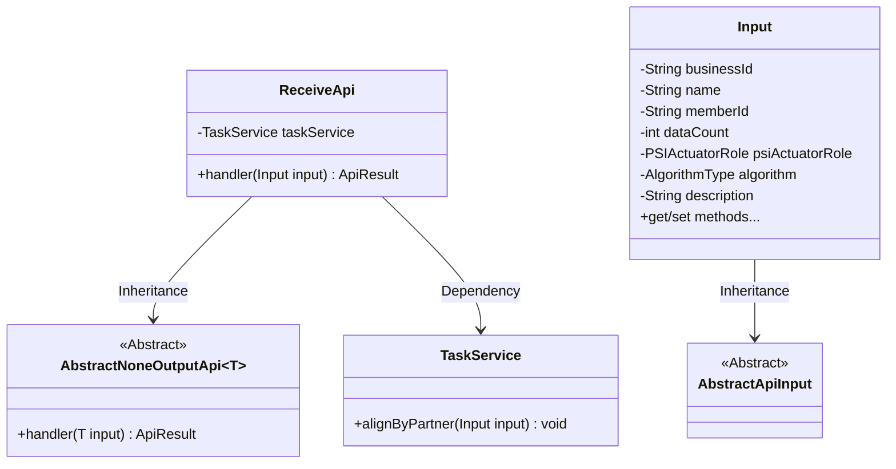
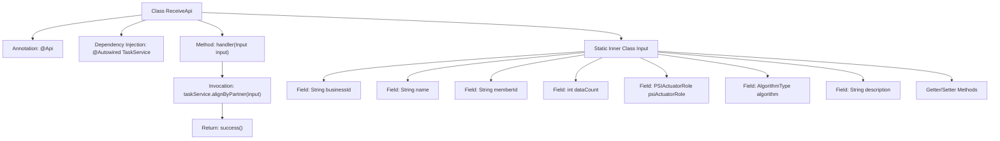

# Basic Information

|      |      |
|------|------|
| Name | ReceiveApi |
| Language | .java |
| Code Path | WeFe/fusion/fusion-service/src/main/java/com/welab/wefe/data/fusion/service/api/task/ReceiveApi.java |
| Package Name | com.welab.wefe.data.fusion.service.api.task |
| Dependencies | ['com.welab.wefe.common.exception.StatusCodeWithException', 'com.welab.wefe.common.fieldvalidate.annotation.Check', 'com.welab.wefe.common.web.api.base.AbstractNoneOutputApi', 'com.welab.wefe.common.web.api.base.Api', 'com.welab.wefe.common.web.dto.AbstractApiInput', 'com.welab.wefe.common.web.dto.ApiResult', 'com.welab.wefe.data.fusion.service.enums.AlgorithmType', 'com.welab.wefe.data.fusion.service.enums.PSIActuatorRole', 'com.welab.wefe.data.fusion.service.service.TaskService', 'org.springframework.beans.factory.annotation.Autowired'] |
| Brief Description | API for receiving alignment requests requires parameters such as businessId, task name, partner member ID, data volume, alignment role, algorithm, and description. The request is processed by invoking taskService. |

# Description

ReceiveApi is an API class designed to handle alignment requests, accessible via the path `task/receive` with signed access. It inherits from `AbstractNoneOutputApi` and takes an internal class `Input` as its parameter. The `Input` class includes multiple mandatory fields: `businessId`, `name`, `memberId`, `psiActuatorRole`, and `algorithm`, along with optional fields `dataCount` and `description` (limited to 1024 characters). The `handler` method invokes `taskService.alignByPartner` to process the input and returns a success result. All fields are annotated with validation constraints and equipped with getter/setter methods.

# Class Summary

| Name   | Type  | Description |
|-------|------|-------------|
| ReceiveApi | class | API for receiving alignment requests requires passing parameters including businessId, task name, partner member ID, data volume, alignment role, algorithm, and description, then invoking taskService.alignByPartner for processing. |

## Class ReceiveApi

|      |      |
|------|------|
| Access Modifier | @Api(path = "task/receive", name = "接收对齐请求", desc = "接收对齐请求", allowAccessWithSign = true);public |
| Type | class |
| Name | ReceiveApi |
| Description | API for receiving alignment requests requires passing parameters including businessId, task name, partner member ID, data volume, alignment role, algorithm, and description, then invoking taskService.alignByPartner for processing. |

### UML Class Diagram

Class Diagram Description: This diagram illustrates the class structure of the alignment request receiving API. ReceiveApi inherits from the generic class AbstractNoneOutputApi<Input> and depends on TaskService for business processing. The Input class inherits from AbstractApiInput and contains multiple fields with validation annotations along with their getter/setter methods. The overall structure reflects the complete workflow from input validation to business processing when the API handles requests.

### Internal Method Call Graph

This code represents an API implementation class for receiving alignment requests, including annotation configurations, service invocations, and input parameter validations. The flowchart illustrates the class structure relationships, starting from the main class ReceiveApi, configuring API paths through annotations, injecting the TaskService, processing input parameters via the handler method to invoke the alignment service, and finally returning a success result. The static inner class Input defines the request parameter structure and validation rules, containing multiple fields with validation annotations and corresponding Getter/Setter methods. The entire flow demonstrates the basic logic of API request processing and data validation mechanisms.

### Field List

| Name  | Type  | Description |
|-------|-------|------|
| taskService | TaskService | Automatically inject the TaskService instance. |

### Method List

| Name  | Type  | Description |
|-------|-------|------|
| handler | ApiResult | Method override, call the task service to process the input parameters, and return the result upon success. |

